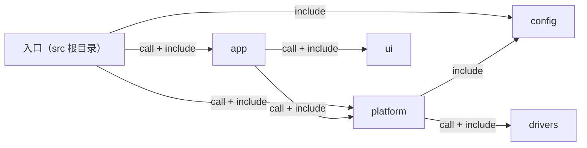

# HT 固件代码图谱

由 `firmware/tools/code_graph.py` 从实际源码生成，请勿手工修改。

在仓库根目录运行：

```powershell
python firmware/tools/code_graph.py
python firmware/tools/code_graph.py --check
```

`--check` 比较 Markdown 和 JSON；源码新增、删除或内容变化后未更新会返回非零状态。

机器数据：[代码图谱.json](代码图谱.json)。源码链接相对本文件，并带定义行号。

## 解析边界

- 仅扫描 firmware/src 下的 .c/.h；模块按一级目录划分，根目录文件归入口模块。
- 源码按 UTF-8 解码（允许 BOM），CRLF/CR 统一为 LF 后再解析和计算 SHA256；换行格式不影响图谱。
- 有界词法解析支持普通函数定义及 ISR_DIRECT_DECLARE；不是 C 编译器，不展开宏或计算条件编译。
- 直接调用边只连接可唯一定位的源码函数定义；注释、字符串和预处理指令不参与调用识别。
- 函数指针、成员调用、外部库和未知宏调用不能据此确定目标；同名冲突会列入诊断。
- 没有完整类型与作用域分析，复杂声明、宏生成代码或间接调用需人工核对，不能声称完整调用图。
- 设备树、线程调度、回调注册、DMA/中断触发及人工硬件依赖不属于自动调用证明。

## 模块关系

箭头由使用方指向被引用/调用方，节点名称来自源码目录。



## 职责与文件索引

职责仅提取文件头 `@brief`，不从目录名推断。

| 模块 | 源码 | 职责 | 函数定义数 |
|---|---|---|---:|
| app | [app/screen_bridge.c](<../../firmware/src/app/screen_bridge.c>) | Forward USART1/USART3 bytes while periodically verifying relay-off registers. | 2 |
| app | [app/screen_bridge.h](<../../firmware/src/app/screen_bridge.h>) | Transparent host/display UART bridge with relay-off supervision. | 0 |
| app | [app/screen_panel.c](<../../firmware/src/app/screen_panel.c>) | 只处理屏幕与手动请求，始终不启动测量或切换继电器。 | 12 |
| app | [app/screen_panel.h](<../../firmware/src/app/screen_panel.h>) | 输出禁止的屏幕与面板联调服务。 | 0 |
| config | [config/analog.h](<../../firmware/src/config/analog.h>) | 采样链标称参数，单位写入名称；实机换算仍须标定。 | 0 |
| drivers | [drivers/tca9539_safe.c](<../../firmware/src/drivers/tca9539_safe.c>) | 只允许清零继电器输出，失败即撤销就绪状态。 | 7 |
| drivers | [drivers/tca9539_safe.h](<../../firmware/src/drivers/tca9539_safe.h>) | TCA9539 安全初始化、全断寄存器检查与面板输入接口。 | 0 |
| 入口 | [main.c](<../../firmware/src/main.c>) | Run the output-disabled bring-up checks and change-only diagnostics. | 1 |
| platform | [platform/board_io.c](<../../firmware/src/platform/board_io.c>) | Initialize HT safe pins and check the clock and internal reference. | 7 |
| platform | [platform/board_io.h](<../../firmware/src/platform/board_io.h>) | HT board safe GPIO setup and diagnostic input snapshot. | 0 |
| platform | [platform/relay_io.c](<../../firmware/src/platform/relay_io.c>) | Adapt the portable TCA9539 driver to Zephyr I2C on HT MAIN-01. | 6 |
| platform | [platform/relay_io.h](<../../firmware/src/platform/relay_io.h>) | Single-owner relay-off checks and panel reads for safe bring-up. | 0 |
| platform | [platform/screen_uart.c](<../../firmware/src/platform/screen_uart.c>) | Buffer UART RX in interrupts and latch communication failures. | 10 |
| platform | [platform/screen_uart.h](<../../firmware/src/platform/screen_uart.h>) | Interrupt-buffered display/host UART transport for screen bring-up. | 0 |
| ui | [ui/dgus.c](<../../firmware/src/ui/dgus.c>) | DGUS II 82/83 帧与 Modbus CRC，固定内存解析并在坏帧后重同步。 | 16 |
| ui | [ui/dgus.h](<../../firmware/src/ui/dgus.h>) | 有界 DGUS II 帧编解码与流式接收，不含串口配置或 HT 变量映射。 | 0 |
| ui | [ui/encoder.c](<../../firmware/src/ui/encoder.c>) | 累计合法 Gray 转换并抵消回摆，非法跳变丢弃未完成格数。 | 2 |
| ui | [ui/encoder.h](<../../firmware/src/ui/encoder.h>) | 可配置整格转换数的 A/B 正交解码，只生成旋转格数。 | 0 |
| ui | [ui/panel.c](<../../firmware/src/ui/panel.c>) | 选档先编辑草稿再提交，导航与输出许可相互独立。 | 12 |
| ui | [ui/panel.h](<../../firmware/src/ui/panel.h>) | 已消抖面板导航、选档草稿与启停请求模型，不操作硬件。 | 0 |
| ui | [ui/view.c](<../../firmware/src/ui/view.c>) | 格式化已生效状态与独立候选值，同步两页屏幕契约。 | 7 |
| ui | [ui/view.h](<../../firmware/src/ui/view.h>) | 两页仪表快照与 DGUS VP 同步，不执行测量或挡位切换。 | 0 |

## 函数定义

| 函数 | 定义位置 | 链接属性 | 可定位的直接被调函数 |
|---|---|---|---|
| `forward` | [app/screen_bridge.c:8](<../../firmware/src/app/screen_bridge.c#L8>) | static | `screen_uart_read` ([platform/screen_uart.c:182](<../../firmware/src/platform/screen_uart.c#L182>))、`screen_uart_write` ([platform/screen_uart.c:206](<../../firmware/src/platform/screen_uart.c#L206>)) |
| `screen_bridge_run` | [app/screen_bridge.c:21](<../../firmware/src/app/screen_bridge.c#L21>) | external | `forward` ([app/screen_bridge.c:8](<../../firmware/src/app/screen_bridge.c#L8>))、`relay_io_check` ([platform/relay_io.c:40](<../../firmware/src/platform/relay_io.c#L40>))、`screen_uart_init` ([platform/screen_uart.c:116](<../../firmware/src/platform/screen_uart.c#L116>))、`screen_uart_stop` ([platform/screen_uart.c:258](<../../firmware/src/platform/screen_uart.c#L258>)) |
| `read_encoder` | [app/screen_panel.c:85](<../../firmware/src/app/screen_panel.c#L85>) | static | 无已定位调用 |
| `encoder_edge` | [app/screen_panel.c:97](<../../firmware/src/app/screen_panel.c#L97>) | static | `read_encoder` ([app/screen_panel.c:85](<../../firmware/src/app/screen_panel.c#L85>))、`encoder_update` ([ui/encoder.c:29](<../../firmware/src/ui/encoder.c#L29>)) |
| `stop_encoder` | [app/screen_panel.c:129](<../../firmware/src/app/screen_panel.c#L129>) | static | 无已定位调用 |
| `start_encoder` | [app/screen_panel.c:150](<../../firmware/src/app/screen_panel.c#L150>) | static | `read_encoder` ([app/screen_panel.c:85](<../../firmware/src/app/screen_panel.c#L85>))、`encoder_init` ([ui/encoder.c:6](<../../firmware/src/ui/encoder.c#L6>)) |
| `update_keys` | [app/screen_panel.c:195](<../../firmware/src/app/screen_panel.c#L195>) | static | `panel_range_ohm` ([ui/panel.c:35](<../../firmware/src/ui/panel.c#L35>))、`panel_pressed_keys` ([ui/panel.c:45](<../../firmware/src/ui/panel.c#L45>))、`panel_key` ([ui/panel.c:79](<../../firmware/src/ui/panel.c#L79>)) |
| `update_inputs` | [app/screen_panel.c:238](<../../firmware/src/app/screen_panel.c#L238>) | static | `update_keys` ([app/screen_panel.c:195](<../../firmware/src/app/screen_panel.c#L195>))、`board_io_read` ([platform/board_io.c:126](<../../firmware/src/platform/board_io.c#L126>))、`relay_io_check` ([platform/relay_io.c:40](<../../firmware/src/platform/relay_io.c#L40>))、`relay_io_read_panel` ([platform/relay_io.c:45](<../../firmware/src/platform/relay_io.c#L45>))、`panel_rotate` ([ui/panel.c:127](<../../firmware/src/ui/panel.c#L127>))、`panel_inputs` ([ui/panel.c:176](<../../firmware/src/ui/panel.c#L176>)) |
| `receive_frame` | [app/screen_panel.c:274](<../../firmware/src/app/screen_panel.c#L274>) | static | 无已定位调用 |
| `update_link` | [app/screen_panel.c:287](<../../firmware/src/app/screen_panel.c#L287>) | static | `screen_uart_read` ([platform/screen_uart.c:182](<../../firmware/src/platform/screen_uart.c#L182>))、`screen_uart_write` ([platform/screen_uart.c:206](<../../firmware/src/platform/screen_uart.c#L206>))、`screen_uart_check` ([platform/screen_uart.c:228](<../../firmware/src/platform/screen_uart.c#L228>))、`dgus_init` ([ui/dgus.c:191](<../../firmware/src/ui/dgus.c#L191>))、`dgus_feed` ([ui/dgus.c:276](<../../firmware/src/ui/dgus.c#L276>))、`dgus_reset` ([ui/dgus.c:294](<../../firmware/src/ui/dgus.c#L294>))、`dgus_encode_read` ([ui/dgus.c:93](<../../firmware/src/ui/dgus.c#L93>))、`view_reset` ([ui/view.c:126](<../../firmware/src/ui/view.c#L126>)) |
| `display_send` | [app/screen_panel.c:363](<../../firmware/src/app/screen_panel.c#L363>) | static | `update_inputs` ([app/screen_panel.c:238](<../../firmware/src/app/screen_panel.c#L238>))、`screen_uart_write` ([platform/screen_uart.c:206](<../../firmware/src/platform/screen_uart.c#L206>)) |
| `snapshot` | [app/screen_panel.c:381](<../../firmware/src/app/screen_panel.c#L381>) | static | `panel_draft_changed` ([ui/panel.c:145](<../../firmware/src/ui/panel.c#L145>))、`panel_range_ohm` ([ui/panel.c:35](<../../firmware/src/ui/panel.c#L35>))、`panel_frequency_hz` ([ui/panel.c:40](<../../firmware/src/ui/panel.c#L40>)) |
| `refresh_display` | [app/screen_panel.c:400](<../../firmware/src/app/screen_panel.c#L400>) | static | `display_send` ([app/screen_panel.c:363](<../../firmware/src/app/screen_panel.c#L363>))、`snapshot` ([app/screen_panel.c:381](<../../firmware/src/app/screen_panel.c#L381>))、`dgus_encode_write` ([ui/dgus.c:66](<../../firmware/src/ui/dgus.c#L66>))、`view_refresh` ([ui/view.c:133](<../../firmware/src/ui/view.c#L133>)) |
| `screen_panel_run` | [app/screen_panel.c:427](<../../firmware/src/app/screen_panel.c#L427>) | external | `stop_encoder` ([app/screen_panel.c:129](<../../firmware/src/app/screen_panel.c#L129>))、`start_encoder` ([app/screen_panel.c:150](<../../firmware/src/app/screen_panel.c#L150>))、`update_inputs` ([app/screen_panel.c:238](<../../firmware/src/app/screen_panel.c#L238>))、`update_link` ([app/screen_panel.c:287](<../../firmware/src/app/screen_panel.c#L287>))、`refresh_display` ([app/screen_panel.c:400](<../../firmware/src/app/screen_panel.c#L400>))、`screen_uart_init` ([platform/screen_uart.c:116](<../../firmware/src/platform/screen_uart.c#L116>))、`screen_uart_stop` ([platform/screen_uart.c:258](<../../firmware/src/platform/screen_uart.c#L258>))、`dgus_init` ([ui/dgus.c:191](<../../firmware/src/ui/dgus.c#L191>))、`panel_init` ([ui/panel.c:50](<../../firmware/src/ui/panel.c#L50>)) |
| `valid_bus` | [drivers/tca9539_safe.c:14](<../../firmware/src/drivers/tca9539_safe.c#L14>) | static | 无已定位调用 |
| `fail` | [drivers/tca9539_safe.c:20](<../../firmware/src/drivers/tca9539_safe.c#L20>) | static | 无已定位调用 |
| `read_expected` | [drivers/tca9539_safe.c:26](<../../firmware/src/drivers/tca9539_safe.c#L26>) | static | `fail` ([drivers/tca9539_safe.c:20](<../../firmware/src/drivers/tca9539_safe.c#L20>)) |
| `check_ready` | [drivers/tca9539_safe.c:39](<../../firmware/src/drivers/tca9539_safe.c#L39>) | static | `valid_bus` ([drivers/tca9539_safe.c:14](<../../firmware/src/drivers/tca9539_safe.c#L14>))、`fail` ([drivers/tca9539_safe.c:20](<../../firmware/src/drivers/tca9539_safe.c#L20>)) |
| `tca9539_init` | [drivers/tca9539_safe.c:53](<../../firmware/src/drivers/tca9539_safe.c#L53>) | external | `valid_bus` ([drivers/tca9539_safe.c:14](<../../firmware/src/drivers/tca9539_safe.c#L14>))、`fail` ([drivers/tca9539_safe.c:20](<../../firmware/src/drivers/tca9539_safe.c#L20>))、`read_expected` ([drivers/tca9539_safe.c:26](<../../firmware/src/drivers/tca9539_safe.c#L26>)) |
| `tca9539_verify_off` | [drivers/tca9539_safe.c:89](<../../firmware/src/drivers/tca9539_safe.c#L89>) | external | `read_expected` ([drivers/tca9539_safe.c:26](<../../firmware/src/drivers/tca9539_safe.c#L26>))、`check_ready` ([drivers/tca9539_safe.c:39](<../../firmware/src/drivers/tca9539_safe.c#L39>)) |
| `tca9539_read_panel` | [drivers/tca9539_safe.c:103](<../../firmware/src/drivers/tca9539_safe.c#L103>) | external | `fail` ([drivers/tca9539_safe.c:20](<../../firmware/src/drivers/tca9539_safe.c#L20>))、`check_ready` ([drivers/tca9539_safe.c:39](<../../firmware/src/drivers/tca9539_safe.c#L39>)) |
| `main` | [main.c:16](<../../firmware/src/main.c#L16>) | external | `screen_bridge_run` ([app/screen_bridge.c:21](<../../firmware/src/app/screen_bridge.c#L21>))、`screen_panel_run` ([app/screen_panel.c:427](<../../firmware/src/app/screen_panel.c#L427>))、`board_io_init` ([platform/board_io.c:114](<../../firmware/src/platform/board_io.c#L114>))、`board_io_init_digital` ([platform/board_io.c:120](<../../firmware/src/platform/board_io.c#L120>))、`board_io_read` ([platform/board_io.c:126](<../../firmware/src/platform/board_io.c#L126>))、`relay_io_init` ([platform/relay_io.c:31](<../../firmware/src/platform/relay_io.c#L31>))、`relay_io_check` ([platform/relay_io.c:40](<../../firmware/src/platform/relay_io.c#L40>))、`relay_io_read_panel` ([platform/relay_io.c:45](<../../firmware/src/platform/relay_io.c#L45>))、`relay_io_stop` ([platform/relay_io.c:50](<../../firmware/src/platform/relay_io.c#L50>)) |
| `setup_pin` | [platform/board_io.c:35](<../../firmware/src/platform/board_io.c#L35>) | static | 无已定位调用 |
| `check_clock` | [platform/board_io.c:43](<../../firmware/src/platform/board_io.c#L43>) | static | 无已定位调用 |
| `start_vref` | [platform/board_io.c:54](<../../firmware/src/platform/board_io.c#L54>) | static | 无已定位调用 |
| `init_board` | [platform/board_io.c:76](<../../firmware/src/platform/board_io.c#L76>) | static | `setup_pin` ([platform/board_io.c:35](<../../firmware/src/platform/board_io.c#L35>))、`check_clock` ([platform/board_io.c:43](<../../firmware/src/platform/board_io.c#L43>))、`start_vref` ([platform/board_io.c:54](<../../firmware/src/platform/board_io.c#L54>)) |
| `board_io_init` | [platform/board_io.c:114](<../../firmware/src/platform/board_io.c#L114>) | external | `init_board` ([platform/board_io.c:76](<../../firmware/src/platform/board_io.c#L76>)) |
| `board_io_init_digital` | [platform/board_io.c:120](<../../firmware/src/platform/board_io.c#L120>) | external | `init_board` ([platform/board_io.c:76](<../../firmware/src/platform/board_io.c#L76>)) |
| `board_io_read` | [platform/board_io.c:126](<../../firmware/src/platform/board_io.c#L126>) | external | 无已定位调用 |
| `read_reg` | [platform/relay_io.c:10](<../../firmware/src/platform/relay_io.c#L10>) | static | 无已定位调用 |
| `write_reg` | [platform/relay_io.c:17](<../../firmware/src/platform/relay_io.c#L17>) | static | 无已定位调用 |
| `relay_io_init` | [platform/relay_io.c:31](<../../firmware/src/platform/relay_io.c#L31>) | external | `tca9539_init` ([drivers/tca9539_safe.c:53](<../../firmware/src/drivers/tca9539_safe.c#L53>)) |
| `relay_io_check` | [platform/relay_io.c:40](<../../firmware/src/platform/relay_io.c#L40>) | external | `tca9539_verify_off` ([drivers/tca9539_safe.c:89](<../../firmware/src/drivers/tca9539_safe.c#L89>)) |
| `relay_io_read_panel` | [platform/relay_io.c:45](<../../firmware/src/platform/relay_io.c#L45>) | external | `tca9539_read_panel` ([drivers/tca9539_safe.c:103](<../../firmware/src/drivers/tca9539_safe.c#L103>)) |
| `relay_io_stop` | [platform/relay_io.c:50](<../../firmware/src/platform/relay_io.c#L50>) | external | `relay_io_init` ([platform/relay_io.c:31](<../../firmware/src/platform/relay_io.c#L31>)) |
| `get_link` | [platform/screen_uart.c:36](<../../firmware/src/platform/screen_uart.c#L36>) | static | 无已定位调用 |
| `status_locked` | [platform/screen_uart.c:41](<../../firmware/src/platform/screen_uart.c#L41>) | static | 无已定位调用 |
| `fail_link` | [platform/screen_uart.c:46](<../../firmware/src/platform/screen_uart.c#L46>) | static | 无已定位调用 |
| `receive_irq` | [platform/screen_uart.c:62](<../../firmware/src/platform/screen_uart.c#L62>) | static | `fail_link` ([platform/screen_uart.c:46](<../../firmware/src/platform/screen_uart.c#L46>)) |
| `screen_uart_init` | [platform/screen_uart.c:116](<../../firmware/src/platform/screen_uart.c#L116>) | external | `screen_uart_check` ([platform/screen_uart.c:228](<../../firmware/src/platform/screen_uart.c#L228>))、`screen_uart_stop` ([platform/screen_uart.c:258](<../../firmware/src/platform/screen_uart.c#L258>))、`get_link` ([platform/screen_uart.c:36](<../../firmware/src/platform/screen_uart.c#L36>))、`fail_link` ([platform/screen_uart.c:46](<../../firmware/src/platform/screen_uart.c#L46>)) |
| `screen_uart_read` | [platform/screen_uart.c:182](<../../firmware/src/platform/screen_uart.c#L182>) | external | `get_link` ([platform/screen_uart.c:36](<../../firmware/src/platform/screen_uart.c#L36>))、`status_locked` ([platform/screen_uart.c:41](<../../firmware/src/platform/screen_uart.c#L41>)) |
| `screen_uart_write` | [platform/screen_uart.c:206](<../../firmware/src/platform/screen_uart.c#L206>) | external | `screen_uart_check` ([platform/screen_uart.c:228](<../../firmware/src/platform/screen_uart.c#L228>))、`get_link` ([platform/screen_uart.c:36](<../../firmware/src/platform/screen_uart.c#L36>)) |
| `screen_uart_check` | [platform/screen_uart.c:228](<../../firmware/src/platform/screen_uart.c#L228>) | external | `get_link` ([platform/screen_uart.c:36](<../../firmware/src/platform/screen_uart.c#L36>))、`status_locked` ([platform/screen_uart.c:41](<../../firmware/src/platform/screen_uart.c#L41>)) |
| `screen_uart_get_stats` | [platform/screen_uart.c:242](<../../firmware/src/platform/screen_uart.c#L242>) | external | `get_link` ([platform/screen_uart.c:36](<../../firmware/src/platform/screen_uart.c#L36>))、`status_locked` ([platform/screen_uart.c:41](<../../firmware/src/platform/screen_uart.c#L41>)) |
| `screen_uart_stop` | [platform/screen_uart.c:258](<../../firmware/src/platform/screen_uart.c#L258>) | external | `get_link` ([platform/screen_uart.c:36](<../../firmware/src/platform/screen_uart.c#L36>)) |
| `crc_bytes` | [ui/dgus.c:9](<../../firmware/src/ui/dgus.c#L9>) | static | 无已定位调用 |
| `crc16` | [ui/dgus.c:20](<../../firmware/src/ui/dgus.c#L20>) | static | 无已定位调用 |
| `get_word` | [ui/dgus.c:33](<../../firmware/src/ui/dgus.c#L33>) | static | 无已定位调用 |
| `put_word` | [ui/dgus.c:38](<../../firmware/src/ui/dgus.c#L38>) | static | 无已定位调用 |
| `valid_range` | [ui/dgus.c:44](<../../firmware/src/ui/dgus.c#L44>) | static | 无已定位调用 |
| `finish_frame` | [ui/dgus.c:50](<../../firmware/src/ui/dgus.c#L50>) | static | `crc16` ([ui/dgus.c:20](<../../firmware/src/ui/dgus.c#L20>)) |
| `dgus_encode_write` | [ui/dgus.c:66](<../../firmware/src/ui/dgus.c#L66>) | external | `put_word` ([ui/dgus.c:38](<../../firmware/src/ui/dgus.c#L38>))、`valid_range` ([ui/dgus.c:44](<../../firmware/src/ui/dgus.c#L44>))、`finish_frame` ([ui/dgus.c:50](<../../firmware/src/ui/dgus.c#L50>))、`crc_bytes` ([ui/dgus.c:9](<../../firmware/src/ui/dgus.c#L9>)) |
| `dgus_encode_read` | [ui/dgus.c:93](<../../firmware/src/ui/dgus.c#L93>) | external | `put_word` ([ui/dgus.c:38](<../../firmware/src/ui/dgus.c#L38>))、`valid_range` ([ui/dgus.c:44](<../../firmware/src/ui/dgus.c#L44>))、`finish_frame` ([ui/dgus.c:50](<../../firmware/src/ui/dgus.c#L50>))、`crc_bytes` ([ui/dgus.c:9](<../../firmware/src/ui/dgus.c#L9>)) |
| `valid_shape` | [ui/dgus.c:113](<../../firmware/src/ui/dgus.c#L113>) | static | 无已定位调用 |
| `dgus_decode` | [ui/dgus.c:126](<../../firmware/src/ui/dgus.c#L126>) | external | `valid_shape` ([ui/dgus.c:113](<../../firmware/src/ui/dgus.c#L113>))、`crc16` ([ui/dgus.c:20](<../../firmware/src/ui/dgus.c#L20>))、`get_word` ([ui/dgus.c:33](<../../firmware/src/ui/dgus.c#L33>))、`valid_range` ([ui/dgus.c:44](<../../firmware/src/ui/dgus.c#L44>))、`crc_bytes` ([ui/dgus.c:9](<../../firmware/src/ui/dgus.c#L9>)) |
| `dgus_init` | [ui/dgus.c:191](<../../firmware/src/ui/dgus.c#L191>) | external | `crc_bytes` ([ui/dgus.c:9](<../../firmware/src/ui/dgus.c#L9>)) |
| `consume` | [ui/dgus.c:210](<../../firmware/src/ui/dgus.c#L210>) | static | 无已定位调用 |
| `reject` | [ui/dgus.c:216](<../../firmware/src/ui/dgus.c#L216>) | static | `consume` ([ui/dgus.c:210](<../../firmware/src/ui/dgus.c#L210>)) |
| `parse_buffer` | [ui/dgus.c:224](<../../firmware/src/ui/dgus.c#L224>) | static | `valid_shape` ([ui/dgus.c:113](<../../firmware/src/ui/dgus.c#L113>))、`dgus_decode` ([ui/dgus.c:126](<../../firmware/src/ui/dgus.c#L126>))、`consume` ([ui/dgus.c:210](<../../firmware/src/ui/dgus.c#L210>))、`reject` ([ui/dgus.c:216](<../../firmware/src/ui/dgus.c#L216>))、`get_word` ([ui/dgus.c:33](<../../firmware/src/ui/dgus.c#L33>))、`valid_range` ([ui/dgus.c:44](<../../firmware/src/ui/dgus.c#L44>))、`crc_bytes` ([ui/dgus.c:9](<../../firmware/src/ui/dgus.c#L9>)) |
| `dgus_feed` | [ui/dgus.c:276](<../../firmware/src/ui/dgus.c#L276>) | external | `parse_buffer` ([ui/dgus.c:224](<../../firmware/src/ui/dgus.c#L224>))、`crc_bytes` ([ui/dgus.c:9](<../../firmware/src/ui/dgus.c#L9>)) |
| `dgus_reset` | [ui/dgus.c:294](<../../firmware/src/ui/dgus.c#L294>) | external | 无已定位调用 |
| `encoder_init` | [ui/encoder.c:6](<../../firmware/src/ui/encoder.c#L6>) | external | 无已定位调用 |
| `encoder_update` | [ui/encoder.c:29](<../../firmware/src/ui/encoder.c#L29>) | external | 无已定位调用 |
| `valid_mode` | [ui/panel.c:9](<../../firmware/src/ui/panel.c#L9>) | static | 无已定位调用 |
| `check_ready` | [ui/panel.c:14](<../../firmware/src/ui/panel.c#L14>) | static | 无已定位调用 |
| `selected_index` | [ui/panel.c:22](<../../firmware/src/ui/panel.c#L22>) | static | 无已定位调用 |
| `panel_range_ohm` | [ui/panel.c:35](<../../firmware/src/ui/panel.c#L35>) | external | 无已定位调用 |
| `panel_frequency_hz` | [ui/panel.c:40](<../../firmware/src/ui/panel.c#L40>) | external | 无已定位调用 |
| `panel_pressed_keys` | [ui/panel.c:45](<../../firmware/src/ui/panel.c#L45>) | external | 无已定位调用 |
| `panel_init` | [ui/panel.c:50](<../../firmware/src/ui/panel.c#L50>) | external | `valid_mode` ([ui/panel.c:9](<../../firmware/src/ui/panel.c#L9>)) |
| `panel_key` | [ui/panel.c:79](<../../firmware/src/ui/panel.c#L79>) | external | `check_ready` ([ui/panel.c:14](<../../firmware/src/ui/panel.c#L14>))、`selected_index` ([ui/panel.c:22](<../../firmware/src/ui/panel.c#L22>)) |
| `panel_rotate` | [ui/panel.c:127](<../../firmware/src/ui/panel.c#L127>) | external | `check_ready` ([ui/panel.c:14](<../../firmware/src/ui/panel.c#L14>)) |
| `panel_draft_changed` | [ui/panel.c:145](<../../firmware/src/ui/panel.c#L145>) | external | `check_ready` ([ui/panel.c:14](<../../firmware/src/ui/panel.c#L14>))、`selected_index` ([ui/panel.c:22](<../../firmware/src/ui/panel.c#L22>)) |
| `panel_set_target` | [ui/panel.c:152](<../../firmware/src/ui/panel.c#L152>) | external | `check_ready` ([ui/panel.c:14](<../../firmware/src/ui/panel.c#L14>))、`valid_mode` ([ui/panel.c:9](<../../firmware/src/ui/panel.c#L9>)) |
| `panel_inputs` | [ui/panel.c:176](<../../firmware/src/ui/panel.c#L176>) | external | `check_ready` ([ui/panel.c:14](<../../firmware/src/ui/panel.c#L14>))、`valid_mode` ([ui/panel.c:9](<../../firmware/src/ui/panel.c#L9>)) |
| `send_words` | [ui/view.c:5](<../../firmware/src/ui/view.c#L5>) | static | `dgus_encode_write` ([ui/dgus.c:66](<../../firmware/src/ui/dgus.c#L66>)) |
| `format_number` | [ui/view.c:16](<../../firmware/src/ui/view.c#L16>) | static | 无已定位调用 |
| `format_time` | [ui/view.c:48](<../../firmware/src/ui/view.c#L48>) | static | 无已定位调用 |
| `format_value` | [ui/view.c:74](<../../firmware/src/ui/view.c#L74>) | static | `format_number` ([ui/view.c:16](<../../firmware/src/ui/view.c#L16>))、`format_time` ([ui/view.c:48](<../../firmware/src/ui/view.c#L48>)) |
| `send_values` | [ui/view.c:98](<../../firmware/src/ui/view.c#L98>) | static | `send_words` ([ui/view.c:5](<../../firmware/src/ui/view.c#L5>))、`format_value` ([ui/view.c:74](<../../firmware/src/ui/view.c#L74>)) |
| `view_reset` | [ui/view.c:126](<../../firmware/src/ui/view.c#L126>) | external | 无已定位调用 |
| `view_refresh` | [ui/view.c:133](<../../firmware/src/ui/view.c#L133>) | external | `view_reset` ([ui/view.c:126](<../../firmware/src/ui/view.c#L126>))、`send_words` ([ui/view.c:5](<../../firmware/src/ui/view.c#L5>))、`send_values` ([ui/view.c:98](<../../firmware/src/ui/view.c#L98>)) |

## 源码直接调用图

只画参与已定位调用的函数；同名函数通过文件路径区分。

```mermaid
flowchart TD
    F0["forward"]
    F1["screen_bridge_run"]
    F2["read_encoder"]
    F3["encoder_edge"]
    F4["stop_encoder"]
    F5["start_encoder"]
    F6["update_keys"]
    F7["update_inputs"]
    F9["update_link"]
    F10["display_send"]
    F11["snapshot"]
    F12["refresh_display"]
    F13["screen_panel_run"]
    F14["valid_bus"]
    F15["fail"]
    F16["read_expected"]
    F17["check_ready / drivers/tca9539_safe.c"]
    F18["tca9539_init"]
    F19["tca9539_verify_off"]
    F20["tca9539_read_panel"]
    F21["main"]
    F22["setup_pin"]
    F23["check_clock"]
    F24["start_vref"]
    F25["init_board"]
    F26["board_io_init"]
    F27["board_io_init_digital"]
    F28["board_io_read"]
    F31["relay_io_init"]
    F32["relay_io_check"]
    F33["relay_io_read_panel"]
    F34["relay_io_stop"]
    F35["get_link"]
    F36["status_locked"]
    F37["fail_link"]
    F38["receive_irq"]
    F39["screen_uart_init"]
    F40["screen_uart_read"]
    F41["screen_uart_write"]
    F42["screen_uart_check"]
    F43["screen_uart_get_stats"]
    F44["screen_uart_stop"]
    F45["crc_bytes"]
    F46["crc16"]
    F47["get_word"]
    F48["put_word"]
    F49["valid_range"]
    F50["finish_frame"]
    F51["dgus_encode_write"]
    F52["dgus_encode_read"]
    F53["valid_shape"]
    F54["dgus_decode"]
    F55["dgus_init"]
    F56["consume"]
    F57["reject"]
    F58["parse_buffer"]
    F59["dgus_feed"]
    F60["dgus_reset"]
    F61["encoder_init"]
    F62["encoder_update"]
    F63["valid_mode"]
    F64["check_ready / ui/panel.c"]
    F65["selected_index"]
    F66["panel_range_ohm"]
    F67["panel_frequency_hz"]
    F68["panel_pressed_keys"]
    F69["panel_init"]
    F70["panel_key"]
    F71["panel_rotate"]
    F72["panel_draft_changed"]
    F73["panel_set_target"]
    F74["panel_inputs"]
    F75["send_words"]
    F76["format_number"]
    F77["format_time"]
    F78["format_value"]
    F79["send_values"]
    F80["view_reset"]
    F81["view_refresh"]
    F1 --> F0
    F1 --> F32
    F1 --> F39
    F1 --> F44
    F0 --> F40
    F0 --> F41
    F5 --> F2
    F5 --> F61
    F6 --> F66
    F6 --> F68
    F6 --> F70
    F7 --> F6
    F7 --> F28
    F7 --> F32
    F7 --> F33
    F7 --> F71
    F7 --> F74
    F9 --> F40
    F9 --> F41
    F9 --> F42
    F9 --> F55
    F9 --> F59
    F9 --> F60
    F9 --> F52
    F9 --> F80
    F10 --> F7
    F10 --> F41
    F11 --> F72
    F11 --> F66
    F11 --> F67
    F12 --> F10
    F12 --> F11
    F12 --> F51
    F12 --> F81
    F13 --> F4
    F13 --> F5
    F13 --> F7
    F13 --> F9
    F13 --> F12
    F13 --> F39
    F13 --> F44
    F13 --> F55
    F13 --> F69
    F3 --> F2
    F3 --> F62
    F20 --> F15
    F20 --> F17
    F16 --> F15
    F17 --> F14
    F17 --> F15
    F18 --> F14
    F18 --> F15
    F18 --> F16
    F19 --> F16
    F19 --> F17
    F21 --> F1
    F21 --> F13
    F21 --> F26
    F21 --> F27
    F21 --> F28
    F21 --> F31
    F21 --> F32
    F21 --> F33
    F21 --> F34
    F26 --> F25
    F27 --> F25
    F25 --> F22
    F25 --> F23
    F25 --> F24
    F31 --> F18
    F32 --> F19
    F33 --> F20
    F34 --> F31
    F39 --> F42
    F39 --> F44
    F39 --> F35
    F39 --> F37
    F40 --> F35
    F40 --> F36
    F41 --> F42
    F41 --> F35
    F42 --> F35
    F42 --> F36
    F43 --> F35
    F43 --> F36
    F44 --> F35
    F38 --> F37
    F54 --> F53
    F54 --> F46
    F54 --> F47
    F54 --> F49
    F54 --> F45
    F55 --> F45
    F57 --> F56
    F58 --> F53
    F58 --> F54
    F58 --> F56
    F58 --> F57
    F58 --> F47
    F58 --> F49
    F58 --> F45
    F59 --> F58
    F59 --> F45
    F50 --> F46
    F51 --> F48
    F51 --> F49
    F51 --> F50
    F51 --> F45
    F52 --> F48
    F52 --> F49
    F52 --> F50
    F52 --> F45
    F71 --> F64
    F72 --> F64
    F72 --> F65
    F73 --> F64
    F73 --> F63
    F74 --> F64
    F74 --> F63
    F69 --> F63
    F70 --> F64
    F70 --> F65
    F81 --> F80
    F81 --> F75
    F81 --> F79
    F75 --> F51
    F78 --> F76
    F78 --> F77
    F79 --> F75
    F79 --> F78
```



## 未解析项与诊断

未解析调用形式共 142 处，详见 JSON 的 `unresolved_calls`。这不表示调用错误或无效。

未发现函数命名冲突或无法定位的项目内引号引用。
