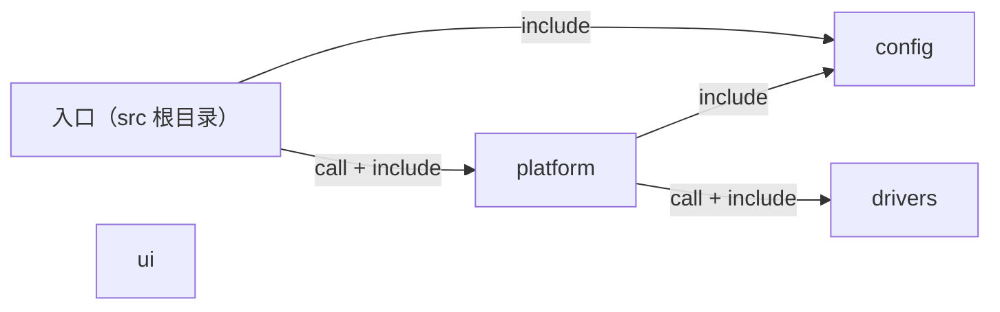
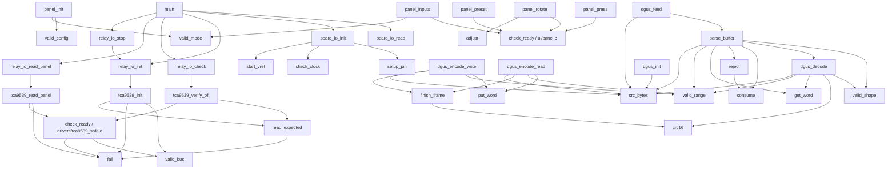

# HT 固件代码图谱

由 `firmware/tools/code_graph.py` 从实际源码生成，请勿手工修改。

在仓库根目录运行：

```powershell
python firmware/tools/code_graph.py
python firmware/tools/code_graph.py --check
```

`--check` 比较 Markdown 和 JSON；源码新增、删除或内容变化后未更新会返回非零状态。

机器数据：[代码图谱.json](代码图谱.json)。源码链接相对本文件，并带定义行号。

## 解析边界

- 仅扫描 firmware/src 下的 .c/.h；模块按一级目录划分，根目录文件归入口模块。
- 源码按 UTF-8 解码（允许 BOM），CRLF/CR 统一为 LF 后再解析和计算 SHA256；换行格式不影响图谱。
- 有界词法解析支持普通函数定义及 ISR_DIRECT_DECLARE；不是 C 编译器，不展开宏或计算条件编译。
- 直接调用边只连接可唯一定位的源码函数定义；注释、字符串和预处理指令不参与调用识别。
- 函数指针、成员调用、外部库和未知宏调用不能据此确定目标；同名冲突会列入诊断。
- 没有完整类型与作用域分析，复杂声明、宏生成代码或间接调用需人工核对，不能声称完整调用图。
- 设备树、线程调度、回调注册、DMA/中断触发及人工硬件依赖不属于自动调用证明。

## 模块关系

箭头由使用方指向被引用/调用方，节点名称来自源码目录。



## 职责与文件索引

职责仅提取文件头 `@brief`，不从目录名推断。

| 模块 | 源码 | 职责 | 函数定义数 |
|---|---|---|---:|
| config | [config/analog.h](<../../firmware/src/config/analog.h>) | 采样链标称参数，单位写入名称；实机换算仍须标定。 | 0 |
| drivers | [drivers/tca9539_safe.c](<../../firmware/src/drivers/tca9539_safe.c>) | 只允许清零继电器输出，失败即撤销就绪状态。 | 7 |
| drivers | [drivers/tca9539_safe.h](<../../firmware/src/drivers/tca9539_safe.h>) | TCA9539 安全初始化、全断寄存器检查与面板输入接口。 | 0 |
| 入口 | [main.c](<../../firmware/src/main.c>) | Run the output-disabled bring-up checks and change-only diagnostics. | 1 |
| platform | [platform/board_io.c](<../../firmware/src/platform/board_io.c>) | Initialize HT safe pins and check the clock and internal reference. | 5 |
| platform | [platform/board_io.h](<../../firmware/src/platform/board_io.h>) | HT board safe GPIO setup and diagnostic input snapshot. | 0 |
| platform | [platform/relay_io.c](<../../firmware/src/platform/relay_io.c>) | Adapt the portable TCA9539 driver to Zephyr I2C on HT MAIN-01. | 6 |
| platform | [platform/relay_io.h](<../../firmware/src/platform/relay_io.h>) | Single-owner relay-off checks and panel reads for safe bring-up. | 0 |
| ui | [ui/dgus.c](<../../firmware/src/ui/dgus.c>) | DGUS II 82/83 帧与 Modbus CRC，固定内存解析并在坏帧后重同步。 | 16 |
| ui | [ui/dgus.h](<../../firmware/src/ui/dgus.h>) | 有界 DGUS II 帧编解码与流式接收，不含串口配置或 HT 变量映射。 | 0 |
| ui | [ui/panel.c](<../../firmware/src/ui/panel.c>) | 维护面板参数与释放后启用条件，所有操作只生成软件请求。 | 9 |
| ui | [ui/panel.h](<../../firmware/src/ui/panel.h>) | 已消抖面板事件的设置状态与启停请求模型，不操作硬件。 | 0 |

## 函数定义

| 函数 | 定义位置 | 链接属性 | 可定位的直接被调函数 |
|---|---|---|---|
| `valid_bus` | [drivers/tca9539_safe.c:14](<../../firmware/src/drivers/tca9539_safe.c#L14>) | static | 无已定位调用 |
| `fail` | [drivers/tca9539_safe.c:20](<../../firmware/src/drivers/tca9539_safe.c#L20>) | static | 无已定位调用 |
| `read_expected` | [drivers/tca9539_safe.c:26](<../../firmware/src/drivers/tca9539_safe.c#L26>) | static | `fail` ([drivers/tca9539_safe.c:20](<../../firmware/src/drivers/tca9539_safe.c#L20>)) |
| `check_ready` | [drivers/tca9539_safe.c:39](<../../firmware/src/drivers/tca9539_safe.c#L39>) | static | `valid_bus` ([drivers/tca9539_safe.c:14](<../../firmware/src/drivers/tca9539_safe.c#L14>))、`fail` ([drivers/tca9539_safe.c:20](<../../firmware/src/drivers/tca9539_safe.c#L20>)) |
| `tca9539_init` | [drivers/tca9539_safe.c:53](<../../firmware/src/drivers/tca9539_safe.c#L53>) | external | `valid_bus` ([drivers/tca9539_safe.c:14](<../../firmware/src/drivers/tca9539_safe.c#L14>))、`fail` ([drivers/tca9539_safe.c:20](<../../firmware/src/drivers/tca9539_safe.c#L20>))、`read_expected` ([drivers/tca9539_safe.c:26](<../../firmware/src/drivers/tca9539_safe.c#L26>)) |
| `tca9539_verify_off` | [drivers/tca9539_safe.c:89](<../../firmware/src/drivers/tca9539_safe.c#L89>) | external | `read_expected` ([drivers/tca9539_safe.c:26](<../../firmware/src/drivers/tca9539_safe.c#L26>))、`check_ready` ([drivers/tca9539_safe.c:39](<../../firmware/src/drivers/tca9539_safe.c#L39>)) |
| `tca9539_read_panel` | [drivers/tca9539_safe.c:103](<../../firmware/src/drivers/tca9539_safe.c#L103>) | external | `fail` ([drivers/tca9539_safe.c:20](<../../firmware/src/drivers/tca9539_safe.c#L20>))、`check_ready` ([drivers/tca9539_safe.c:39](<../../firmware/src/drivers/tca9539_safe.c#L39>)) |
| `main` | [main.c:11](<../../firmware/src/main.c#L11>) | external | `board_io_read` ([platform/board_io.c:109](<../../firmware/src/platform/board_io.c#L109>))、`board_io_init` ([platform/board_io.c:76](<../../firmware/src/platform/board_io.c#L76>))、`relay_io_init` ([platform/relay_io.c:31](<../../firmware/src/platform/relay_io.c#L31>))、`relay_io_check` ([platform/relay_io.c:40](<../../firmware/src/platform/relay_io.c#L40>))、`relay_io_read_panel` ([platform/relay_io.c:45](<../../firmware/src/platform/relay_io.c#L45>))、`relay_io_stop` ([platform/relay_io.c:50](<../../firmware/src/platform/relay_io.c#L50>)) |
| `setup_pin` | [platform/board_io.c:35](<../../firmware/src/platform/board_io.c#L35>) | static | 无已定位调用 |
| `check_clock` | [platform/board_io.c:43](<../../firmware/src/platform/board_io.c#L43>) | static | 无已定位调用 |
| `start_vref` | [platform/board_io.c:54](<../../firmware/src/platform/board_io.c#L54>) | static | 无已定位调用 |
| `board_io_init` | [platform/board_io.c:76](<../../firmware/src/platform/board_io.c#L76>) | external | `setup_pin` ([platform/board_io.c:35](<../../firmware/src/platform/board_io.c#L35>))、`check_clock` ([platform/board_io.c:43](<../../firmware/src/platform/board_io.c#L43>))、`start_vref` ([platform/board_io.c:54](<../../firmware/src/platform/board_io.c#L54>)) |
| `board_io_read` | [platform/board_io.c:109](<../../firmware/src/platform/board_io.c#L109>) | external | 无已定位调用 |
| `read_reg` | [platform/relay_io.c:10](<../../firmware/src/platform/relay_io.c#L10>) | static | 无已定位调用 |
| `write_reg` | [platform/relay_io.c:17](<../../firmware/src/platform/relay_io.c#L17>) | static | 无已定位调用 |
| `relay_io_init` | [platform/relay_io.c:31](<../../firmware/src/platform/relay_io.c#L31>) | external | `tca9539_init` ([drivers/tca9539_safe.c:53](<../../firmware/src/drivers/tca9539_safe.c#L53>)) |
| `relay_io_check` | [platform/relay_io.c:40](<../../firmware/src/platform/relay_io.c#L40>) | external | `tca9539_verify_off` ([drivers/tca9539_safe.c:89](<../../firmware/src/drivers/tca9539_safe.c#L89>)) |
| `relay_io_read_panel` | [platform/relay_io.c:45](<../../firmware/src/platform/relay_io.c#L45>) | external | `tca9539_read_panel` ([drivers/tca9539_safe.c:103](<../../firmware/src/drivers/tca9539_safe.c#L103>)) |
| `relay_io_stop` | [platform/relay_io.c:50](<../../firmware/src/platform/relay_io.c#L50>) | external | `relay_io_init` ([platform/relay_io.c:31](<../../firmware/src/platform/relay_io.c#L31>)) |
| `crc_bytes` | [ui/dgus.c:9](<../../firmware/src/ui/dgus.c#L9>) | static | 无已定位调用 |
| `crc16` | [ui/dgus.c:20](<../../firmware/src/ui/dgus.c#L20>) | static | 无已定位调用 |
| `get_word` | [ui/dgus.c:33](<../../firmware/src/ui/dgus.c#L33>) | static | 无已定位调用 |
| `put_word` | [ui/dgus.c:38](<../../firmware/src/ui/dgus.c#L38>) | static | 无已定位调用 |
| `valid_range` | [ui/dgus.c:44](<../../firmware/src/ui/dgus.c#L44>) | static | 无已定位调用 |
| `finish_frame` | [ui/dgus.c:50](<../../firmware/src/ui/dgus.c#L50>) | static | `crc16` ([ui/dgus.c:20](<../../firmware/src/ui/dgus.c#L20>)) |
| `dgus_encode_write` | [ui/dgus.c:66](<../../firmware/src/ui/dgus.c#L66>) | external | `put_word` ([ui/dgus.c:38](<../../firmware/src/ui/dgus.c#L38>))、`valid_range` ([ui/dgus.c:44](<../../firmware/src/ui/dgus.c#L44>))、`finish_frame` ([ui/dgus.c:50](<../../firmware/src/ui/dgus.c#L50>))、`crc_bytes` ([ui/dgus.c:9](<../../firmware/src/ui/dgus.c#L9>)) |
| `dgus_encode_read` | [ui/dgus.c:93](<../../firmware/src/ui/dgus.c#L93>) | external | `put_word` ([ui/dgus.c:38](<../../firmware/src/ui/dgus.c#L38>))、`valid_range` ([ui/dgus.c:44](<../../firmware/src/ui/dgus.c#L44>))、`finish_frame` ([ui/dgus.c:50](<../../firmware/src/ui/dgus.c#L50>))、`crc_bytes` ([ui/dgus.c:9](<../../firmware/src/ui/dgus.c#L9>)) |
| `valid_shape` | [ui/dgus.c:113](<../../firmware/src/ui/dgus.c#L113>) | static | 无已定位调用 |
| `dgus_decode` | [ui/dgus.c:126](<../../firmware/src/ui/dgus.c#L126>) | external | `valid_shape` ([ui/dgus.c:113](<../../firmware/src/ui/dgus.c#L113>))、`crc16` ([ui/dgus.c:20](<../../firmware/src/ui/dgus.c#L20>))、`get_word` ([ui/dgus.c:33](<../../firmware/src/ui/dgus.c#L33>))、`valid_range` ([ui/dgus.c:44](<../../firmware/src/ui/dgus.c#L44>))、`crc_bytes` ([ui/dgus.c:9](<../../firmware/src/ui/dgus.c#L9>)) |
| `dgus_init` | [ui/dgus.c:191](<../../firmware/src/ui/dgus.c#L191>) | external | `crc_bytes` ([ui/dgus.c:9](<../../firmware/src/ui/dgus.c#L9>)) |
| `consume` | [ui/dgus.c:210](<../../firmware/src/ui/dgus.c#L210>) | static | 无已定位调用 |
| `reject` | [ui/dgus.c:216](<../../firmware/src/ui/dgus.c#L216>) | static | `consume` ([ui/dgus.c:210](<../../firmware/src/ui/dgus.c#L210>)) |
| `parse_buffer` | [ui/dgus.c:224](<../../firmware/src/ui/dgus.c#L224>) | static | `valid_shape` ([ui/dgus.c:113](<../../firmware/src/ui/dgus.c#L113>))、`dgus_decode` ([ui/dgus.c:126](<../../firmware/src/ui/dgus.c#L126>))、`consume` ([ui/dgus.c:210](<../../firmware/src/ui/dgus.c#L210>))、`reject` ([ui/dgus.c:216](<../../firmware/src/ui/dgus.c#L216>))、`get_word` ([ui/dgus.c:33](<../../firmware/src/ui/dgus.c#L33>))、`valid_range` ([ui/dgus.c:44](<../../firmware/src/ui/dgus.c#L44>))、`crc_bytes` ([ui/dgus.c:9](<../../firmware/src/ui/dgus.c#L9>)) |
| `dgus_feed` | [ui/dgus.c:276](<../../firmware/src/ui/dgus.c#L276>) | external | `parse_buffer` ([ui/dgus.c:224](<../../firmware/src/ui/dgus.c#L224>))、`crc_bytes` ([ui/dgus.c:9](<../../firmware/src/ui/dgus.c#L9>)) |
| `dgus_reset` | [ui/dgus.c:294](<../../firmware/src/ui/dgus.c#L294>) | external | 无已定位调用 |
| `valid_mode` | [ui/panel.c:6](<../../firmware/src/ui/panel.c#L6>) | static | 无已定位调用 |
| `valid_config` | [ui/panel.c:11](<../../firmware/src/ui/panel.c#L11>) | static | 无已定位调用 |
| `check_ready` | [ui/panel.c:25](<../../firmware/src/ui/panel.c#L25>) | static | 无已定位调用 |
| `adjust` | [ui/panel.c:33](<../../firmware/src/ui/panel.c#L33>) | static | 无已定位调用 |
| `panel_init` | [ui/panel.c:47](<../../firmware/src/ui/panel.c#L47>) | external | `valid_config` ([ui/panel.c:11](<../../firmware/src/ui/panel.c#L11>))、`valid_mode` ([ui/panel.c:6](<../../firmware/src/ui/panel.c#L6>)) |
| `panel_rotate` | [ui/panel.c:77](<../../firmware/src/ui/panel.c#L77>) | external | `check_ready` ([ui/panel.c:25](<../../firmware/src/ui/panel.c#L25>))、`adjust` ([ui/panel.c:33](<../../firmware/src/ui/panel.c#L33>)) |
| `panel_press` | [ui/panel.c:114](<../../firmware/src/ui/panel.c#L114>) | external | `check_ready` ([ui/panel.c:25](<../../firmware/src/ui/panel.c#L25>)) |
| `panel_preset` | [ui/panel.c:132](<../../firmware/src/ui/panel.c#L132>) | external | `check_ready` ([ui/panel.c:25](<../../firmware/src/ui/panel.c#L25>)) |
| `panel_inputs` | [ui/panel.c:153](<../../firmware/src/ui/panel.c#L153>) | external | `check_ready` ([ui/panel.c:25](<../../firmware/src/ui/panel.c#L25>))、`valid_mode` ([ui/panel.c:6](<../../firmware/src/ui/panel.c#L6>)) |

## 源码直接调用图

只画参与已定位调用的函数；同名函数通过文件路径区分。



## 未解析项与诊断

未解析调用形式共 37 处，详见 JSON 的 `unresolved_calls`。这不表示调用错误或无效。

未发现函数命名冲突或无法定位的项目内引号引用。
