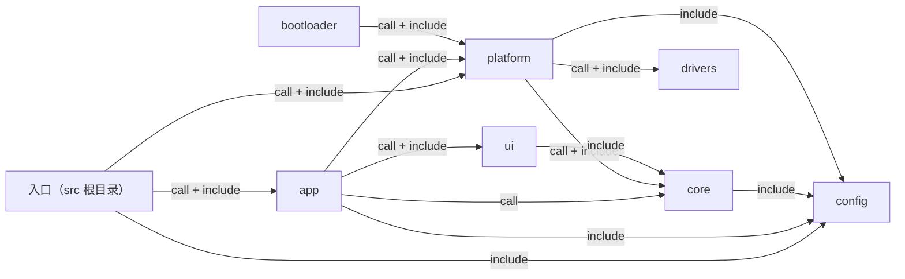

# HT 固件代码图谱

由 `firmware/tools/code_graph.py` 从实际源码生成，请勿手工修改。

在仓库根目录运行：

```powershell
python firmware/tools/code_graph.py
python firmware/tools/code_graph.py --check
```

`--check` 比较 Markdown 和 JSON；源码新增、删除或内容变化后未更新会返回非零状态。

机器数据：[代码图谱.json](代码图谱.json)。源码链接相对本文件，并带定义行号。

## 解析边界

- 仅扫描 firmware/src 与 firmware/bootloader/src 下的原创 .c/.h；后者归 bootloader 模块，不扫描第三方 MCUboot。
- 源码按 UTF-8 解码（允许 BOM），CRLF/CR 统一为 LF 后再解析和计算 SHA256；换行格式不影响图谱。
- 有界词法解析支持普通函数定义及 ISR_DIRECT_DECLARE；不是 C 编译器，不展开宏或计算条件编译。
- 直接调用边只连接可唯一定位的源码函数定义；注释、字符串和预处理指令不参与调用识别。
- 函数指针、成员调用、外部库和未知宏调用不能据此确定目标；同名冲突会列入诊断。
- 没有完整类型与作用域分析，复杂声明、宏生成代码或间接调用需人工核对，不能声称完整调用图。
- 设备树、线程调度、回调注册、DMA/中断触发及人工硬件依赖不属于自动调用证明。

## 模块关系

箭头由使用方指向被引用/调用方，节点名称来自源码目录。



## 职责与文件索引

职责仅提取文件头 `@brief`，不从目录名推断。

| 模块 | 源码 | 职责 | 函数定义数 |
|---|---|---|---:|
| bootloader | [firmware/bootloader/src/safe.c](<../../firmware/bootloader/src/safe.c>) | 引导期间保持数字输出安全与继电器全断，故障只允许串口恢复。 | 4 |
| app | [app/dds_bench.c](<../../firmware/src/app/dds_bench.c>) | shell和屏幕共用请求队列，主线程复核许可并执行限幅、限时DAC输出。 | 20 |
| app | [app/dds_bench.h](<../../firmware/src/app/dds_bench.h>) | 有界、默认停止的DAC台架命令服务；不控制继电器或CC目标。 | 0 |
| app | [app/output.c](<../../firmware/src/app/output.c>) | 独立输出线程执行控制；STOP取消待启动，硬件保护ISR直接静音。 | 14 |
| app | [app/output.h](<../../firmware/src/app/output.h>) | 屏幕只提交整机启停请求；后台负责继电器、测量与恒VA控制。 | 0 |
| app | [app/screen_bridge.c](<../../firmware/src/app/screen_bridge.c>) | Forward USART1/USART3 bytes while periodically verifying relay-off registers. | 2 |
| app | [app/screen_bridge.h](<../../firmware/src/app/screen_bridge.h>) | Transparent host/display UART bridge with relay-off supervision. | 0 |
| app | [app/screen_panel.c](<../../firmware/src/app/screen_panel.c>) | 面板导航、温度和日志；正式输出自动匹配，频率和VA由面板提交。 | 20 |
| app | [app/screen_panel.h](<../../firmware/src/app/screen_panel.h>) | 屏幕与面板联调；可选DAC台架控制，继电器保持全断。 | 0 |
| config | [config/analog.h](<../../firmware/src/config/analog.h>) | 采样链标称参数，单位写入名称；实机换算仍须标定。 | 0 |
| core | [core/dds.c](<../../firmware/src/core/dds.c>) | 固定Q15正弦表生成有界12位波形和四个精确频率挡位。 | 2 |
| core | [core/dds.h](<../../firmware/src/core/dds.h>) | 85点整数正弦与170MHz定时器分频，不访问硬件。 | 0 |
| core | [core/event_log.c](<../../firmware/src/core/event_log.c>) | 固定容量事件环缓冲，按从新到旧的偏移复制记录。 | 4 |
| core | [core/event_log.h](<../../firmware/src/core/event_log.h>) | 保存本次上电的有限事件记录，不依赖硬件、时钟或日志后端。 | 0 |
| core | [core/ntc.c](<../../firmware/src/core/ntc.c>) | 由分压求NTC阻值，按用户141点Rnorm表线性插值。 | 2 |
| core | [core/ntc.h](<../../firmware/src/core/ntc.h>) | 用户阻温表的纯C换算，输出0.1摄氏度，不访问硬件。 | 0 |
| core | [core/power.c](<../../firmware/src/core/power.c>) | 静音后先断后合，按真实VA反馈积分调幅；停止/故障取消后续合闸。 | 13 |
| core | [core/power.h](<../../firmware/src/core/power.h>) | 恒VA输出状态机；所有硬件动作经单一所有者的回调执行。 | 0 |
| core | [core/rms.c](<../../firmware/src/core/rms.c>) | 整数累积避免小信号精度损失，窗口收尾仅两次平方根。 | 3 |
| core | [core/rms.h](<../../firmware/src/core/rms.h>) | 配对ADC码值累积为交流RMS和视在功率，不推定有功功率。 | 0 |
| drivers | [drivers/tca9539_safe.c](<../../firmware/src/drivers/tca9539_safe.c>) | 校验继电器寄存器和单抽头互斥，失败即撤销就绪状态。 | 9 |
| drivers | [drivers/tca9539_safe.h](<../../firmware/src/drivers/tca9539_safe.h>) | TCA9539 安全初始化、全断寄存器检查与面板输入接口。 | 0 |
| 入口 | [main.c](<../../firmware/src/main.c>) | Initialize relay-off bring-up and dispatch the selected service. | 1 |
| platform | [platform/board_io.c](<../../firmware/src/platform/board_io.c>) | Initialize HT safe pins and check the clock and internal reference. | 8 |
| platform | [platform/board_io.h](<../../firmware/src/platform/board_io.h>) | HT board safe GPIO setup and diagnostic input snapshot. | 0 |
| platform | [platform/dds_io.c](<../../firmware/src/platform/dds_io.c>) | 独占DAC1/TIM6/DMA1通道1；输出模式仅在DMA空闲半区调幅。 | 16 |
| platform | [platform/dds_io.h](<../../firmware/src/platform/dds_io.h>) | PA4 DAC台架波形的独占配置、启停和故障状态。 | 0 |
| platform | [platform/relay_io.c](<../../firmware/src/platform/relay_io.c>) | Adapt the portable TCA9539 driver to Zephyr I2C on HT MAIN-01. | 12 |
| platform | [platform/relay_io.h](<../../firmware/src/platform/relay_io.h>) | Single-owner relay-off checks and panel reads for safe bring-up. | 0 |
| platform | [platform/screen_uart.c](<../../firmware/src/platform/screen_uart.c>) | Buffer UART RX in interrupts and latch communication failures. | 10 |
| platform | [platform/screen_uart.h](<../../firmware/src/platform/screen_uart.h>) | Interrupt-buffered display/host UART transport for screen bring-up. | 0 |
| platform | [platform/signal_io.c](<../../firmware/src/platform/signal_io.c>) | 双ADC持续采集，待机仅开采样时钟；NTC维护后丢弃首半区。 | 16 |
| platform | [platform/signal_io.h](<../../firmware/src/platform/signal_io.h>) | 正式输出的ADC12与DDS协调者，温度维护不与独立温度驱动并用。 | 0 |
| platform | [platform/temperature_io.c](<../../firmware/src/platform/temperature_io.c>) | ADC1单端软件触发读三路NTC，所有硬件等待有截止时间。 | 8 |
| platform | [platform/temperature_io.h](<../../firmware/src/platform/temperature_io.h>) | 三路NTC的有界慢采样，独占ADC12资源，不启动激励。 | 0 |
| ui | [ui/dgus.c](<../../firmware/src/ui/dgus.c>) | DGUS II 82/83 帧与 Modbus CRC，固定内存解析并在坏帧后重同步。 | 16 |
| ui | [ui/dgus.h](<../../firmware/src/ui/dgus.h>) | 有界 DGUS II 帧编解码与流式接收，不含串口配置或 HT 变量映射。 | 0 |
| ui | [ui/encoder.c](<../../firmware/src/ui/encoder.c>) | 累计合法 Gray 转换并抵消回摆，非法跳变丢弃未完成格数。 | 2 |
| ui | [ui/encoder.h](<../../firmware/src/ui/encoder.h>) | 可配置整格转换数的 A/B 正交解码，只生成旋转格数。 | 0 |
| ui | [ui/panel.c](<../../firmware/src/ui/panel.c>) | 选档先编辑草稿再提交，导航与输出许可相互独立。 | 13 |
| ui | [ui/panel.h](<../../firmware/src/ui/panel.h>) | 已消抖面板导航、选档草稿与启停请求模型，不操作硬件。 | 0 |
| ui | [ui/view.c](<../../firmware/src/ui/view.c>) | 格式化状态、独立候选值与事件记录，同步屏幕契约。 | 10 |
| ui | [ui/view.h](<../../firmware/src/ui/view.h>) | 仪表、设置和事件日志快照，不执行测量或挡位切换。 | 0 |

## 函数定义

| 函数 | 定义位置 | 链接属性 | 可定位的直接被调函数 |
|---|---|---|---|
| `stop` | [firmware/bootloader/src/safe.c:21](<../../firmware/bootloader/src/safe.c#L21>) | static | `relay_io_stop` ([platform/relay_io.c:88](<../../firmware/src/platform/relay_io.c#L88>)) |
| `mcuboot_watchdog_feed` | [firmware/bootloader/src/safe.c:28](<../../firmware/bootloader/src/safe.c#L28>) | external | `stop` ([firmware/bootloader/src/safe.c:21](<../../firmware/bootloader/src/safe.c#L21>))、`relay_io_check` ([platform/relay_io.c:58](<../../firmware/src/platform/relay_io.c#L58>)) |
| `boot_go_hook` | [firmware/bootloader/src/safe.c:40](<../../firmware/bootloader/src/safe.c#L40>) | external | 无已定位调用 |
| `mcuboot_status_change` | [firmware/bootloader/src/safe.c:49](<../../firmware/bootloader/src/safe.c#L49>) | external | `stop` ([firmware/bootloader/src/safe.c:21](<../../firmware/bootloader/src/safe.c#L21>))、`board_io_init_digital` ([platform/board_io.c:138](<../../firmware/src/platform/board_io.c#L138>))、`relay_io_init` ([platform/relay_io.c:50](<../../firmware/src/platform/relay_io.c#L50>))、`relay_io_check` ([platform/relay_io.c:58](<../../firmware/src/platform/relay_io.c#L58>)) |
| `clear_requests` | [app/dds_bench.c:40](<../../firmware/src/app/dds_bench.c#L40>) | static | 无已定位调用 |
| `valid_frequency` | [app/dds_bench.c:48](<../../firmware/src/app/dds_bench.c#L48>) | static | 无已定位调用 |
| `dds_bench_request_start` | [app/dds_bench.c:54](<../../firmware/src/app/dds_bench.c#L54>) | external | `valid_frequency` ([app/dds_bench.c:48](<../../firmware/src/app/dds_bench.c#L48>)) |
| `dds_bench_request_stop` | [app/dds_bench.c:85](<../../firmware/src/app/dds_bench.c#L85>) | external | 无已定位调用 |
| `cancelled` | [app/dds_bench.c:99](<../../firmware/src/app/dds_bench.c#L99>) | static | 无已定位调用 |
| `dequeue` | [app/dds_bench.c:108](<../../firmware/src/app/dds_bench.c#L108>) | static | 无已定位调用 |
| `publish` | [app/dds_bench.c:122](<../../firmware/src/app/dds_bench.c#L122>) | static | 无已定位调用 |
| `dds_bench_snapshot` | [app/dds_bench.c:133](<../../firmware/src/app/dds_bench.c#L133>) | external | 无已定位调用 |
| `stop_output` | [app/dds_bench.c:145](<../../firmware/src/app/dds_bench.c#L145>) | static | `dds_io_fault_stop` ([platform/dds_io.c:129](<../../firmware/src/platform/dds_io.c#L129>))、`dds_io_stop` ([platform/dds_io.c:370](<../../firmware/src/platform/dds_io.c#L370>))、`dds_io_snapshot` ([platform/dds_io.c:441](<../../firmware/src/platform/dds_io.c#L441>)) |
| `begin_stop` | [app/dds_bench.c:176](<../../firmware/src/app/dds_bench.c#L176>) | static | 无已定位调用 |
| `finish_stop` | [app/dds_bench.c:187](<../../firmware/src/app/dds_bench.c#L187>) | static | 无已定位调用 |
| `fail` | [app/dds_bench.c:198](<../../firmware/src/app/dds_bench.c#L198>) | static | `stop_output` ([app/dds_bench.c:145](<../../firmware/src/app/dds_bench.c#L145>))、`begin_stop` ([app/dds_bench.c:176](<../../firmware/src/app/dds_bench.c#L176>))、`finish_stop` ([app/dds_bench.c:187](<../../firmware/src/app/dds_bench.c#L187>))、`dds_io_fault_stop` ([platform/dds_io.c:129](<../../firmware/src/platform/dds_io.c#L129>)) |
| `dds_bench_init` | [app/dds_bench.c:210](<../../firmware/src/app/dds_bench.c#L210>) | external | `begin_stop` ([app/dds_bench.c:176](<../../firmware/src/app/dds_bench.c#L176>))、`finish_stop` ([app/dds_bench.c:187](<../../firmware/src/app/dds_bench.c#L187>))、`fail` ([app/dds_bench.c:198](<../../firmware/src/app/dds_bench.c#L198>))、`dds_io_init` ([platform/dds_io.c:216](<../../firmware/src/platform/dds_io.c#L216>))、`dds_io_snapshot` ([platform/dds_io.c:441](<../../firmware/src/platform/dds_io.c#L441>)) |
| `dds_bench_stop` | [app/dds_bench.c:234](<../../firmware/src/app/dds_bench.c#L234>) | external | `stop_output` ([app/dds_bench.c:145](<../../firmware/src/app/dds_bench.c#L145>))、`begin_stop` ([app/dds_bench.c:176](<../../firmware/src/app/dds_bench.c#L176>))、`finish_stop` ([app/dds_bench.c:187](<../../firmware/src/app/dds_bench.c#L187>)) |
| `start_output` | [app/dds_bench.c:247](<../../firmware/src/app/dds_bench.c#L247>) | static | `fail` ([app/dds_bench.c:198](<../../firmware/src/app/dds_bench.c#L198>))、`valid_frequency` ([app/dds_bench.c:48](<../../firmware/src/app/dds_bench.c#L48>))、`cancelled` ([app/dds_bench.c:99](<../../firmware/src/app/dds_bench.c#L99>))、`dds_io_configure` ([platform/dds_io.c:283](<../../firmware/src/platform/dds_io.c#L283>))、`dds_io_start` ([platform/dds_io.c:319](<../../firmware/src/platform/dds_io.c#L319>))、`dds_io_snapshot` ([platform/dds_io.c:441](<../../firmware/src/platform/dds_io.c#L441>)) |
| `dds_bench_poll` | [app/dds_bench.c:300](<../../firmware/src/app/dds_bench.c#L300>) | external | `dequeue` ([app/dds_bench.c:108](<../../firmware/src/app/dds_bench.c#L108>))、`publish` ([app/dds_bench.c:122](<../../firmware/src/app/dds_bench.c#L122>))、`begin_stop` ([app/dds_bench.c:176](<../../firmware/src/app/dds_bench.c#L176>))、`finish_stop` ([app/dds_bench.c:187](<../../firmware/src/app/dds_bench.c#L187>))、`fail` ([app/dds_bench.c:198](<../../firmware/src/app/dds_bench.c#L198>))、`dds_bench_stop` ([app/dds_bench.c:234](<../../firmware/src/app/dds_bench.c#L234>))、`start_output` ([app/dds_bench.c:247](<../../firmware/src/app/dds_bench.c#L247>))、`clear_requests` ([app/dds_bench.c:40](<../../firmware/src/app/dds_bench.c#L40>))、`dds_io_check` ([platform/dds_io.c:432](<../../firmware/src/platform/dds_io.c#L432>))、`dds_io_snapshot` ([platform/dds_io.c:441](<../../firmware/src/platform/dds_io.c#L441>)) |
| `parse_number` | [app/dds_bench.c:367](<../../firmware/src/app/dds_bench.c#L367>) | static | 无已定位调用 |
| `command_start` | [app/dds_bench.c:384](<../../firmware/src/app/dds_bench.c#L384>) | static | `parse_number` ([app/dds_bench.c:367](<../../firmware/src/app/dds_bench.c#L367>))、`valid_frequency` ([app/dds_bench.c:48](<../../firmware/src/app/dds_bench.c#L48>))、`dds_bench_request_start` ([app/dds_bench.c:54](<../../firmware/src/app/dds_bench.c#L54>)) |
| `command_stop` | [app/dds_bench.c:409](<../../firmware/src/app/dds_bench.c#L409>) | static | `dds_bench_request_stop` ([app/dds_bench.c:85](<../../firmware/src/app/dds_bench.c#L85>)) |
| `command_status` | [app/dds_bench.c:419](<../../firmware/src/app/dds_bench.c#L419>) | static | `dds_bench_snapshot` ([app/dds_bench.c:133](<../../firmware/src/app/dds_bench.c#L133>)) |
| `mute` | [app/output.c:29](<../../firmware/src/app/output.c#L29>) | static | `signal_io_stop` ([platform/signal_io.c:274](<../../firmware/src/platform/signal_io.c#L274>)) |
| `select_range` | [app/output.c:30](<../../firmware/src/app/output.c#L30>) | static | `relay_io_select` ([platform/relay_io.c:79](<../../firmware/src/platform/relay_io.c#L79>))、`signal_io_failed` ([platform/signal_io.c:63](<../../firmware/src/platform/signal_io.c#L63>)) |
| `start_signal` | [app/output.c:38](<../../firmware/src/app/output.c#L38>) | static | `signal_io_start` ([platform/signal_io.c:259](<../../firmware/src/platform/signal_io.c#L259>)) |
| `level` | [app/output.c:39](<../../firmware/src/app/output.c#L39>) | static | `dds_io_set_amplitude` ([platform/dds_io.c:417](<../../firmware/src/platform/dds_io.c#L417>)) |
| `now_ms` | [app/output.c:40](<../../firmware/src/app/output.c#L40>) | static | 无已定位调用 |
| `cancelled` | [app/output.c:41](<../../firmware/src/app/output.c#L41>) | static | 无已定位调用 |
| `protection` | [app/output.c:50](<../../firmware/src/app/output.c#L50>) | static | `signal_io_fault` ([platform/signal_io.c:51](<../../firmware/src/platform/signal_io.c#L51>)) |
| `output_init` | [app/output.c:56](<../../firmware/src/app/output.c#L56>) | external | `power_init` ([core/power.c:23](<../../firmware/src/core/power.c#L23>))、`signal_io_init` ([platform/signal_io.c:211](<../../firmware/src/platform/signal_io.c#L211>))、`signal_io_stop` ([platform/signal_io.c:274](<../../firmware/src/platform/signal_io.c#L274>))、`signal_io_fault` ([platform/signal_io.c:51](<../../firmware/src/platform/signal_io.c#L51>)) |
| `output_inputs` | [app/output.c:91](<../../firmware/src/app/output.c#L91>) | external | 无已定位调用 |
| `output_start` | [app/output.c:102](<../../firmware/src/app/output.c#L102>) | external | 无已定位调用 |
| `output_stop` | [app/output.c:118](<../../firmware/src/app/output.c#L118>) | external | 无已定位调用 |
| `output_snapshot` | [app/output.c:127](<../../firmware/src/app/output.c#L127>) | external | 无已定位调用 |
| `output_shutdown` | [app/output.c:134](<../../firmware/src/app/output.c#L134>) | external | `signal_io_fault` ([platform/signal_io.c:51](<../../firmware/src/platform/signal_io.c#L51>)) |
| `run` | [app/output.c:145](<../../firmware/src/app/output.c#L145>) | static | `power_poll` ([core/power.c:178](<../../firmware/src/core/power.c#L178>))、`power_fail` ([core/power.c:30](<../../firmware/src/core/power.c#L30>))、`power_start` ([core/power.c:62](<../../firmware/src/core/power.c#L62>))、`power_stop` ([core/power.c:86](<../../firmware/src/core/power.c#L86>))、`board_io_read` ([platform/board_io.c:144](<../../firmware/src/platform/board_io.c#L144>))、`signal_io_poll` ([platform/signal_io.c:311](<../../firmware/src/platform/signal_io.c#L311>))、`signal_io_failed` ([platform/signal_io.c:63](<../../firmware/src/platform/signal_io.c#L63>)) |
| `forward` | [app/screen_bridge.c:8](<../../firmware/src/app/screen_bridge.c#L8>) | static | `screen_uart_read` ([platform/screen_uart.c:182](<../../firmware/src/platform/screen_uart.c#L182>))、`screen_uart_write` ([platform/screen_uart.c:206](<../../firmware/src/platform/screen_uart.c#L206>)) |
| `screen_bridge_run` | [app/screen_bridge.c:21](<../../firmware/src/app/screen_bridge.c#L21>) | external | `forward` ([app/screen_bridge.c:8](<../../firmware/src/app/screen_bridge.c#L8>))、`relay_io_check` ([platform/relay_io.c:58](<../../firmware/src/platform/relay_io.c#L58>))、`screen_uart_init` ([platform/screen_uart.c:116](<../../firmware/src/platform/screen_uart.c#L116>))、`screen_uart_stop` ([platform/screen_uart.c:258](<../../firmware/src/platform/screen_uart.c#L258>)) |
| `request_stop` | [app/screen_panel.c:120](<../../firmware/src/app/screen_panel.c#L120>) | static | `dds_bench_request_stop` ([app/dds_bench.c:85](<../../firmware/src/app/dds_bench.c#L85>))、`output_stop` ([app/output.c:118](<../../firmware/src/app/output.c#L118>)) |
| `request_start` | [app/screen_panel.c:129](<../../firmware/src/app/screen_panel.c#L129>) | static | `dds_bench_request_start` ([app/dds_bench.c:54](<../../firmware/src/app/dds_bench.c#L54>))、`output_start` ([app/output.c:102](<../../firmware/src/app/output.c#L102>)) |
| `update_output` | [app/screen_panel.c:142](<../../firmware/src/app/screen_panel.c#L142>) | static | `output_snapshot` ([app/output.c:127](<../../firmware/src/app/output.c#L127>))、`output_inputs` ([app/output.c:91](<../../firmware/src/app/output.c#L91>))、`record_event` ([app/screen_panel.c:215](<../../firmware/src/app/screen_panel.c#L215>))、`panel_set_output_state` ([ui/panel.c:183](<../../firmware/src/ui/panel.c#L183>))、`panel_range_ohm` ([ui/panel.c:36](<../../firmware/src/ui/panel.c#L36>)) |
| `update_dds` | [app/screen_panel.c:170](<../../firmware/src/app/screen_panel.c#L170>) | static | `dds_bench_snapshot` ([app/dds_bench.c:133](<../../firmware/src/app/dds_bench.c#L133>))、`dds_bench_stop` ([app/dds_bench.c:234](<../../firmware/src/app/dds_bench.c#L234>))、`dds_bench_poll` ([app/dds_bench.c:300](<../../firmware/src/app/dds_bench.c#L300>))、`record_event` ([app/screen_panel.c:215](<../../firmware/src/app/screen_panel.c#L215>))、`panel_set_output_state` ([ui/panel.c:183](<../../firmware/src/ui/panel.c#L183>)) |
| `scroll_log` | [app/screen_panel.c:206](<../../firmware/src/app/screen_panel.c#L206>) | static | `event_log_count` ([core/event_log.c:45](<../../firmware/src/core/event_log.c#L45>)) |
| `record_event` | [app/screen_panel.c:215](<../../firmware/src/app/screen_panel.c#L215>) | static | `scroll_log` ([app/screen_panel.c:206](<../../firmware/src/app/screen_panel.c#L206>))、`event_log_add` ([core/event_log.c:11](<../../firmware/src/core/event_log.c#L11>)) |
| `update_digital` | [app/screen_panel.c:222](<../../firmware/src/app/screen_panel.c#L222>) | static | `record_event` ([app/screen_panel.c:215](<../../firmware/src/app/screen_panel.c#L215>)) |
| `update_temperature` | [app/screen_panel.c:240](<../../firmware/src/app/screen_panel.c#L240>) | static | `record_event` ([app/screen_panel.c:215](<../../firmware/src/app/screen_panel.c#L215>))、`temperature_io_read` ([platform/temperature_io.c:203](<../../firmware/src/platform/temperature_io.c#L203>))、`temperature_io_stop` ([platform/temperature_io.c:71](<../../firmware/src/platform/temperature_io.c#L71>)) |
| `read_encoder` | [app/screen_panel.c:271](<../../firmware/src/app/screen_panel.c#L271>) | static | 无已定位调用 |
| `encoder_edge` | [app/screen_panel.c:283](<../../firmware/src/app/screen_panel.c#L283>) | static | `read_encoder` ([app/screen_panel.c:271](<../../firmware/src/app/screen_panel.c#L271>))、`encoder_update` ([ui/encoder.c:29](<../../firmware/src/ui/encoder.c#L29>)) |
| `stop_encoder` | [app/screen_panel.c:315](<../../firmware/src/app/screen_panel.c#L315>) | static | 无已定位调用 |
| `start_encoder` | [app/screen_panel.c:336](<../../firmware/src/app/screen_panel.c#L336>) | static | `read_encoder` ([app/screen_panel.c:271](<../../firmware/src/app/screen_panel.c#L271>))、`encoder_init` ([ui/encoder.c:6](<../../firmware/src/ui/encoder.c#L6>)) |
| `update_keys` | [app/screen_panel.c:381](<../../firmware/src/app/screen_panel.c#L381>) | static | `request_stop` ([app/screen_panel.c:120](<../../firmware/src/app/screen_panel.c#L120>))、`request_start` ([app/screen_panel.c:129](<../../firmware/src/app/screen_panel.c#L129>))、`scroll_log` ([app/screen_panel.c:206](<../../firmware/src/app/screen_panel.c#L206>))、`record_event` ([app/screen_panel.c:215](<../../firmware/src/app/screen_panel.c#L215>))、`panel_pressed_keys` ([ui/panel.c:46](<../../firmware/src/ui/panel.c#L46>))、`panel_key` ([ui/panel.c:80](<../../firmware/src/ui/panel.c#L80>)) |
| `update_inputs` | [app/screen_panel.c:460](<../../firmware/src/app/screen_panel.c#L460>) | static | `request_stop` ([app/screen_panel.c:120](<../../firmware/src/app/screen_panel.c#L120>))、`scroll_log` ([app/screen_panel.c:206](<../../firmware/src/app/screen_panel.c#L206>))、`update_digital` ([app/screen_panel.c:222](<../../firmware/src/app/screen_panel.c#L222>))、`update_keys` ([app/screen_panel.c:381](<../../firmware/src/app/screen_panel.c#L381>))、`board_io_read` ([platform/board_io.c:144](<../../firmware/src/platform/board_io.c#L144>))、`relay_io_check` ([platform/relay_io.c:58](<../../firmware/src/platform/relay_io.c#L58>))、`relay_io_read_panel` ([platform/relay_io.c:70](<../../firmware/src/platform/relay_io.c#L70>))、`panel_rotate` ([ui/panel.c:147](<../../firmware/src/ui/panel.c#L147>))、`panel_inputs` ([ui/panel.c:224](<../../firmware/src/ui/panel.c#L224>)) |
| `receive_frame` | [app/screen_panel.c:509](<../../firmware/src/app/screen_panel.c#L509>) | static | 无已定位调用 |
| `update_link` | [app/screen_panel.c:522](<../../firmware/src/app/screen_panel.c#L522>) | static | `record_event` ([app/screen_panel.c:215](<../../firmware/src/app/screen_panel.c#L215>))、`screen_uart_read` ([platform/screen_uart.c:182](<../../firmware/src/platform/screen_uart.c#L182>))、`screen_uart_write` ([platform/screen_uart.c:206](<../../firmware/src/platform/screen_uart.c#L206>))、`screen_uart_check` ([platform/screen_uart.c:228](<../../firmware/src/platform/screen_uart.c#L228>))、`dgus_init` ([ui/dgus.c:191](<../../firmware/src/ui/dgus.c#L191>))、`dgus_feed` ([ui/dgus.c:276](<../../firmware/src/ui/dgus.c#L276>))、`dgus_reset` ([ui/dgus.c:294](<../../firmware/src/ui/dgus.c#L294>))、`dgus_encode_read` ([ui/dgus.c:93](<../../firmware/src/ui/dgus.c#L93>))、`view_reset` ([ui/view.c:223](<../../firmware/src/ui/view.c#L223>)) |
| `display_send` | [app/screen_panel.c:600](<../../firmware/src/app/screen_panel.c#L600>) | static | `update_output` ([app/screen_panel.c:142](<../../firmware/src/app/screen_panel.c#L142>))、`update_dds` ([app/screen_panel.c:170](<../../firmware/src/app/screen_panel.c#L170>))、`update_inputs` ([app/screen_panel.c:460](<../../firmware/src/app/screen_panel.c#L460>))、`screen_uart_write` ([platform/screen_uart.c:206](<../../firmware/src/platform/screen_uart.c#L206>)) |
| `snapshot` | [app/screen_panel.c:624](<../../firmware/src/app/screen_panel.c#L624>) | static | `dds_bench_snapshot` ([app/dds_bench.c:133](<../../firmware/src/app/dds_bench.c#L133>))、`output_snapshot` ([app/output.c:127](<../../firmware/src/app/output.c#L127>))、`event_log_get` ([core/event_log.c:27](<../../firmware/src/core/event_log.c#L27>))、`event_log_count` ([core/event_log.c:45](<../../firmware/src/core/event_log.c#L45>))、`panel_draft_changed` ([ui/panel.c:177](<../../firmware/src/ui/panel.c#L177>))、`panel_range_ohm` ([ui/panel.c:36](<../../firmware/src/ui/panel.c#L36>))、`panel_frequency_hz` ([ui/panel.c:41](<../../firmware/src/ui/panel.c#L41>)) |
| `refresh_display` | [app/screen_panel.c:703](<../../firmware/src/app/screen_panel.c#L703>) | static | `display_send` ([app/screen_panel.c:600](<../../firmware/src/app/screen_panel.c#L600>))、`snapshot` ([app/screen_panel.c:624](<../../firmware/src/app/screen_panel.c#L624>))、`dgus_encode_write` ([ui/dgus.c:66](<../../firmware/src/ui/dgus.c#L66>))、`view_refresh` ([ui/view.c:230](<../../firmware/src/ui/view.c#L230>)) |
| `screen_panel_run` | [app/screen_panel.c:730](<../../firmware/src/app/screen_panel.c#L730>) | external | `dds_bench_init` ([app/dds_bench.c:210](<../../firmware/src/app/dds_bench.c#L210>))、`dds_bench_stop` ([app/dds_bench.c:234](<../../firmware/src/app/dds_bench.c#L234>))、`output_shutdown` ([app/output.c:134](<../../firmware/src/app/output.c#L134>))、`output_init` ([app/output.c:56](<../../firmware/src/app/output.c#L56>))、`update_output` ([app/screen_panel.c:142](<../../firmware/src/app/screen_panel.c#L142>))、`update_dds` ([app/screen_panel.c:170](<../../firmware/src/app/screen_panel.c#L170>))、`record_event` ([app/screen_panel.c:215](<../../firmware/src/app/screen_panel.c#L215>))、`update_temperature` ([app/screen_panel.c:240](<../../firmware/src/app/screen_panel.c#L240>))、`stop_encoder` ([app/screen_panel.c:315](<../../firmware/src/app/screen_panel.c#L315>))、`start_encoder` ([app/screen_panel.c:336](<../../firmware/src/app/screen_panel.c#L336>))、`update_inputs` ([app/screen_panel.c:460](<../../firmware/src/app/screen_panel.c#L460>))、`update_link` ([app/screen_panel.c:522](<../../firmware/src/app/screen_panel.c#L522>))、`refresh_display` ([app/screen_panel.c:703](<../../firmware/src/app/screen_panel.c#L703>))、`event_log_init` ([core/event_log.c:4](<../../firmware/src/core/event_log.c#L4>))、`screen_uart_init` ([platform/screen_uart.c:116](<../../firmware/src/platform/screen_uart.c#L116>))、`screen_uart_stop` ([platform/screen_uart.c:258](<../../firmware/src/platform/screen_uart.c#L258>))、`temperature_io_stop` ([platform/temperature_io.c:71](<../../firmware/src/platform/temperature_io.c#L71>))、`temperature_io_init` ([platform/temperature_io.c:96](<../../firmware/src/platform/temperature_io.c#L96>))、`dgus_init` ([ui/dgus.c:191](<../../firmware/src/ui/dgus.c#L191>))、`panel_init` ([ui/panel.c:51](<../../firmware/src/ui/panel.c#L51>)) |
| `dds_wave` | [core/dds.c:17](<../../firmware/src/core/dds.c#L17>) | external | 无已定位调用 |
| `dds_timer` | [core/dds.c:33](<../../firmware/src/core/dds.c#L33>) | external | 无已定位调用 |
| `event_log_init` | [core/event_log.c:4](<../../firmware/src/core/event_log.c#L4>) | external | 无已定位调用 |
| `event_log_add` | [core/event_log.c:11](<../../firmware/src/core/event_log.c#L11>) | external | 无已定位调用 |
| `event_log_get` | [core/event_log.c:27](<../../firmware/src/core/event_log.c#L27>) | external | 无已定位调用 |
| `event_log_count` | [core/event_log.c:45](<../../firmware/src/core/event_log.c#L45>) | external | 无已定位调用 |
| `ntc_from_resistance` | [core/ntc.c:43](<../../firmware/src/core/ntc.c#L43>) | external | 无已定位调用 |
| `ntc_convert` | [core/ntc.c:64](<../../firmware/src/core/ntc.c#L64>) | external | `ntc_from_resistance` ([core/ntc.c:43](<../../firmware/src/core/ntc.c#L43>)) |
| `closest` | [core/power.c:9](<../../firmware/src/core/power.c#L9>) | static | 无已定位调用 |
| `stable_range` | [core/power.c:16](<../../firmware/src/core/power.c#L16>) | static | `closest` ([core/power.c:9](<../../firmware/src/core/power.c#L9>)) |
| `power_init` | [core/power.c:23](<../../firmware/src/core/power.c#L23>) | external | 无已定位调用 |
| `power_fail` | [core/power.c:30](<../../firmware/src/core/power.c#L30>) | external | 无已定位调用 |
| `cancel` | [core/power.c:43](<../../firmware/src/core/power.c#L43>) | static | `power_stop` ([core/power.c:86](<../../firmware/src/core/power.c#L86>)) |
| `select_output` | [core/power.c:51](<../../firmware/src/core/power.c#L51>) | static | `power_fail` ([core/power.c:30](<../../firmware/src/core/power.c#L30>))、`cancel` ([core/power.c:43](<../../firmware/src/core/power.c#L43>)) |
| `power_start` | [core/power.c:62](<../../firmware/src/core/power.c#L62>) | external | `power_fail` ([core/power.c:30](<../../firmware/src/core/power.c#L30>))、`cancel` ([core/power.c:43](<../../firmware/src/core/power.c#L43>)) |
| `power_stop` | [core/power.c:86](<../../firmware/src/core/power.c#L86>) | external | `power_fail` ([core/power.c:30](<../../firmware/src/core/power.c#L30>)) |
| `switch_range` | [core/power.c:98](<../../firmware/src/core/power.c#L98>) | static | `power_fail` ([core/power.c:30](<../../firmware/src/core/power.c#L30>))、`cancel` ([core/power.c:43](<../../firmware/src/core/power.c#L43>)) |
| `consistent` | [core/power.c:111](<../../firmware/src/core/power.c#L111>) | static | 无已定位调用 |
| `maximum` | [core/power.c:118](<../../firmware/src/core/power.c#L118>) | static | 无已定位调用 |
| `probe` | [core/power.c:120](<../../firmware/src/core/power.c#L120>) | static | `consistent` ([core/power.c:111](<../../firmware/src/core/power.c#L111>))、`maximum` ([core/power.c:118](<../../firmware/src/core/power.c#L118>))、`stable_range` ([core/power.c:16](<../../firmware/src/core/power.c#L16>))、`power_fail` ([core/power.c:30](<../../firmware/src/core/power.c#L30>))、`cancel` ([core/power.c:43](<../../firmware/src/core/power.c#L43>))、`switch_range` ([core/power.c:98](<../../firmware/src/core/power.c#L98>))、`closest` ([core/power.c:9](<../../firmware/src/core/power.c#L9>)) |
| `power_poll` | [core/power.c:178](<../../firmware/src/core/power.c#L178>) | external | `consistent` ([core/power.c:111](<../../firmware/src/core/power.c#L111>))、`maximum` ([core/power.c:118](<../../firmware/src/core/power.c#L118>))、`probe` ([core/power.c:120](<../../firmware/src/core/power.c#L120>))、`stable_range` ([core/power.c:16](<../../firmware/src/core/power.c#L16>))、`power_fail` ([core/power.c:30](<../../firmware/src/core/power.c#L30>))、`cancel` ([core/power.c:43](<../../firmware/src/core/power.c#L43>))、`select_output` ([core/power.c:51](<../../firmware/src/core/power.c#L51>))、`switch_range` ([core/power.c:98](<../../firmware/src/core/power.c#L98>)) |
| `rms_reset` | [core/rms.c:6](<../../firmware/src/core/rms.c#L6>) | external | 无已定位调用 |
| `rms_add` | [core/rms.c:8](<../../firmware/src/core/rms.c#L8>) | external | 无已定位调用 |
| `rms_result` | [core/rms.c:23](<../../firmware/src/core/rms.c#L23>) | external | 无已定位调用 |
| `valid_bus` | [drivers/tca9539_safe.c:14](<../../firmware/src/drivers/tca9539_safe.c#L14>) | static | 无已定位调用 |
| `fail` | [drivers/tca9539_safe.c:20](<../../firmware/src/drivers/tca9539_safe.c#L20>) | static | 无已定位调用 |
| `read_expected` | [drivers/tca9539_safe.c:26](<../../firmware/src/drivers/tca9539_safe.c#L26>) | static | `fail` ([drivers/tca9539_safe.c:20](<../../firmware/src/drivers/tca9539_safe.c#L20>)) |
| `check_ready` | [drivers/tca9539_safe.c:39](<../../firmware/src/drivers/tca9539_safe.c#L39>) | static | `valid_bus` ([drivers/tca9539_safe.c:14](<../../firmware/src/drivers/tca9539_safe.c#L14>))、`fail` ([drivers/tca9539_safe.c:20](<../../firmware/src/drivers/tca9539_safe.c#L20>)) |
| `tca9539_init` | [drivers/tca9539_safe.c:53](<../../firmware/src/drivers/tca9539_safe.c#L53>) | external | `valid_bus` ([drivers/tca9539_safe.c:14](<../../firmware/src/drivers/tca9539_safe.c#L14>))、`fail` ([drivers/tca9539_safe.c:20](<../../firmware/src/drivers/tca9539_safe.c#L20>))、`read_expected` ([drivers/tca9539_safe.c:26](<../../firmware/src/drivers/tca9539_safe.c#L26>)) |
| `tca9539_verify_off` | [drivers/tca9539_safe.c:90](<../../firmware/src/drivers/tca9539_safe.c#L90>) | external | `read_expected` ([drivers/tca9539_safe.c:26](<../../firmware/src/drivers/tca9539_safe.c#L26>))、`check_ready` ([drivers/tca9539_safe.c:39](<../../firmware/src/drivers/tca9539_safe.c#L39>)) |
| `tca9539_read_panel` | [drivers/tca9539_safe.c:104](<../../firmware/src/drivers/tca9539_safe.c#L104>) | external | `fail` ([drivers/tca9539_safe.c:20](<../../firmware/src/drivers/tca9539_safe.c#L20>))、`check_ready` ([drivers/tca9539_safe.c:39](<../../firmware/src/drivers/tca9539_safe.c#L39>)) |
| `tca9539_verify_output` | [drivers/tca9539_safe.c:126](<../../firmware/src/drivers/tca9539_safe.c#L126>) | external | `read_expected` ([drivers/tca9539_safe.c:26](<../../firmware/src/drivers/tca9539_safe.c#L26>))、`check_ready` ([drivers/tca9539_safe.c:39](<../../firmware/src/drivers/tca9539_safe.c#L39>)) |
| `tca9539_set_output` | [drivers/tca9539_safe.c:136](<../../firmware/src/drivers/tca9539_safe.c#L136>) | external | `tca9539_verify_output` ([drivers/tca9539_safe.c:126](<../../firmware/src/drivers/tca9539_safe.c#L126>))、`fail` ([drivers/tca9539_safe.c:20](<../../firmware/src/drivers/tca9539_safe.c#L20>))、`read_expected` ([drivers/tca9539_safe.c:26](<../../firmware/src/drivers/tca9539_safe.c#L26>))、`check_ready` ([drivers/tca9539_safe.c:39](<../../firmware/src/drivers/tca9539_safe.c#L39>)) |
| `main` | [main.c:16](<../../firmware/src/main.c#L16>) | external | `screen_bridge_run` ([app/screen_bridge.c:21](<../../firmware/src/app/screen_bridge.c#L21>))、`screen_panel_run` ([app/screen_panel.c:730](<../../firmware/src/app/screen_panel.c#L730>))、`board_io_init` ([platform/board_io.c:125](<../../firmware/src/platform/board_io.c#L125>))、`board_io_init_digital` ([platform/board_io.c:138](<../../firmware/src/platform/board_io.c#L138>))、`board_io_read` ([platform/board_io.c:144](<../../firmware/src/platform/board_io.c#L144>))、`relay_io_init` ([platform/relay_io.c:50](<../../firmware/src/platform/relay_io.c#L50>))、`relay_io_check` ([platform/relay_io.c:58](<../../firmware/src/platform/relay_io.c#L58>))、`relay_io_read_panel` ([platform/relay_io.c:70](<../../firmware/src/platform/relay_io.c#L70>))、`relay_io_stop` ([platform/relay_io.c:88](<../../firmware/src/platform/relay_io.c#L88>)) |
| `setup_pin` | [platform/board_io.c:35](<../../firmware/src/platform/board_io.c#L35>) | static | 无已定位调用 |
| `check_clock` | [platform/board_io.c:43](<../../firmware/src/platform/board_io.c#L43>) | static | 无已定位调用 |
| `start_vref` | [platform/board_io.c:65](<../../firmware/src/platform/board_io.c#L65>) | static | 无已定位调用 |
| `init_board` | [platform/board_io.c:87](<../../firmware/src/platform/board_io.c#L87>) | static | `setup_pin` ([platform/board_io.c:35](<../../firmware/src/platform/board_io.c#L35>))、`check_clock` ([platform/board_io.c:43](<../../firmware/src/platform/board_io.c#L43>))、`start_vref` ([platform/board_io.c:65](<../../firmware/src/platform/board_io.c#L65>)) |
| `board_io_init` | [platform/board_io.c:125](<../../firmware/src/platform/board_io.c#L125>) | external | `init_board` ([platform/board_io.c:87](<../../firmware/src/platform/board_io.c#L87>)) |
| `board_io_start_reference` | [platform/board_io.c:131](<../../firmware/src/platform/board_io.c#L131>) | external | `start_vref` ([platform/board_io.c:65](<../../firmware/src/platform/board_io.c#L65>)) |
| `board_io_init_digital` | [platform/board_io.c:138](<../../firmware/src/platform/board_io.c#L138>) | external | `init_board` ([platform/board_io.c:87](<../../firmware/src/platform/board_io.c#L87>)) |
| `board_io_read` | [platform/board_io.c:144](<../../firmware/src/platform/board_io.c#L144>) | external | 无已定位调用 |
| `clocks_ready` | [platform/dds_io.c:50](<../../firmware/src/platform/dds_io.c#L50>) | static | 无已定位调用 |
| `reference_ready` | [platform/dds_io.c:57](<../../firmware/src/platform/dds_io.c#L57>) | static | 无已定位调用 |
| `quiet` | [platform/dds_io.c:70](<../../firmware/src/platform/dds_io.c#L70>) | static | `clocks_ready` ([platform/dds_io.c:50](<../../firmware/src/platform/dds_io.c#L50>)) |
| `fail` | [platform/dds_io.c:117](<../../firmware/src/platform/dds_io.c#L117>) | static | `quiet` ([platform/dds_io.c:70](<../../firmware/src/platform/dds_io.c#L70>)) |
| `dds_io_fault_stop` | [platform/dds_io.c:129](<../../firmware/src/platform/dds_io.c#L129>) | external | `fail` ([platform/dds_io.c:117](<../../firmware/src/platform/dds_io.c#L117>)) |
| `dma_error` | [platform/dds_io.c:134](<../../firmware/src/platform/dds_io.c#L134>) | static | `dds_wave` ([core/dds.c:17](<../../firmware/src/core/dds.c#L17>))、`fail` ([platform/dds_io.c:117](<../../firmware/src/platform/dds_io.c#L117>)) |
| `dac_error` | [platform/dds_io.c:169](<../../firmware/src/platform/dds_io.c#L169>) | static | `fail` ([platform/dds_io.c:117](<../../firmware/src/platform/dds_io.c#L117>)) |
| `check` | [platform/dds_io.c:177](<../../firmware/src/platform/dds_io.c#L177>) | static | `fail` ([platform/dds_io.c:117](<../../firmware/src/platform/dds_io.c#L117>))、`clocks_ready` ([platform/dds_io.c:50](<../../firmware/src/platform/dds_io.c#L50>))、`reference_ready` ([platform/dds_io.c:57](<../../firmware/src/platform/dds_io.c#L57>)) |
| `dds_io_init` | [platform/dds_io.c:216](<../../firmware/src/platform/dds_io.c#L216>) | external | `dds_timer` ([core/dds.c:33](<../../firmware/src/core/dds.c#L33>))、`reference_ready` ([platform/dds_io.c:57](<../../firmware/src/platform/dds_io.c#L57>)) |
| `dds_io_configure` | [platform/dds_io.c:283](<../../firmware/src/platform/dds_io.c#L283>) | external | `dds_wave` ([core/dds.c:17](<../../firmware/src/core/dds.c#L17>))、`dds_timer` ([core/dds.c:33](<../../firmware/src/core/dds.c#L33>))、`check` ([platform/dds_io.c:177](<../../firmware/src/platform/dds_io.c#L177>)) |
| `dds_io_start` | [platform/dds_io.c:319](<../../firmware/src/platform/dds_io.c#L319>) | external | `fail` ([platform/dds_io.c:117](<../../firmware/src/platform/dds_io.c#L117>))、`check` ([platform/dds_io.c:177](<../../firmware/src/platform/dds_io.c#L177>)) |
| `dds_io_stop` | [platform/dds_io.c:370](<../../firmware/src/platform/dds_io.c#L370>) | external | `quiet` ([platform/dds_io.c:70](<../../firmware/src/platform/dds_io.c#L70>)) |
| `dds_io_sample_start` | [platform/dds_io.c:387](<../../firmware/src/platform/dds_io.c#L387>) | external | `dds_timer` ([core/dds.c:33](<../../firmware/src/core/dds.c#L33>))、`check` ([platform/dds_io.c:177](<../../firmware/src/platform/dds_io.c#L177>)) |
| `dds_io_set_amplitude` | [platform/dds_io.c:417](<../../firmware/src/platform/dds_io.c#L417>) | external | `check` ([platform/dds_io.c:177](<../../firmware/src/platform/dds_io.c#L177>)) |
| `dds_io_check` | [platform/dds_io.c:432](<../../firmware/src/platform/dds_io.c#L432>) | external | `check` ([platform/dds_io.c:177](<../../firmware/src/platform/dds_io.c#L177>)) |
| `dds_io_snapshot` | [platform/dds_io.c:441](<../../firmware/src/platform/dds_io.c#L441>) | external | 无已定位调用 |
| `enter` | [platform/relay_io.c:11](<../../firmware/src/platform/relay_io.c#L11>) | static | 无已定位调用 |
| `leave` | [platform/relay_io.c:12](<../../firmware/src/platform/relay_io.c#L12>) | static | 无已定位调用 |
| `enter` | [platform/relay_io.c:14](<../../firmware/src/platform/relay_io.c#L14>) | static | 无已定位调用 |
| `leave` | [platform/relay_io.c:15](<../../firmware/src/platform/relay_io.c#L15>) | static | 无已定位调用 |
| `read_reg` | [platform/relay_io.c:20](<../../firmware/src/platform/relay_io.c#L20>) | static | 无已定位调用 |
| `write_reg` | [platform/relay_io.c:27](<../../firmware/src/platform/relay_io.c#L27>) | static | 无已定位调用 |
| `reset_output` | [platform/relay_io.c:41](<../../firmware/src/platform/relay_io.c#L41>) | static | `tca9539_init` ([drivers/tca9539_safe.c:53](<../../firmware/src/drivers/tca9539_safe.c#L53>)) |
| `relay_io_init` | [platform/relay_io.c:50](<../../firmware/src/platform/relay_io.c#L50>) | external | `reset_output` ([platform/relay_io.c:41](<../../firmware/src/platform/relay_io.c#L41>)) |
| `relay_io_check` | [platform/relay_io.c:58](<../../firmware/src/platform/relay_io.c#L58>) | external | `tca9539_verify_output` ([drivers/tca9539_safe.c:126](<../../firmware/src/drivers/tca9539_safe.c#L126>))、`tca9539_verify_off` ([drivers/tca9539_safe.c:90](<../../firmware/src/drivers/tca9539_safe.c#L90>)) |
| `relay_io_read_panel` | [platform/relay_io.c:70](<../../firmware/src/platform/relay_io.c#L70>) | external | `tca9539_read_panel` ([drivers/tca9539_safe.c:104](<../../firmware/src/drivers/tca9539_safe.c#L104>)) |
| `relay_io_select` | [platform/relay_io.c:79](<../../firmware/src/platform/relay_io.c#L79>) | external | `tca9539_set_output` ([drivers/tca9539_safe.c:136](<../../firmware/src/drivers/tca9539_safe.c#L136>)) |
| `relay_io_stop` | [platform/relay_io.c:88](<../../firmware/src/platform/relay_io.c#L88>) | external | `reset_output` ([platform/relay_io.c:41](<../../firmware/src/platform/relay_io.c#L41>)) |
| `get_link` | [platform/screen_uart.c:36](<../../firmware/src/platform/screen_uart.c#L36>) | static | 无已定位调用 |
| `status_locked` | [platform/screen_uart.c:41](<../../firmware/src/platform/screen_uart.c#L41>) | static | 无已定位调用 |
| `fail_link` | [platform/screen_uart.c:46](<../../firmware/src/platform/screen_uart.c#L46>) | static | 无已定位调用 |
| `receive_irq` | [platform/screen_uart.c:62](<../../firmware/src/platform/screen_uart.c#L62>) | static | `fail_link` ([platform/screen_uart.c:46](<../../firmware/src/platform/screen_uart.c#L46>)) |
| `screen_uart_init` | [platform/screen_uart.c:116](<../../firmware/src/platform/screen_uart.c#L116>) | external | `screen_uart_check` ([platform/screen_uart.c:228](<../../firmware/src/platform/screen_uart.c#L228>))、`screen_uart_stop` ([platform/screen_uart.c:258](<../../firmware/src/platform/screen_uart.c#L258>))、`get_link` ([platform/screen_uart.c:36](<../../firmware/src/platform/screen_uart.c#L36>))、`fail_link` ([platform/screen_uart.c:46](<../../firmware/src/platform/screen_uart.c#L46>)) |
| `screen_uart_read` | [platform/screen_uart.c:182](<../../firmware/src/platform/screen_uart.c#L182>) | external | `get_link` ([platform/screen_uart.c:36](<../../firmware/src/platform/screen_uart.c#L36>))、`status_locked` ([platform/screen_uart.c:41](<../../firmware/src/platform/screen_uart.c#L41>)) |
| `screen_uart_write` | [platform/screen_uart.c:206](<../../firmware/src/platform/screen_uart.c#L206>) | external | `screen_uart_check` ([platform/screen_uart.c:228](<../../firmware/src/platform/screen_uart.c#L228>))、`get_link` ([platform/screen_uart.c:36](<../../firmware/src/platform/screen_uart.c#L36>)) |
| `screen_uart_check` | [platform/screen_uart.c:228](<../../firmware/src/platform/screen_uart.c#L228>) | external | `get_link` ([platform/screen_uart.c:36](<../../firmware/src/platform/screen_uart.c#L36>))、`status_locked` ([platform/screen_uart.c:41](<../../firmware/src/platform/screen_uart.c#L41>)) |
| `screen_uart_get_stats` | [platform/screen_uart.c:242](<../../firmware/src/platform/screen_uart.c#L242>) | external | `get_link` ([platform/screen_uart.c:36](<../../firmware/src/platform/screen_uart.c#L36>))、`status_locked` ([platform/screen_uart.c:41](<../../firmware/src/platform/screen_uart.c#L41>)) |
| `screen_uart_stop` | [platform/screen_uart.c:258](<../../firmware/src/platform/screen_uart.c#L258>) | external | `get_link` ([platform/screen_uart.c:36](<../../firmware/src/platform/screen_uart.c#L36>)) |
| `wait_bits` | [platform/signal_io.c:41](<../../firmware/src/platform/signal_io.c#L41>) | static | 无已定位调用 |
| `signal_io_fault` | [platform/signal_io.c:51](<../../firmware/src/platform/signal_io.c#L51>) | external | `dds_io_fault_stop` ([platform/dds_io.c:129](<../../firmware/src/platform/dds_io.c#L129>)) |
| `signal_io_failed` | [platform/signal_io.c:63](<../../firmware/src/platform/signal_io.c#L63>) | external | 无已定位调用 |
| `resources_ready` | [platform/signal_io.c:65](<../../firmware/src/platform/signal_io.c#L65>) | static | 无已定位调用 |
| `dma_interrupt` | [platform/signal_io.c:88](<../../firmware/src/platform/signal_io.c#L88>) | static | `signal_io_fault` ([platform/signal_io.c:51](<../../firmware/src/platform/signal_io.c#L51>)) |
| `adc_interrupt` | [platform/signal_io.c:114](<../../firmware/src/platform/signal_io.c#L114>) | static | `signal_io_fault` ([platform/signal_io.c:51](<../../firmware/src/platform/signal_io.c#L51>)) |
| `pause_adc` | [platform/signal_io.c:120](<../../firmware/src/platform/signal_io.c#L120>) | static | `rms_reset` ([core/rms.c:6](<../../firmware/src/core/rms.c#L6>))、`wait_bits` ([platform/signal_io.c:41](<../../firmware/src/platform/signal_io.c#L41>)) |
| `arm_adc` | [platform/signal_io.c:139](<../../firmware/src/platform/signal_io.c#L139>) | static | 无已定位调用 |
| `stop` | [platform/signal_io.c:159](<../../firmware/src/platform/signal_io.c#L159>) | static | `dds_io_stop` ([platform/dds_io.c:370](<../../firmware/src/platform/dds_io.c#L370>))、`pause_adc` ([platform/signal_io.c:120](<../../firmware/src/platform/signal_io.c#L120>)) |
| `sample` | [platform/signal_io.c:171](<../../firmware/src/platform/signal_io.c#L171>) | static | `dds_io_sample_start` ([platform/dds_io.c:387](<../../firmware/src/platform/dds_io.c#L387>))、`arm_adc` ([platform/signal_io.c:139](<../../firmware/src/platform/signal_io.c#L139>))、`signal_io_fault` ([platform/signal_io.c:51](<../../firmware/src/platform/signal_io.c#L51>)) |
| `configure_adc` | [platform/signal_io.c:180](<../../firmware/src/platform/signal_io.c#L180>) | static | `wait_bits` ([platform/signal_io.c:41](<../../firmware/src/platform/signal_io.c#L41>)) |
| `signal_io_init` | [platform/signal_io.c:211](<../../firmware/src/platform/signal_io.c#L211>) | external | `board_io_start_reference` ([platform/board_io.c:131](<../../firmware/src/platform/board_io.c#L131>))、`dds_io_init` ([platform/dds_io.c:216](<../../firmware/src/platform/dds_io.c#L216>))、`pause_adc` ([platform/signal_io.c:120](<../../firmware/src/platform/signal_io.c#L120>))、`sample` ([platform/signal_io.c:171](<../../firmware/src/platform/signal_io.c#L171>))、`configure_adc` ([platform/signal_io.c:180](<../../firmware/src/platform/signal_io.c#L180>))、`signal_io_fault` ([platform/signal_io.c:51](<../../firmware/src/platform/signal_io.c#L51>))、`resources_ready` ([platform/signal_io.c:65](<../../firmware/src/platform/signal_io.c#L65>)) |
| `signal_io_start` | [platform/signal_io.c:259](<../../firmware/src/platform/signal_io.c#L259>) | external | `dds_io_configure` ([platform/dds_io.c:283](<../../firmware/src/platform/dds_io.c#L283>))、`dds_io_start` ([platform/dds_io.c:319](<../../firmware/src/platform/dds_io.c#L319>))、`arm_adc` ([platform/signal_io.c:139](<../../firmware/src/platform/signal_io.c#L139>))、`stop` ([platform/signal_io.c:159](<../../firmware/src/platform/signal_io.c#L159>))、`signal_io_fault` ([platform/signal_io.c:51](<../../firmware/src/platform/signal_io.c#L51>)) |
| `signal_io_stop` | [platform/signal_io.c:274](<../../firmware/src/platform/signal_io.c#L274>) | external | `stop` ([platform/signal_io.c:159](<../../firmware/src/platform/signal_io.c#L159>))、`sample` ([platform/signal_io.c:171](<../../firmware/src/platform/signal_io.c#L171>))、`signal_io_fault` ([platform/signal_io.c:51](<../../firmware/src/platform/signal_io.c#L51>)) |
| `temperature` | [platform/signal_io.c:282](<../../firmware/src/platform/signal_io.c#L282>) | static | `ntc_convert` ([core/ntc.c:64](<../../firmware/src/core/ntc.c#L64>))、`pause_adc` ([platform/signal_io.c:120](<../../firmware/src/platform/signal_io.c#L120>))、`arm_adc` ([platform/signal_io.c:139](<../../firmware/src/platform/signal_io.c#L139>))、`wait_bits` ([platform/signal_io.c:41](<../../firmware/src/platform/signal_io.c#L41>)) |
| `signal_io_poll` | [platform/signal_io.c:311](<../../firmware/src/platform/signal_io.c#L311>) | external | `rms_result` ([core/rms.c:23](<../../firmware/src/core/rms.c#L23>))、`rms_reset` ([core/rms.c:6](<../../firmware/src/core/rms.c#L6>))、`rms_add` ([core/rms.c:8](<../../firmware/src/core/rms.c#L8>))、`dds_io_check` ([platform/dds_io.c:432](<../../firmware/src/platform/dds_io.c#L432>))、`temperature` ([platform/signal_io.c:282](<../../firmware/src/platform/signal_io.c#L282>))、`signal_io_fault` ([platform/signal_io.c:51](<../../firmware/src/platform/signal_io.c#L51>))、`resources_ready` ([platform/signal_io.c:65](<../../firmware/src/platform/signal_io.c#L65>)) |
| `wait_bits` | [platform/temperature_io.c:40](<../../firmware/src/platform/temperature_io.c#L40>) | static | 无已定位调用 |
| `pins_available` | [platform/temperature_io.c:53](<../../firmware/src/platform/temperature_io.c#L53>) | static | 无已定位调用 |
| `invalidate` | [platform/temperature_io.c:63](<../../firmware/src/platform/temperature_io.c#L63>) | static | 无已定位调用 |
| `temperature_io_stop` | [platform/temperature_io.c:71](<../../firmware/src/platform/temperature_io.c#L71>) | external | `wait_bits` ([platform/temperature_io.c:40](<../../firmware/src/platform/temperature_io.c#L40>)) |
| `temperature_io_init` | [platform/temperature_io.c:96](<../../firmware/src/platform/temperature_io.c#L96>) | external | `board_io_start_reference` ([platform/board_io.c:131](<../../firmware/src/platform/board_io.c#L131>))、`wait_bits` ([platform/temperature_io.c:40](<../../firmware/src/platform/temperature_io.c#L40>))、`pins_available` ([platform/temperature_io.c:53](<../../firmware/src/platform/temperature_io.c#L53>))、`temperature_io_stop` ([platform/temperature_io.c:71](<../../firmware/src/platform/temperature_io.c#L71>)) |
| `check_adc` | [platform/temperature_io.c:160](<../../firmware/src/platform/temperature_io.c#L160>) | static | `pins_available` ([platform/temperature_io.c:53](<../../firmware/src/platform/temperature_io.c#L53>)) |
| `read_once` | [platform/temperature_io.c:183](<../../firmware/src/platform/temperature_io.c#L183>) | static | `wait_bits` ([platform/temperature_io.c:40](<../../firmware/src/platform/temperature_io.c#L40>)) |
| `temperature_io_read` | [platform/temperature_io.c:203](<../../firmware/src/platform/temperature_io.c#L203>) | external | `ntc_convert` ([core/ntc.c:64](<../../firmware/src/core/ntc.c#L64>))、`check_adc` ([platform/temperature_io.c:160](<../../firmware/src/platform/temperature_io.c#L160>))、`read_once` ([platform/temperature_io.c:183](<../../firmware/src/platform/temperature_io.c#L183>))、`invalidate` ([platform/temperature_io.c:63](<../../firmware/src/platform/temperature_io.c#L63>))、`temperature_io_stop` ([platform/temperature_io.c:71](<../../firmware/src/platform/temperature_io.c#L71>)) |
| `crc_bytes` | [ui/dgus.c:9](<../../firmware/src/ui/dgus.c#L9>) | static | 无已定位调用 |
| `crc16` | [ui/dgus.c:20](<../../firmware/src/ui/dgus.c#L20>) | static | 无已定位调用 |
| `get_word` | [ui/dgus.c:33](<../../firmware/src/ui/dgus.c#L33>) | static | 无已定位调用 |
| `put_word` | [ui/dgus.c:38](<../../firmware/src/ui/dgus.c#L38>) | static | 无已定位调用 |
| `valid_range` | [ui/dgus.c:44](<../../firmware/src/ui/dgus.c#L44>) | static | 无已定位调用 |
| `finish_frame` | [ui/dgus.c:50](<../../firmware/src/ui/dgus.c#L50>) | static | `crc16` ([ui/dgus.c:20](<../../firmware/src/ui/dgus.c#L20>)) |
| `dgus_encode_write` | [ui/dgus.c:66](<../../firmware/src/ui/dgus.c#L66>) | external | `put_word` ([ui/dgus.c:38](<../../firmware/src/ui/dgus.c#L38>))、`valid_range` ([ui/dgus.c:44](<../../firmware/src/ui/dgus.c#L44>))、`finish_frame` ([ui/dgus.c:50](<../../firmware/src/ui/dgus.c#L50>))、`crc_bytes` ([ui/dgus.c:9](<../../firmware/src/ui/dgus.c#L9>)) |
| `dgus_encode_read` | [ui/dgus.c:93](<../../firmware/src/ui/dgus.c#L93>) | external | `put_word` ([ui/dgus.c:38](<../../firmware/src/ui/dgus.c#L38>))、`valid_range` ([ui/dgus.c:44](<../../firmware/src/ui/dgus.c#L44>))、`finish_frame` ([ui/dgus.c:50](<../../firmware/src/ui/dgus.c#L50>))、`crc_bytes` ([ui/dgus.c:9](<../../firmware/src/ui/dgus.c#L9>)) |
| `valid_shape` | [ui/dgus.c:113](<../../firmware/src/ui/dgus.c#L113>) | static | 无已定位调用 |
| `dgus_decode` | [ui/dgus.c:126](<../../firmware/src/ui/dgus.c#L126>) | external | `valid_shape` ([ui/dgus.c:113](<../../firmware/src/ui/dgus.c#L113>))、`crc16` ([ui/dgus.c:20](<../../firmware/src/ui/dgus.c#L20>))、`get_word` ([ui/dgus.c:33](<../../firmware/src/ui/dgus.c#L33>))、`valid_range` ([ui/dgus.c:44](<../../firmware/src/ui/dgus.c#L44>))、`crc_bytes` ([ui/dgus.c:9](<../../firmware/src/ui/dgus.c#L9>)) |
| `dgus_init` | [ui/dgus.c:191](<../../firmware/src/ui/dgus.c#L191>) | external | `crc_bytes` ([ui/dgus.c:9](<../../firmware/src/ui/dgus.c#L9>)) |
| `consume` | [ui/dgus.c:210](<../../firmware/src/ui/dgus.c#L210>) | static | 无已定位调用 |
| `reject` | [ui/dgus.c:216](<../../firmware/src/ui/dgus.c#L216>) | static | `consume` ([ui/dgus.c:210](<../../firmware/src/ui/dgus.c#L210>)) |
| `parse_buffer` | [ui/dgus.c:224](<../../firmware/src/ui/dgus.c#L224>) | static | `valid_shape` ([ui/dgus.c:113](<../../firmware/src/ui/dgus.c#L113>))、`dgus_decode` ([ui/dgus.c:126](<../../firmware/src/ui/dgus.c#L126>))、`consume` ([ui/dgus.c:210](<../../firmware/src/ui/dgus.c#L210>))、`reject` ([ui/dgus.c:216](<../../firmware/src/ui/dgus.c#L216>))、`get_word` ([ui/dgus.c:33](<../../firmware/src/ui/dgus.c#L33>))、`valid_range` ([ui/dgus.c:44](<../../firmware/src/ui/dgus.c#L44>))、`crc_bytes` ([ui/dgus.c:9](<../../firmware/src/ui/dgus.c#L9>)) |
| `dgus_feed` | [ui/dgus.c:276](<../../firmware/src/ui/dgus.c#L276>) | external | `parse_buffer` ([ui/dgus.c:224](<../../firmware/src/ui/dgus.c#L224>))、`crc_bytes` ([ui/dgus.c:9](<../../firmware/src/ui/dgus.c#L9>)) |
| `dgus_reset` | [ui/dgus.c:294](<../../firmware/src/ui/dgus.c#L294>) | external | 无已定位调用 |
| `encoder_init` | [ui/encoder.c:6](<../../firmware/src/ui/encoder.c#L6>) | external | 无已定位调用 |
| `encoder_update` | [ui/encoder.c:29](<../../firmware/src/ui/encoder.c#L29>) | external | 无已定位调用 |
| `valid_mode` | [ui/panel.c:9](<../../firmware/src/ui/panel.c#L9>) | static | 无已定位调用 |
| `check_ready` | [ui/panel.c:14](<../../firmware/src/ui/panel.c#L14>) | static | 无已定位调用 |
| `selected_index` | [ui/panel.c:22](<../../firmware/src/ui/panel.c#L22>) | static | 无已定位调用 |
| `panel_range_ohm` | [ui/panel.c:36](<../../firmware/src/ui/panel.c#L36>) | external | 无已定位调用 |
| `panel_frequency_hz` | [ui/panel.c:41](<../../firmware/src/ui/panel.c#L41>) | external | 无已定位调用 |
| `panel_pressed_keys` | [ui/panel.c:46](<../../firmware/src/ui/panel.c#L46>) | external | 无已定位调用 |
| `panel_init` | [ui/panel.c:51](<../../firmware/src/ui/panel.c#L51>) | external | `valid_mode` ([ui/panel.c:9](<../../firmware/src/ui/panel.c#L9>)) |
| `panel_key` | [ui/panel.c:80](<../../firmware/src/ui/panel.c#L80>) | external | `check_ready` ([ui/panel.c:14](<../../firmware/src/ui/panel.c#L14>))、`selected_index` ([ui/panel.c:22](<../../firmware/src/ui/panel.c#L22>)) |
| `panel_rotate` | [ui/panel.c:147](<../../firmware/src/ui/panel.c#L147>) | external | `check_ready` ([ui/panel.c:14](<../../firmware/src/ui/panel.c#L14>)) |
| `panel_draft_changed` | [ui/panel.c:177](<../../firmware/src/ui/panel.c#L177>) | external | `check_ready` ([ui/panel.c:14](<../../firmware/src/ui/panel.c#L14>))、`selected_index` ([ui/panel.c:22](<../../firmware/src/ui/panel.c#L22>)) |
| `panel_set_output_state` | [ui/panel.c:183](<../../firmware/src/ui/panel.c#L183>) | external | `check_ready` ([ui/panel.c:14](<../../firmware/src/ui/panel.c#L14>)) |
| `panel_set_target` | [ui/panel.c:200](<../../firmware/src/ui/panel.c#L200>) | external | `check_ready` ([ui/panel.c:14](<../../firmware/src/ui/panel.c#L14>))、`valid_mode` ([ui/panel.c:9](<../../firmware/src/ui/panel.c#L9>)) |
| `panel_inputs` | [ui/panel.c:224](<../../firmware/src/ui/panel.c#L224>) | external | `check_ready` ([ui/panel.c:14](<../../firmware/src/ui/panel.c#L14>))、`valid_mode` ([ui/panel.c:9](<../../firmware/src/ui/panel.c#L9>)) |
| `send_words` | [ui/view.c:5](<../../firmware/src/ui/view.c#L5>) | static | `dgus_encode_write` ([ui/dgus.c:66](<../../firmware/src/ui/dgus.c#L66>)) |
| `format_number` | [ui/view.c:16](<../../firmware/src/ui/view.c#L16>) | static | 无已定位调用 |
| `format_time` | [ui/view.c:48](<../../firmware/src/ui/view.c#L48>) | static | 无已定位调用 |
| `format_value` | [ui/view.c:74](<../../firmware/src/ui/view.c#L74>) | static | `format_number` ([ui/view.c:16](<../../firmware/src/ui/view.c#L16>))、`format_time` ([ui/view.c:48](<../../firmware/src/ui/view.c#L48>)) |
| `send_text` | [ui/view.c:104](<../../firmware/src/ui/view.c#L104>) | static | `send_words` ([ui/view.c:5](<../../firmware/src/ui/view.c#L5>)) |
| `send_values` | [ui/view.c:115](<../../firmware/src/ui/view.c#L115>) | static | `send_text` ([ui/view.c:104](<../../firmware/src/ui/view.c#L104>))、`format_value` ([ui/view.c:74](<../../firmware/src/ui/view.c#L74>)) |
| `format_log_value` | [ui/view.c:142](<../../firmware/src/ui/view.c#L142>) | static | `format_number` ([ui/view.c:16](<../../firmware/src/ui/view.c#L16>))、`format_value` ([ui/view.c:74](<../../firmware/src/ui/view.c#L74>)) |
| `send_logs` | [ui/view.c:185](<../../firmware/src/ui/view.c#L185>) | static | `send_text` ([ui/view.c:104](<../../firmware/src/ui/view.c#L104>))、`format_log_value` ([ui/view.c:142](<../../firmware/src/ui/view.c#L142>))、`format_time` ([ui/view.c:48](<../../firmware/src/ui/view.c#L48>))、`send_words` ([ui/view.c:5](<../../firmware/src/ui/view.c#L5>)) |
| `view_reset` | [ui/view.c:223](<../../firmware/src/ui/view.c#L223>) | external | 无已定位调用 |
| `view_refresh` | [ui/view.c:230](<../../firmware/src/ui/view.c#L230>) | external | `send_values` ([ui/view.c:115](<../../firmware/src/ui/view.c#L115>))、`send_logs` ([ui/view.c:185](<../../firmware/src/ui/view.c#L185>))、`view_reset` ([ui/view.c:223](<../../firmware/src/ui/view.c#L223>))、`send_words` ([ui/view.c:5](<../../firmware/src/ui/view.c#L5>)) |

## 源码直接调用图

只画参与已定位调用的函数；同名函数通过文件路径区分。

```mermaid
flowchart TD
    F0["stop / firmware/bootloader/src/safe.c"]
    F1["mcuboot_watchdog_feed"]
    F3["mcuboot_status_change"]
    F4["clear_requests"]
    F5["valid_frequency"]
    F6["dds_bench_request_start"]
    F7["dds_bench_request_stop"]
    F8["cancelled / app/dds_bench.c"]
    F9["dequeue"]
    F10["publish"]
    F11["dds_bench_snapshot"]
    F12["stop_output"]
    F13["begin_stop"]
    F14["finish_stop"]
    F15["fail / app/dds_bench.c"]
    F16["dds_bench_init"]
    F17["dds_bench_stop"]
    F18["start_output"]
    F19["dds_bench_poll"]
    F20["parse_number"]
    F21["command_start"]
    F22["command_stop"]
    F23["command_status"]
    F24["mute"]
    F25["select_range"]
    F26["start_signal"]
    F27["level"]
    F30["protection"]
    F31["output_init"]
    F32["output_inputs"]
    F33["output_start"]
    F34["output_stop"]
    F35["output_snapshot"]
    F36["output_shutdown"]
    F37["run"]
    F38["forward"]
    F39["screen_bridge_run"]
    F40["request_stop"]
    F41["request_start"]
    F42["update_output"]
    F43["update_dds"]
    F44["scroll_log"]
    F45["record_event"]
    F46["update_digital"]
    F47["update_temperature"]
    F48["read_encoder"]
    F49["encoder_edge"]
    F50["stop_encoder"]
    F51["start_encoder"]
    F52["update_keys"]
    F53["update_inputs"]
    F55["update_link"]
    F56["display_send"]
    F57["snapshot"]
    F58["refresh_display"]
    F59["screen_panel_run"]
    F60["dds_wave"]
    F61["dds_timer"]
    F62["event_log_init"]
    F63["event_log_add"]
    F64["event_log_get"]
    F65["event_log_count"]
    F66["ntc_from_resistance"]
    F67["ntc_convert"]
    F68["closest"]
    F69["stable_range"]
    F70["power_init"]
    F71["power_fail"]
    F72["cancel"]
    F73["select_output"]
    F74["power_start"]
    F75["power_stop"]
    F76["switch_range"]
    F77["consistent"]
    F78["maximum"]
    F79["probe"]
    F80["power_poll"]
    F81["rms_reset"]
    F82["rms_add"]
    F83["rms_result"]
    F84["valid_bus"]
    F85["fail / drivers/tca9539_safe.c"]
    F86["read_expected"]
    F87["check_ready / drivers/tca9539_safe.c"]
    F88["tca9539_init"]
    F89["tca9539_verify_off"]
    F90["tca9539_read_panel"]
    F91["tca9539_verify_output"]
    F92["tca9539_set_output"]
    F93["main"]
    F94["setup_pin"]
    F95["check_clock"]
    F96["start_vref"]
    F97["init_board"]
    F98["board_io_init"]
    F99["board_io_start_reference"]
    F100["board_io_init_digital"]
    F101["board_io_read"]
    F102["clocks_ready"]
    F103["reference_ready"]
    F104["quiet"]
    F105["fail / platform/dds_io.c"]
    F106["dds_io_fault_stop"]
    F107["dma_error"]
    F108["dac_error"]
    F109["check"]
    F110["dds_io_init"]
    F111["dds_io_configure"]
    F112["dds_io_start"]
    F113["dds_io_stop"]
    F114["dds_io_sample_start"]
    F115["dds_io_set_amplitude"]
    F116["dds_io_check"]
    F117["dds_io_snapshot"]
    F124["reset_output"]
    F125["relay_io_init"]
    F126["relay_io_check"]
    F127["relay_io_read_panel"]
    F128["relay_io_select"]
    F129["relay_io_stop"]
    F130["get_link"]
    F131["status_locked"]
    F132["fail_link"]
    F133["receive_irq"]
    F134["screen_uart_init"]
    F135["screen_uart_read"]
    F136["screen_uart_write"]
    F137["screen_uart_check"]
    F138["screen_uart_get_stats"]
    F139["screen_uart_stop"]
    F140["wait_bits / platform/signal_io.c"]
    F141["signal_io_fault"]
    F142["signal_io_failed"]
    F143["resources_ready"]
    F144["dma_interrupt"]
    F145["adc_interrupt"]
    F146["pause_adc"]
    F147["arm_adc"]
    F148["stop / platform/signal_io.c"]
    F149["sample"]
    F150["configure_adc"]
    F151["signal_io_init"]
    F152["signal_io_start"]
    F153["signal_io_stop"]
    F154["temperature"]
    F155["signal_io_poll"]
    F156["wait_bits / platform/temperature_io.c"]
    F157["pins_available"]
    F158["invalidate"]
    F159["temperature_io_stop"]
    F160["temperature_io_init"]
    F161["check_adc"]
    F162["read_once"]
    F163["temperature_io_read"]
    F164["crc_bytes"]
    F165["crc16"]
    F166["get_word"]
    F167["put_word"]
    F168["valid_range"]
    F169["finish_frame"]
    F170["dgus_encode_write"]
    F171["dgus_encode_read"]
    F172["valid_shape"]
    F173["dgus_decode"]
    F174["dgus_init"]
    F175["consume"]
    F176["reject"]
    F177["parse_buffer"]
    F178["dgus_feed"]
    F179["dgus_reset"]
    F180["encoder_init"]
    F181["encoder_update"]
    F182["valid_mode"]
    F183["check_ready / ui/panel.c"]
    F184["selected_index"]
    F185["panel_range_ohm"]
    F186["panel_frequency_hz"]
    F187["panel_pressed_keys"]
    F188["panel_init"]
    F189["panel_key"]
    F190["panel_rotate"]
    F191["panel_draft_changed"]
    F192["panel_set_output_state"]
    F193["panel_set_target"]
    F194["panel_inputs"]
    F195["send_words"]
    F196["format_number"]
    F197["format_time"]
    F198["format_value"]
    F199["send_text"]
    F200["send_values"]
    F201["format_log_value"]
    F202["send_logs"]
    F203["view_reset"]
    F204["view_refresh"]
    F0 --> F129
    F1 --> F0
    F1 --> F126
    F3 --> F0
    F3 --> F100
    F3 --> F125
    F3 --> F126
    F12 --> F106
    F12 --> F113
    F12 --> F117
    F15 --> F12
    F15 --> F13
    F15 --> F14
    F15 --> F106
    F16 --> F13
    F16 --> F14
    F16 --> F15
    F16 --> F110
    F16 --> F117
    F17 --> F12
    F17 --> F13
    F17 --> F14
    F18 --> F15
    F18 --> F5
    F18 --> F8
    F18 --> F111
    F18 --> F112
    F18 --> F117
    F19 --> F9
    F19 --> F10
    F19 --> F13
    F19 --> F14
    F19 --> F15
    F19 --> F17
    F19 --> F18
    F19 --> F4
    F19 --> F116
    F19 --> F117
    F21 --> F20
    F21 --> F5
    F21 --> F6
    F22 --> F7
    F23 --> F11
    F6 --> F5
    F36 --> F141
    F37 --> F80
    F37 --> F71
    F37 --> F74
    F37 --> F75
    F37 --> F101
    F37 --> F155
    F37 --> F142
    F24 --> F153
    F25 --> F128
    F25 --> F142
    F26 --> F152
    F27 --> F115
    F30 --> F141
    F31 --> F70
    F31 --> F151
    F31 --> F153
    F31 --> F141
    F39 --> F38
    F39 --> F126
    F39 --> F134
    F39 --> F139
    F38 --> F135
    F38 --> F136
    F40 --> F7
    F40 --> F34
    F41 --> F6
    F41 --> F33
    F42 --> F35
    F42 --> F32
    F42 --> F45
    F42 --> F192
    F42 --> F185
    F43 --> F11
    F43 --> F17
    F43 --> F19
    F43 --> F45
    F43 --> F192
    F44 --> F65
    F45 --> F44
    F45 --> F63
    F46 --> F45
    F47 --> F45
    F47 --> F163
    F47 --> F159
    F49 --> F48
    F49 --> F181
    F51 --> F48
    F51 --> F180
    F52 --> F40
    F52 --> F41
    F52 --> F44
    F52 --> F45
    F52 --> F187
    F52 --> F189
    F53 --> F40
    F53 --> F44
    F53 --> F46
    F53 --> F52
    F53 --> F101
    F53 --> F126
    F53 --> F127
    F53 --> F190
    F53 --> F194
    F55 --> F45
    F55 --> F135
    F55 --> F136
    F55 --> F137
    F55 --> F174
    F55 --> F178
    F55 --> F179
    F55 --> F171
    F55 --> F203
    F56 --> F42
    F56 --> F43
    F56 --> F53
    F56 --> F136
    F57 --> F11
    F57 --> F35
    F57 --> F64
    F57 --> F65
    F57 --> F191
    F57 --> F185
    F57 --> F186
    F58 --> F56
    F58 --> F57
    F58 --> F170
    F58 --> F204
    F59 --> F16
    F59 --> F17
    F59 --> F36
    F59 --> F31
    F59 --> F42
    F59 --> F43
    F59 --> F45
    F59 --> F47
    F59 --> F50
    F59 --> F51
    F59 --> F53
    F59 --> F55
    F59 --> F58
    F59 --> F62
    F59 --> F134
    F59 --> F139
    F59 --> F159
    F59 --> F160
    F59 --> F174
    F59 --> F188
    F67 --> F66
    F79 --> F77
    F79 --> F78
    F79 --> F69
    F79 --> F71
    F79 --> F72
    F79 --> F76
    F79 --> F68
    F69 --> F68
    F80 --> F77
    F80 --> F78
    F80 --> F79
    F80 --> F69
    F80 --> F71
    F80 --> F72
    F80 --> F73
    F80 --> F76
    F72 --> F75
    F73 --> F71
    F73 --> F72
    F74 --> F71
    F74 --> F72
    F75 --> F71
    F76 --> F71
    F76 --> F72
    F90 --> F85
    F90 --> F87
    F91 --> F86
    F91 --> F87
    F92 --> F91
    F92 --> F85
    F92 --> F86
    F92 --> F87
    F86 --> F85
    F87 --> F84
    F87 --> F85
    F88 --> F84
    F88 --> F85
    F88 --> F86
    F89 --> F86
    F89 --> F87
    F93 --> F39
    F93 --> F59
    F93 --> F98
    F93 --> F100
    F93 --> F101
    F93 --> F125
    F93 --> F126
    F93 --> F127
    F93 --> F129
    F98 --> F97
    F99 --> F96
    F100 --> F97
    F97 --> F94
    F97 --> F95
    F97 --> F96
    F105 --> F104
    F106 --> F105
    F107 --> F60
    F107 --> F105
    F108 --> F105
    F109 --> F105
    F109 --> F102
    F109 --> F103
    F110 --> F61
    F110 --> F103
    F111 --> F60
    F111 --> F61
    F111 --> F109
    F112 --> F105
    F112 --> F109
    F113 --> F104
    F114 --> F61
    F114 --> F109
    F115 --> F109
    F116 --> F109
    F104 --> F102
    F124 --> F88
    F125 --> F124
    F126 --> F91
    F126 --> F89
    F127 --> F90
    F128 --> F92
    F129 --> F124
    F134 --> F137
    F134 --> F139
    F134 --> F130
    F134 --> F132
    F135 --> F130
    F135 --> F131
    F136 --> F137
    F136 --> F130
    F137 --> F130
    F137 --> F131
    F138 --> F130
    F138 --> F131
    F139 --> F130
    F133 --> F132
    F145 --> F141
    F146 --> F81
    F146 --> F140
    F148 --> F113
    F148 --> F146
    F149 --> F114
    F149 --> F147
    F149 --> F141
    F150 --> F140
    F151 --> F99
    F151 --> F110
    F151 --> F146
    F151 --> F149
    F151 --> F150
    F151 --> F141
    F151 --> F143
    F152 --> F111
    F152 --> F112
    F152 --> F147
    F152 --> F148
    F152 --> F141
    F153 --> F148
    F153 --> F149
    F153 --> F141
    F154 --> F67
    F154 --> F146
    F154 --> F147
    F154 --> F140
    F155 --> F83
    F155 --> F81
    F155 --> F82
    F155 --> F116
    F155 --> F154
    F155 --> F141
    F155 --> F143
    F141 --> F106
    F144 --> F141
    F161 --> F157
    F162 --> F156
    F163 --> F67
    F163 --> F161
    F163 --> F162
    F163 --> F158
    F163 --> F159
    F159 --> F156
    F160 --> F99
    F160 --> F156
    F160 --> F157
    F160 --> F159
    F173 --> F172
    F173 --> F165
    F173 --> F166
    F173 --> F168
    F173 --> F164
    F174 --> F164
    F176 --> F175
    F177 --> F172
    F177 --> F173
    F177 --> F175
    F177 --> F176
    F177 --> F166
    F177 --> F168
    F177 --> F164
    F178 --> F177
    F178 --> F164
    F169 --> F165
    F170 --> F167
    F170 --> F168
    F170 --> F169
    F170 --> F164
    F171 --> F167
    F171 --> F168
    F171 --> F169
    F171 --> F164
    F190 --> F183
    F191 --> F183
    F191 --> F184
    F192 --> F183
    F193 --> F183
    F193 --> F182
    F194 --> F183
    F194 --> F182
    F188 --> F182
    F189 --> F183
    F189 --> F184
    F199 --> F195
    F200 --> F199
    F200 --> F198
    F201 --> F196
    F201 --> F198
    F202 --> F199
    F202 --> F201
    F202 --> F197
    F202 --> F195
    F204 --> F200
    F204 --> F202
    F204 --> F203
    F204 --> F195
    F195 --> F170
    F198 --> F196
    F198 --> F197
```



## 未解析项与诊断

未解析调用形式共 542 处，详见 JSON 的 `unresolved_calls`。这不表示调用错误或无效。

- `{"code": "duplicate_function_name", "definitions": ["firmware/src/platform/relay_io.c:11:enter", "firmware/src/platform/relay_io.c:14:enter"], "detail": "可能来自条件编译；未预处理，歧义调用不连边。", "name": "enter"}`
- `{"code": "duplicate_function_name", "definitions": ["firmware/src/platform/relay_io.c:12:leave", "firmware/src/platform/relay_io.c:15:leave"], "detail": "可能来自条件编译；未预处理，歧义调用不连边。", "name": "leave"}`
