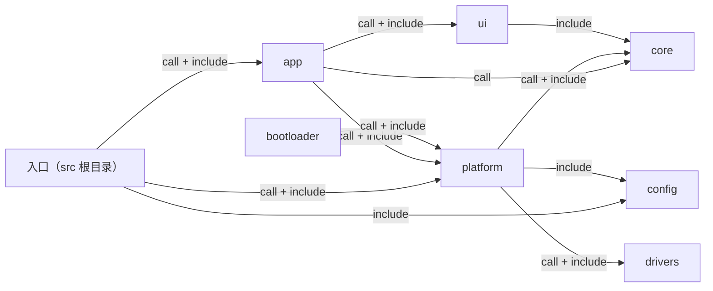

# HT 固件代码图谱

由 `firmware/tools/code_graph.py` 从实际源码生成，请勿手工修改。

在仓库根目录运行：

```powershell
python firmware/tools/code_graph.py
python firmware/tools/code_graph.py --check
```

`--check` 比较 Markdown 和 JSON；源码新增、删除或内容变化后未更新会返回非零状态。

机器数据：[代码图谱.json](代码图谱.json)。源码链接相对本文件，并带定义行号。

## 解析边界

- 仅扫描 firmware/src 与 firmware/bootloader/src 下的原创 .c/.h；后者归 bootloader 模块，不扫描第三方 MCUboot。
- 源码按 UTF-8 解码（允许 BOM），CRLF/CR 统一为 LF 后再解析和计算 SHA256；换行格式不影响图谱。
- 有界词法解析支持普通函数定义及 ISR_DIRECT_DECLARE；不是 C 编译器，不展开宏或计算条件编译。
- 直接调用边只连接可唯一定位的源码函数定义；注释、字符串和预处理指令不参与调用识别。
- 函数指针、成员调用、外部库和未知宏调用不能据此确定目标；同名冲突会列入诊断。
- 没有完整类型与作用域分析，复杂声明、宏生成代码或间接调用需人工核对，不能声称完整调用图。
- 设备树、线程调度、回调注册、DMA/中断触发及人工硬件依赖不属于自动调用证明。

## 模块关系

箭头由使用方指向被引用/调用方，节点名称来自源码目录。



## 职责与文件索引

职责仅提取文件头 `@brief`，不从目录名推断。

| 模块 | 源码 | 职责 | 函数定义数 |
|---|---|---|---:|
| bootloader | [firmware/bootloader/src/safe.c](<../../firmware/bootloader/src/safe.c>) | 引导期间保持数字输出安全与继电器全断，故障只允许串口恢复。 | 4 |
| app | [app/screen_bridge.c](<../../firmware/src/app/screen_bridge.c>) | Forward USART1/USART3 bytes while periodically verifying relay-off registers. | 2 |
| app | [app/screen_bridge.h](<../../firmware/src/app/screen_bridge.h>) | Transparent host/display UART bridge with relay-off supervision. | 0 |
| app | [app/screen_panel.c](<../../firmware/src/app/screen_panel.c>) | 屏幕、手动请求与可选温度显示；始终不启动激励或切换继电器。 | 16 |
| app | [app/screen_panel.h](<../../firmware/src/app/screen_panel.h>) | 输出禁止的屏幕与面板联调服务。 | 0 |
| config | [config/analog.h](<../../firmware/src/config/analog.h>) | 采样链标称参数，单位写入名称；实机换算仍须标定。 | 0 |
| core | [core/event_log.c](<../../firmware/src/core/event_log.c>) | 固定容量事件环缓冲，按从新到旧的偏移复制记录。 | 4 |
| core | [core/event_log.h](<../../firmware/src/core/event_log.h>) | 保存本次上电的有限事件记录，不依赖硬件、时钟或日志后端。 | 0 |
| core | [core/ntc.c](<../../firmware/src/core/ntc.c>) | 由分压求NTC阻值，按用户141点Rnorm表线性插值。 | 2 |
| core | [core/ntc.h](<../../firmware/src/core/ntc.h>) | 用户阻温表的纯C换算，输出0.1摄氏度，不访问硬件。 | 0 |
| drivers | [drivers/tca9539_safe.c](<../../firmware/src/drivers/tca9539_safe.c>) | 只允许清零继电器输出，失败即撤销就绪状态。 | 7 |
| drivers | [drivers/tca9539_safe.h](<../../firmware/src/drivers/tca9539_safe.h>) | TCA9539 安全初始化、全断寄存器检查与面板输入接口。 | 0 |
| 入口 | [main.c](<../../firmware/src/main.c>) | Run the output-disabled bring-up checks and change-only diagnostics. | 1 |
| platform | [platform/board_io.c](<../../firmware/src/platform/board_io.c>) | Initialize HT safe pins and check the clock and internal reference. | 8 |
| platform | [platform/board_io.h](<../../firmware/src/platform/board_io.h>) | HT board safe GPIO setup and diagnostic input snapshot. | 0 |
| platform | [platform/relay_io.c](<../../firmware/src/platform/relay_io.c>) | Adapt the portable TCA9539 driver to Zephyr I2C on HT MAIN-01. | 6 |
| platform | [platform/relay_io.h](<../../firmware/src/platform/relay_io.h>) | Single-owner relay-off checks and panel reads for safe bring-up. | 0 |
| platform | [platform/screen_uart.c](<../../firmware/src/platform/screen_uart.c>) | Buffer UART RX in interrupts and latch communication failures. | 10 |
| platform | [platform/screen_uart.h](<../../firmware/src/platform/screen_uart.h>) | Interrupt-buffered display/host UART transport for screen bring-up. | 0 |
| platform | [platform/temperature_io.c](<../../firmware/src/platform/temperature_io.c>) | ADC1单端软件触发读三路NTC，所有硬件等待有截止时间。 | 8 |
| platform | [platform/temperature_io.h](<../../firmware/src/platform/temperature_io.h>) | 三路NTC的有界慢采样，独占ADC12资源，不启动激励。 | 0 |
| ui | [ui/dgus.c](<../../firmware/src/ui/dgus.c>) | DGUS II 82/83 帧与 Modbus CRC，固定内存解析并在坏帧后重同步。 | 16 |
| ui | [ui/dgus.h](<../../firmware/src/ui/dgus.h>) | 有界 DGUS II 帧编解码与流式接收，不含串口配置或 HT 变量映射。 | 0 |
| ui | [ui/encoder.c](<../../firmware/src/ui/encoder.c>) | 累计合法 Gray 转换并抵消回摆，非法跳变丢弃未完成格数。 | 2 |
| ui | [ui/encoder.h](<../../firmware/src/ui/encoder.h>) | 可配置整格转换数的 A/B 正交解码，只生成旋转格数。 | 0 |
| ui | [ui/panel.c](<../../firmware/src/ui/panel.c>) | 选档先编辑草稿再提交，导航与输出许可相互独立。 | 12 |
| ui | [ui/panel.h](<../../firmware/src/ui/panel.h>) | 已消抖面板导航、选档草稿与启停请求模型，不操作硬件。 | 0 |
| ui | [ui/view.c](<../../firmware/src/ui/view.c>) | 格式化状态、独立候选值与事件记录，同步屏幕契约。 | 10 |
| ui | [ui/view.h](<../../firmware/src/ui/view.h>) | 仪表、设置和事件日志快照，不执行测量或挡位切换。 | 0 |

## 函数定义

| 函数 | 定义位置 | 链接属性 | 可定位的直接被调函数 |
|---|---|---|---|
| `stop` | [firmware/bootloader/src/safe.c:21](<../../firmware/bootloader/src/safe.c#L21>) | static | `relay_io_stop` ([platform/relay_io.c:50](<../../firmware/src/platform/relay_io.c#L50>)) |
| `mcuboot_watchdog_feed` | [firmware/bootloader/src/safe.c:28](<../../firmware/bootloader/src/safe.c#L28>) | external | `stop` ([firmware/bootloader/src/safe.c:21](<../../firmware/bootloader/src/safe.c#L21>))、`relay_io_check` ([platform/relay_io.c:40](<../../firmware/src/platform/relay_io.c#L40>)) |
| `boot_go_hook` | [firmware/bootloader/src/safe.c:40](<../../firmware/bootloader/src/safe.c#L40>) | external | 无已定位调用 |
| `mcuboot_status_change` | [firmware/bootloader/src/safe.c:49](<../../firmware/bootloader/src/safe.c#L49>) | external | `stop` ([firmware/bootloader/src/safe.c:21](<../../firmware/bootloader/src/safe.c#L21>))、`board_io_init_digital` ([platform/board_io.c:127](<../../firmware/src/platform/board_io.c#L127>))、`relay_io_init` ([platform/relay_io.c:31](<../../firmware/src/platform/relay_io.c#L31>))、`relay_io_check` ([platform/relay_io.c:40](<../../firmware/src/platform/relay_io.c#L40>)) |
| `forward` | [app/screen_bridge.c:8](<../../firmware/src/app/screen_bridge.c#L8>) | static | `screen_uart_read` ([platform/screen_uart.c:182](<../../firmware/src/platform/screen_uart.c#L182>))、`screen_uart_write` ([platform/screen_uart.c:206](<../../firmware/src/platform/screen_uart.c#L206>)) |
| `screen_bridge_run` | [app/screen_bridge.c:21](<../../firmware/src/app/screen_bridge.c#L21>) | external | `forward` ([app/screen_bridge.c:8](<../../firmware/src/app/screen_bridge.c#L8>))、`relay_io_check` ([platform/relay_io.c:40](<../../firmware/src/platform/relay_io.c#L40>))、`screen_uart_init` ([platform/screen_uart.c:116](<../../firmware/src/platform/screen_uart.c#L116>))、`screen_uart_stop` ([platform/screen_uart.c:258](<../../firmware/src/platform/screen_uart.c#L258>)) |
| `scroll_log` | [app/screen_panel.c:100](<../../firmware/src/app/screen_panel.c#L100>) | static | `event_log_count` ([core/event_log.c:45](<../../firmware/src/core/event_log.c#L45>)) |
| `record_event` | [app/screen_panel.c:109](<../../firmware/src/app/screen_panel.c#L109>) | static | `scroll_log` ([app/screen_panel.c:100](<../../firmware/src/app/screen_panel.c#L100>))、`event_log_add` ([core/event_log.c:11](<../../firmware/src/core/event_log.c#L11>)) |
| `update_digital` | [app/screen_panel.c:116](<../../firmware/src/app/screen_panel.c#L116>) | static | `record_event` ([app/screen_panel.c:109](<../../firmware/src/app/screen_panel.c#L109>)) |
| `update_temperature` | [app/screen_panel.c:134](<../../firmware/src/app/screen_panel.c#L134>) | static | `record_event` ([app/screen_panel.c:109](<../../firmware/src/app/screen_panel.c#L109>))、`temperature_io_read` ([platform/temperature_io.c:203](<../../firmware/src/platform/temperature_io.c#L203>))、`temperature_io_stop` ([platform/temperature_io.c:71](<../../firmware/src/platform/temperature_io.c#L71>)) |
| `read_encoder` | [app/screen_panel.c:165](<../../firmware/src/app/screen_panel.c#L165>) | static | 无已定位调用 |
| `encoder_edge` | [app/screen_panel.c:177](<../../firmware/src/app/screen_panel.c#L177>) | static | `read_encoder` ([app/screen_panel.c:165](<../../firmware/src/app/screen_panel.c#L165>))、`encoder_update` ([ui/encoder.c:29](<../../firmware/src/ui/encoder.c#L29>)) |
| `stop_encoder` | [app/screen_panel.c:209](<../../firmware/src/app/screen_panel.c#L209>) | static | 无已定位调用 |
| `start_encoder` | [app/screen_panel.c:230](<../../firmware/src/app/screen_panel.c#L230>) | static | `read_encoder` ([app/screen_panel.c:165](<../../firmware/src/app/screen_panel.c#L165>))、`encoder_init` ([ui/encoder.c:6](<../../firmware/src/ui/encoder.c#L6>)) |
| `update_keys` | [app/screen_panel.c:275](<../../firmware/src/app/screen_panel.c#L275>) | static | `scroll_log` ([app/screen_panel.c:100](<../../firmware/src/app/screen_panel.c#L100>))、`record_event` ([app/screen_panel.c:109](<../../firmware/src/app/screen_panel.c#L109>))、`panel_range_ohm` ([ui/panel.c:35](<../../firmware/src/ui/panel.c#L35>))、`panel_pressed_keys` ([ui/panel.c:45](<../../firmware/src/ui/panel.c#L45>))、`panel_key` ([ui/panel.c:79](<../../firmware/src/ui/panel.c#L79>)) |
| `update_inputs` | [app/screen_panel.c:333](<../../firmware/src/app/screen_panel.c#L333>) | static | `scroll_log` ([app/screen_panel.c:100](<../../firmware/src/app/screen_panel.c#L100>))、`update_digital` ([app/screen_panel.c:116](<../../firmware/src/app/screen_panel.c#L116>))、`update_keys` ([app/screen_panel.c:275](<../../firmware/src/app/screen_panel.c#L275>))、`board_io_read` ([platform/board_io.c:133](<../../firmware/src/platform/board_io.c#L133>))、`relay_io_check` ([platform/relay_io.c:40](<../../firmware/src/platform/relay_io.c#L40>))、`relay_io_read_panel` ([platform/relay_io.c:45](<../../firmware/src/platform/relay_io.c#L45>))、`panel_rotate` ([ui/panel.c:133](<../../firmware/src/ui/panel.c#L133>))、`panel_inputs` ([ui/panel.c:182](<../../firmware/src/ui/panel.c#L182>)) |
| `receive_frame` | [app/screen_panel.c:375](<../../firmware/src/app/screen_panel.c#L375>) | static | 无已定位调用 |
| `update_link` | [app/screen_panel.c:388](<../../firmware/src/app/screen_panel.c#L388>) | static | `record_event` ([app/screen_panel.c:109](<../../firmware/src/app/screen_panel.c#L109>))、`screen_uart_read` ([platform/screen_uart.c:182](<../../firmware/src/platform/screen_uart.c#L182>))、`screen_uart_write` ([platform/screen_uart.c:206](<../../firmware/src/platform/screen_uart.c#L206>))、`screen_uart_check` ([platform/screen_uart.c:228](<../../firmware/src/platform/screen_uart.c#L228>))、`dgus_init` ([ui/dgus.c:191](<../../firmware/src/ui/dgus.c#L191>))、`dgus_feed` ([ui/dgus.c:276](<../../firmware/src/ui/dgus.c#L276>))、`dgus_reset` ([ui/dgus.c:294](<../../firmware/src/ui/dgus.c#L294>))、`dgus_encode_read` ([ui/dgus.c:93](<../../firmware/src/ui/dgus.c#L93>))、`view_reset` ([ui/view.c:209](<../../firmware/src/ui/view.c#L209>)) |
| `display_send` | [app/screen_panel.c:466](<../../firmware/src/app/screen_panel.c#L466>) | static | `update_inputs` ([app/screen_panel.c:333](<../../firmware/src/app/screen_panel.c#L333>))、`screen_uart_write` ([platform/screen_uart.c:206](<../../firmware/src/platform/screen_uart.c#L206>)) |
| `snapshot` | [app/screen_panel.c:484](<../../firmware/src/app/screen_panel.c#L484>) | static | `event_log_get` ([core/event_log.c:27](<../../firmware/src/core/event_log.c#L27>))、`event_log_count` ([core/event_log.c:45](<../../firmware/src/core/event_log.c#L45>))、`panel_draft_changed` ([ui/panel.c:151](<../../firmware/src/ui/panel.c#L151>))、`panel_range_ohm` ([ui/panel.c:35](<../../firmware/src/ui/panel.c#L35>))、`panel_frequency_hz` ([ui/panel.c:40](<../../firmware/src/ui/panel.c#L40>)) |
| `refresh_display` | [app/screen_panel.c:519](<../../firmware/src/app/screen_panel.c#L519>) | static | `display_send` ([app/screen_panel.c:466](<../../firmware/src/app/screen_panel.c#L466>))、`snapshot` ([app/screen_panel.c:484](<../../firmware/src/app/screen_panel.c#L484>))、`dgus_encode_write` ([ui/dgus.c:66](<../../firmware/src/ui/dgus.c#L66>))、`view_refresh` ([ui/view.c:216](<../../firmware/src/ui/view.c#L216>)) |
| `screen_panel_run` | [app/screen_panel.c:546](<../../firmware/src/app/screen_panel.c#L546>) | external | `record_event` ([app/screen_panel.c:109](<../../firmware/src/app/screen_panel.c#L109>))、`update_temperature` ([app/screen_panel.c:134](<../../firmware/src/app/screen_panel.c#L134>))、`stop_encoder` ([app/screen_panel.c:209](<../../firmware/src/app/screen_panel.c#L209>))、`start_encoder` ([app/screen_panel.c:230](<../../firmware/src/app/screen_panel.c#L230>))、`update_inputs` ([app/screen_panel.c:333](<../../firmware/src/app/screen_panel.c#L333>))、`update_link` ([app/screen_panel.c:388](<../../firmware/src/app/screen_panel.c#L388>))、`refresh_display` ([app/screen_panel.c:519](<../../firmware/src/app/screen_panel.c#L519>))、`event_log_init` ([core/event_log.c:4](<../../firmware/src/core/event_log.c#L4>))、`screen_uart_init` ([platform/screen_uart.c:116](<../../firmware/src/platform/screen_uart.c#L116>))、`screen_uart_stop` ([platform/screen_uart.c:258](<../../firmware/src/platform/screen_uart.c#L258>))、`temperature_io_stop` ([platform/temperature_io.c:71](<../../firmware/src/platform/temperature_io.c#L71>))、`temperature_io_init` ([platform/temperature_io.c:96](<../../firmware/src/platform/temperature_io.c#L96>))、`dgus_init` ([ui/dgus.c:191](<../../firmware/src/ui/dgus.c#L191>))、`panel_init` ([ui/panel.c:50](<../../firmware/src/ui/panel.c#L50>)) |
| `event_log_init` | [core/event_log.c:4](<../../firmware/src/core/event_log.c#L4>) | external | 无已定位调用 |
| `event_log_add` | [core/event_log.c:11](<../../firmware/src/core/event_log.c#L11>) | external | 无已定位调用 |
| `event_log_get` | [core/event_log.c:27](<../../firmware/src/core/event_log.c#L27>) | external | 无已定位调用 |
| `event_log_count` | [core/event_log.c:45](<../../firmware/src/core/event_log.c#L45>) | external | 无已定位调用 |
| `ntc_from_resistance` | [core/ntc.c:43](<../../firmware/src/core/ntc.c#L43>) | external | 无已定位调用 |
| `ntc_convert` | [core/ntc.c:64](<../../firmware/src/core/ntc.c#L64>) | external | `ntc_from_resistance` ([core/ntc.c:43](<../../firmware/src/core/ntc.c#L43>)) |
| `valid_bus` | [drivers/tca9539_safe.c:14](<../../firmware/src/drivers/tca9539_safe.c#L14>) | static | 无已定位调用 |
| `fail` | [drivers/tca9539_safe.c:20](<../../firmware/src/drivers/tca9539_safe.c#L20>) | static | 无已定位调用 |
| `read_expected` | [drivers/tca9539_safe.c:26](<../../firmware/src/drivers/tca9539_safe.c#L26>) | static | `fail` ([drivers/tca9539_safe.c:20](<../../firmware/src/drivers/tca9539_safe.c#L20>)) |
| `check_ready` | [drivers/tca9539_safe.c:39](<../../firmware/src/drivers/tca9539_safe.c#L39>) | static | `valid_bus` ([drivers/tca9539_safe.c:14](<../../firmware/src/drivers/tca9539_safe.c#L14>))、`fail` ([drivers/tca9539_safe.c:20](<../../firmware/src/drivers/tca9539_safe.c#L20>)) |
| `tca9539_init` | [drivers/tca9539_safe.c:53](<../../firmware/src/drivers/tca9539_safe.c#L53>) | external | `valid_bus` ([drivers/tca9539_safe.c:14](<../../firmware/src/drivers/tca9539_safe.c#L14>))、`fail` ([drivers/tca9539_safe.c:20](<../../firmware/src/drivers/tca9539_safe.c#L20>))、`read_expected` ([drivers/tca9539_safe.c:26](<../../firmware/src/drivers/tca9539_safe.c#L26>)) |
| `tca9539_verify_off` | [drivers/tca9539_safe.c:89](<../../firmware/src/drivers/tca9539_safe.c#L89>) | external | `read_expected` ([drivers/tca9539_safe.c:26](<../../firmware/src/drivers/tca9539_safe.c#L26>))、`check_ready` ([drivers/tca9539_safe.c:39](<../../firmware/src/drivers/tca9539_safe.c#L39>)) |
| `tca9539_read_panel` | [drivers/tca9539_safe.c:103](<../../firmware/src/drivers/tca9539_safe.c#L103>) | external | `fail` ([drivers/tca9539_safe.c:20](<../../firmware/src/drivers/tca9539_safe.c#L20>))、`check_ready` ([drivers/tca9539_safe.c:39](<../../firmware/src/drivers/tca9539_safe.c#L39>)) |
| `main` | [main.c:16](<../../firmware/src/main.c#L16>) | external | `screen_bridge_run` ([app/screen_bridge.c:21](<../../firmware/src/app/screen_bridge.c#L21>))、`screen_panel_run` ([app/screen_panel.c:546](<../../firmware/src/app/screen_panel.c#L546>))、`board_io_init` ([platform/board_io.c:114](<../../firmware/src/platform/board_io.c#L114>))、`board_io_init_digital` ([platform/board_io.c:127](<../../firmware/src/platform/board_io.c#L127>))、`board_io_read` ([platform/board_io.c:133](<../../firmware/src/platform/board_io.c#L133>))、`relay_io_init` ([platform/relay_io.c:31](<../../firmware/src/platform/relay_io.c#L31>))、`relay_io_check` ([platform/relay_io.c:40](<../../firmware/src/platform/relay_io.c#L40>))、`relay_io_read_panel` ([platform/relay_io.c:45](<../../firmware/src/platform/relay_io.c#L45>))、`relay_io_stop` ([platform/relay_io.c:50](<../../firmware/src/platform/relay_io.c#L50>)) |
| `setup_pin` | [platform/board_io.c:35](<../../firmware/src/platform/board_io.c#L35>) | static | 无已定位调用 |
| `check_clock` | [platform/board_io.c:43](<../../firmware/src/platform/board_io.c#L43>) | static | 无已定位调用 |
| `start_vref` | [platform/board_io.c:54](<../../firmware/src/platform/board_io.c#L54>) | static | 无已定位调用 |
| `init_board` | [platform/board_io.c:76](<../../firmware/src/platform/board_io.c#L76>) | static | `setup_pin` ([platform/board_io.c:35](<../../firmware/src/platform/board_io.c#L35>))、`check_clock` ([platform/board_io.c:43](<../../firmware/src/platform/board_io.c#L43>))、`start_vref` ([platform/board_io.c:54](<../../firmware/src/platform/board_io.c#L54>)) |
| `board_io_init` | [platform/board_io.c:114](<../../firmware/src/platform/board_io.c#L114>) | external | `init_board` ([platform/board_io.c:76](<../../firmware/src/platform/board_io.c#L76>)) |
| `board_io_start_reference` | [platform/board_io.c:120](<../../firmware/src/platform/board_io.c#L120>) | external | `start_vref` ([platform/board_io.c:54](<../../firmware/src/platform/board_io.c#L54>)) |
| `board_io_init_digital` | [platform/board_io.c:127](<../../firmware/src/platform/board_io.c#L127>) | external | `init_board` ([platform/board_io.c:76](<../../firmware/src/platform/board_io.c#L76>)) |
| `board_io_read` | [platform/board_io.c:133](<../../firmware/src/platform/board_io.c#L133>) | external | 无已定位调用 |
| `read_reg` | [platform/relay_io.c:10](<../../firmware/src/platform/relay_io.c#L10>) | static | 无已定位调用 |
| `write_reg` | [platform/relay_io.c:17](<../../firmware/src/platform/relay_io.c#L17>) | static | 无已定位调用 |
| `relay_io_init` | [platform/relay_io.c:31](<../../firmware/src/platform/relay_io.c#L31>) | external | `tca9539_init` ([drivers/tca9539_safe.c:53](<../../firmware/src/drivers/tca9539_safe.c#L53>)) |
| `relay_io_check` | [platform/relay_io.c:40](<../../firmware/src/platform/relay_io.c#L40>) | external | `tca9539_verify_off` ([drivers/tca9539_safe.c:89](<../../firmware/src/drivers/tca9539_safe.c#L89>)) |
| `relay_io_read_panel` | [platform/relay_io.c:45](<../../firmware/src/platform/relay_io.c#L45>) | external | `tca9539_read_panel` ([drivers/tca9539_safe.c:103](<../../firmware/src/drivers/tca9539_safe.c#L103>)) |
| `relay_io_stop` | [platform/relay_io.c:50](<../../firmware/src/platform/relay_io.c#L50>) | external | `relay_io_init` ([platform/relay_io.c:31](<../../firmware/src/platform/relay_io.c#L31>)) |
| `get_link` | [platform/screen_uart.c:36](<../../firmware/src/platform/screen_uart.c#L36>) | static | 无已定位调用 |
| `status_locked` | [platform/screen_uart.c:41](<../../firmware/src/platform/screen_uart.c#L41>) | static | 无已定位调用 |
| `fail_link` | [platform/screen_uart.c:46](<../../firmware/src/platform/screen_uart.c#L46>) | static | 无已定位调用 |
| `receive_irq` | [platform/screen_uart.c:62](<../../firmware/src/platform/screen_uart.c#L62>) | static | `fail_link` ([platform/screen_uart.c:46](<../../firmware/src/platform/screen_uart.c#L46>)) |
| `screen_uart_init` | [platform/screen_uart.c:116](<../../firmware/src/platform/screen_uart.c#L116>) | external | `screen_uart_check` ([platform/screen_uart.c:228](<../../firmware/src/platform/screen_uart.c#L228>))、`screen_uart_stop` ([platform/screen_uart.c:258](<../../firmware/src/platform/screen_uart.c#L258>))、`get_link` ([platform/screen_uart.c:36](<../../firmware/src/platform/screen_uart.c#L36>))、`fail_link` ([platform/screen_uart.c:46](<../../firmware/src/platform/screen_uart.c#L46>)) |
| `screen_uart_read` | [platform/screen_uart.c:182](<../../firmware/src/platform/screen_uart.c#L182>) | external | `get_link` ([platform/screen_uart.c:36](<../../firmware/src/platform/screen_uart.c#L36>))、`status_locked` ([platform/screen_uart.c:41](<../../firmware/src/platform/screen_uart.c#L41>)) |
| `screen_uart_write` | [platform/screen_uart.c:206](<../../firmware/src/platform/screen_uart.c#L206>) | external | `screen_uart_check` ([platform/screen_uart.c:228](<../../firmware/src/platform/screen_uart.c#L228>))、`get_link` ([platform/screen_uart.c:36](<../../firmware/src/platform/screen_uart.c#L36>)) |
| `screen_uart_check` | [platform/screen_uart.c:228](<../../firmware/src/platform/screen_uart.c#L228>) | external | `get_link` ([platform/screen_uart.c:36](<../../firmware/src/platform/screen_uart.c#L36>))、`status_locked` ([platform/screen_uart.c:41](<../../firmware/src/platform/screen_uart.c#L41>)) |
| `screen_uart_get_stats` | [platform/screen_uart.c:242](<../../firmware/src/platform/screen_uart.c#L242>) | external | `get_link` ([platform/screen_uart.c:36](<../../firmware/src/platform/screen_uart.c#L36>))、`status_locked` ([platform/screen_uart.c:41](<../../firmware/src/platform/screen_uart.c#L41>)) |
| `screen_uart_stop` | [platform/screen_uart.c:258](<../../firmware/src/platform/screen_uart.c#L258>) | external | `get_link` ([platform/screen_uart.c:36](<../../firmware/src/platform/screen_uart.c#L36>)) |
| `wait_bits` | [platform/temperature_io.c:40](<../../firmware/src/platform/temperature_io.c#L40>) | static | 无已定位调用 |
| `pins_available` | [platform/temperature_io.c:53](<../../firmware/src/platform/temperature_io.c#L53>) | static | 无已定位调用 |
| `invalidate` | [platform/temperature_io.c:63](<../../firmware/src/platform/temperature_io.c#L63>) | static | 无已定位调用 |
| `temperature_io_stop` | [platform/temperature_io.c:71](<../../firmware/src/platform/temperature_io.c#L71>) | external | `wait_bits` ([platform/temperature_io.c:40](<../../firmware/src/platform/temperature_io.c#L40>)) |
| `temperature_io_init` | [platform/temperature_io.c:96](<../../firmware/src/platform/temperature_io.c#L96>) | external | `board_io_start_reference` ([platform/board_io.c:120](<../../firmware/src/platform/board_io.c#L120>))、`wait_bits` ([platform/temperature_io.c:40](<../../firmware/src/platform/temperature_io.c#L40>))、`pins_available` ([platform/temperature_io.c:53](<../../firmware/src/platform/temperature_io.c#L53>))、`temperature_io_stop` ([platform/temperature_io.c:71](<../../firmware/src/platform/temperature_io.c#L71>)) |
| `check_adc` | [platform/temperature_io.c:160](<../../firmware/src/platform/temperature_io.c#L160>) | static | `pins_available` ([platform/temperature_io.c:53](<../../firmware/src/platform/temperature_io.c#L53>)) |
| `read_once` | [platform/temperature_io.c:183](<../../firmware/src/platform/temperature_io.c#L183>) | static | `wait_bits` ([platform/temperature_io.c:40](<../../firmware/src/platform/temperature_io.c#L40>)) |
| `temperature_io_read` | [platform/temperature_io.c:203](<../../firmware/src/platform/temperature_io.c#L203>) | external | `ntc_convert` ([core/ntc.c:64](<../../firmware/src/core/ntc.c#L64>))、`check_adc` ([platform/temperature_io.c:160](<../../firmware/src/platform/temperature_io.c#L160>))、`read_once` ([platform/temperature_io.c:183](<../../firmware/src/platform/temperature_io.c#L183>))、`invalidate` ([platform/temperature_io.c:63](<../../firmware/src/platform/temperature_io.c#L63>))、`temperature_io_stop` ([platform/temperature_io.c:71](<../../firmware/src/platform/temperature_io.c#L71>)) |
| `crc_bytes` | [ui/dgus.c:9](<../../firmware/src/ui/dgus.c#L9>) | static | 无已定位调用 |
| `crc16` | [ui/dgus.c:20](<../../firmware/src/ui/dgus.c#L20>) | static | 无已定位调用 |
| `get_word` | [ui/dgus.c:33](<../../firmware/src/ui/dgus.c#L33>) | static | 无已定位调用 |
| `put_word` | [ui/dgus.c:38](<../../firmware/src/ui/dgus.c#L38>) | static | 无已定位调用 |
| `valid_range` | [ui/dgus.c:44](<../../firmware/src/ui/dgus.c#L44>) | static | 无已定位调用 |
| `finish_frame` | [ui/dgus.c:50](<../../firmware/src/ui/dgus.c#L50>) | static | `crc16` ([ui/dgus.c:20](<../../firmware/src/ui/dgus.c#L20>)) |
| `dgus_encode_write` | [ui/dgus.c:66](<../../firmware/src/ui/dgus.c#L66>) | external | `put_word` ([ui/dgus.c:38](<../../firmware/src/ui/dgus.c#L38>))、`valid_range` ([ui/dgus.c:44](<../../firmware/src/ui/dgus.c#L44>))、`finish_frame` ([ui/dgus.c:50](<../../firmware/src/ui/dgus.c#L50>))、`crc_bytes` ([ui/dgus.c:9](<../../firmware/src/ui/dgus.c#L9>)) |
| `dgus_encode_read` | [ui/dgus.c:93](<../../firmware/src/ui/dgus.c#L93>) | external | `put_word` ([ui/dgus.c:38](<../../firmware/src/ui/dgus.c#L38>))、`valid_range` ([ui/dgus.c:44](<../../firmware/src/ui/dgus.c#L44>))、`finish_frame` ([ui/dgus.c:50](<../../firmware/src/ui/dgus.c#L50>))、`crc_bytes` ([ui/dgus.c:9](<../../firmware/src/ui/dgus.c#L9>)) |
| `valid_shape` | [ui/dgus.c:113](<../../firmware/src/ui/dgus.c#L113>) | static | 无已定位调用 |
| `dgus_decode` | [ui/dgus.c:126](<../../firmware/src/ui/dgus.c#L126>) | external | `valid_shape` ([ui/dgus.c:113](<../../firmware/src/ui/dgus.c#L113>))、`crc16` ([ui/dgus.c:20](<../../firmware/src/ui/dgus.c#L20>))、`get_word` ([ui/dgus.c:33](<../../firmware/src/ui/dgus.c#L33>))、`valid_range` ([ui/dgus.c:44](<../../firmware/src/ui/dgus.c#L44>))、`crc_bytes` ([ui/dgus.c:9](<../../firmware/src/ui/dgus.c#L9>)) |
| `dgus_init` | [ui/dgus.c:191](<../../firmware/src/ui/dgus.c#L191>) | external | `crc_bytes` ([ui/dgus.c:9](<../../firmware/src/ui/dgus.c#L9>)) |
| `consume` | [ui/dgus.c:210](<../../firmware/src/ui/dgus.c#L210>) | static | 无已定位调用 |
| `reject` | [ui/dgus.c:216](<../../firmware/src/ui/dgus.c#L216>) | static | `consume` ([ui/dgus.c:210](<../../firmware/src/ui/dgus.c#L210>)) |
| `parse_buffer` | [ui/dgus.c:224](<../../firmware/src/ui/dgus.c#L224>) | static | `valid_shape` ([ui/dgus.c:113](<../../firmware/src/ui/dgus.c#L113>))、`dgus_decode` ([ui/dgus.c:126](<../../firmware/src/ui/dgus.c#L126>))、`consume` ([ui/dgus.c:210](<../../firmware/src/ui/dgus.c#L210>))、`reject` ([ui/dgus.c:216](<../../firmware/src/ui/dgus.c#L216>))、`get_word` ([ui/dgus.c:33](<../../firmware/src/ui/dgus.c#L33>))、`valid_range` ([ui/dgus.c:44](<../../firmware/src/ui/dgus.c#L44>))、`crc_bytes` ([ui/dgus.c:9](<../../firmware/src/ui/dgus.c#L9>)) |
| `dgus_feed` | [ui/dgus.c:276](<../../firmware/src/ui/dgus.c#L276>) | external | `parse_buffer` ([ui/dgus.c:224](<../../firmware/src/ui/dgus.c#L224>))、`crc_bytes` ([ui/dgus.c:9](<../../firmware/src/ui/dgus.c#L9>)) |
| `dgus_reset` | [ui/dgus.c:294](<../../firmware/src/ui/dgus.c#L294>) | external | 无已定位调用 |
| `encoder_init` | [ui/encoder.c:6](<../../firmware/src/ui/encoder.c#L6>) | external | 无已定位调用 |
| `encoder_update` | [ui/encoder.c:29](<../../firmware/src/ui/encoder.c#L29>) | external | 无已定位调用 |
| `valid_mode` | [ui/panel.c:9](<../../firmware/src/ui/panel.c#L9>) | static | 无已定位调用 |
| `check_ready` | [ui/panel.c:14](<../../firmware/src/ui/panel.c#L14>) | static | 无已定位调用 |
| `selected_index` | [ui/panel.c:22](<../../firmware/src/ui/panel.c#L22>) | static | 无已定位调用 |
| `panel_range_ohm` | [ui/panel.c:35](<../../firmware/src/ui/panel.c#L35>) | external | 无已定位调用 |
| `panel_frequency_hz` | [ui/panel.c:40](<../../firmware/src/ui/panel.c#L40>) | external | 无已定位调用 |
| `panel_pressed_keys` | [ui/panel.c:45](<../../firmware/src/ui/panel.c#L45>) | external | 无已定位调用 |
| `panel_init` | [ui/panel.c:50](<../../firmware/src/ui/panel.c#L50>) | external | `valid_mode` ([ui/panel.c:9](<../../firmware/src/ui/panel.c#L9>)) |
| `panel_key` | [ui/panel.c:79](<../../firmware/src/ui/panel.c#L79>) | external | `check_ready` ([ui/panel.c:14](<../../firmware/src/ui/panel.c#L14>))、`selected_index` ([ui/panel.c:22](<../../firmware/src/ui/panel.c#L22>)) |
| `panel_rotate` | [ui/panel.c:133](<../../firmware/src/ui/panel.c#L133>) | external | `check_ready` ([ui/panel.c:14](<../../firmware/src/ui/panel.c#L14>)) |
| `panel_draft_changed` | [ui/panel.c:151](<../../firmware/src/ui/panel.c#L151>) | external | `check_ready` ([ui/panel.c:14](<../../firmware/src/ui/panel.c#L14>))、`selected_index` ([ui/panel.c:22](<../../firmware/src/ui/panel.c#L22>)) |
| `panel_set_target` | [ui/panel.c:158](<../../firmware/src/ui/panel.c#L158>) | external | `check_ready` ([ui/panel.c:14](<../../firmware/src/ui/panel.c#L14>))、`valid_mode` ([ui/panel.c:9](<../../firmware/src/ui/panel.c#L9>)) |
| `panel_inputs` | [ui/panel.c:182](<../../firmware/src/ui/panel.c#L182>) | external | `check_ready` ([ui/panel.c:14](<../../firmware/src/ui/panel.c#L14>))、`valid_mode` ([ui/panel.c:9](<../../firmware/src/ui/panel.c#L9>)) |
| `send_words` | [ui/view.c:5](<../../firmware/src/ui/view.c#L5>) | static | `dgus_encode_write` ([ui/dgus.c:66](<../../firmware/src/ui/dgus.c#L66>)) |
| `format_number` | [ui/view.c:16](<../../firmware/src/ui/view.c#L16>) | static | 无已定位调用 |
| `format_time` | [ui/view.c:48](<../../firmware/src/ui/view.c#L48>) | static | 无已定位调用 |
| `format_value` | [ui/view.c:74](<../../firmware/src/ui/view.c#L74>) | static | `format_number` ([ui/view.c:16](<../../firmware/src/ui/view.c#L16>))、`format_time` ([ui/view.c:48](<../../firmware/src/ui/view.c#L48>)) |
| `send_text` | [ui/view.c:102](<../../firmware/src/ui/view.c#L102>) | static | `send_words` ([ui/view.c:5](<../../firmware/src/ui/view.c#L5>)) |
| `send_values` | [ui/view.c:113](<../../firmware/src/ui/view.c#L113>) | static | `send_text` ([ui/view.c:102](<../../firmware/src/ui/view.c#L102>))、`format_value` ([ui/view.c:74](<../../firmware/src/ui/view.c#L74>)) |
| `format_log_value` | [ui/view.c:135](<../../firmware/src/ui/view.c#L135>) | static | `format_number` ([ui/view.c:16](<../../firmware/src/ui/view.c#L16>))、`format_value` ([ui/view.c:74](<../../firmware/src/ui/view.c#L74>)) |
| `send_logs` | [ui/view.c:171](<../../firmware/src/ui/view.c#L171>) | static | `send_text` ([ui/view.c:102](<../../firmware/src/ui/view.c#L102>))、`format_log_value` ([ui/view.c:135](<../../firmware/src/ui/view.c#L135>))、`format_time` ([ui/view.c:48](<../../firmware/src/ui/view.c#L48>))、`send_words` ([ui/view.c:5](<../../firmware/src/ui/view.c#L5>)) |
| `view_reset` | [ui/view.c:209](<../../firmware/src/ui/view.c#L209>) | external | 无已定位调用 |
| `view_refresh` | [ui/view.c:216](<../../firmware/src/ui/view.c#L216>) | external | `send_values` ([ui/view.c:113](<../../firmware/src/ui/view.c#L113>))、`send_logs` ([ui/view.c:171](<../../firmware/src/ui/view.c#L171>))、`view_reset` ([ui/view.c:209](<../../firmware/src/ui/view.c#L209>))、`send_words` ([ui/view.c:5](<../../firmware/src/ui/view.c#L5>)) |

## 源码直接调用图

只画参与已定位调用的函数；同名函数通过文件路径区分。

```mermaid
flowchart TD
    F0["stop"]
    F1["mcuboot_watchdog_feed"]
    F3["mcuboot_status_change"]
    F4["forward"]
    F5["screen_bridge_run"]
    F6["scroll_log"]
    F7["record_event"]
    F8["update_digital"]
    F9["update_temperature"]
    F10["read_encoder"]
    F11["encoder_edge"]
    F12["stop_encoder"]
    F13["start_encoder"]
    F14["update_keys"]
    F15["update_inputs"]
    F17["update_link"]
    F18["display_send"]
    F19["snapshot"]
    F20["refresh_display"]
    F21["screen_panel_run"]
    F22["event_log_init"]
    F23["event_log_add"]
    F24["event_log_get"]
    F25["event_log_count"]
    F26["ntc_from_resistance"]
    F27["ntc_convert"]
    F28["valid_bus"]
    F29["fail"]
    F30["read_expected"]
    F31["check_ready / drivers/tca9539_safe.c"]
    F32["tca9539_init"]
    F33["tca9539_verify_off"]
    F34["tca9539_read_panel"]
    F35["main"]
    F36["setup_pin"]
    F37["check_clock"]
    F38["start_vref"]
    F39["init_board"]
    F40["board_io_init"]
    F41["board_io_start_reference"]
    F42["board_io_init_digital"]
    F43["board_io_read"]
    F46["relay_io_init"]
    F47["relay_io_check"]
    F48["relay_io_read_panel"]
    F49["relay_io_stop"]
    F50["get_link"]
    F51["status_locked"]
    F52["fail_link"]
    F53["receive_irq"]
    F54["screen_uart_init"]
    F55["screen_uart_read"]
    F56["screen_uart_write"]
    F57["screen_uart_check"]
    F58["screen_uart_get_stats"]
    F59["screen_uart_stop"]
    F60["wait_bits"]
    F61["pins_available"]
    F62["invalidate"]
    F63["temperature_io_stop"]
    F64["temperature_io_init"]
    F65["check_adc"]
    F66["read_once"]
    F67["temperature_io_read"]
    F68["crc_bytes"]
    F69["crc16"]
    F70["get_word"]
    F71["put_word"]
    F72["valid_range"]
    F73["finish_frame"]
    F74["dgus_encode_write"]
    F75["dgus_encode_read"]
    F76["valid_shape"]
    F77["dgus_decode"]
    F78["dgus_init"]
    F79["consume"]
    F80["reject"]
    F81["parse_buffer"]
    F82["dgus_feed"]
    F83["dgus_reset"]
    F84["encoder_init"]
    F85["encoder_update"]
    F86["valid_mode"]
    F87["check_ready / ui/panel.c"]
    F88["selected_index"]
    F89["panel_range_ohm"]
    F90["panel_frequency_hz"]
    F91["panel_pressed_keys"]
    F92["panel_init"]
    F93["panel_key"]
    F94["panel_rotate"]
    F95["panel_draft_changed"]
    F96["panel_set_target"]
    F97["panel_inputs"]
    F98["send_words"]
    F99["format_number"]
    F100["format_time"]
    F101["format_value"]
    F102["send_text"]
    F103["send_values"]
    F104["format_log_value"]
    F105["send_logs"]
    F106["view_reset"]
    F107["view_refresh"]
    F0 --> F49
    F1 --> F0
    F1 --> F47
    F3 --> F0
    F3 --> F42
    F3 --> F46
    F3 --> F47
    F5 --> F4
    F5 --> F47
    F5 --> F54
    F5 --> F59
    F4 --> F55
    F4 --> F56
    F6 --> F25
    F7 --> F6
    F7 --> F23
    F8 --> F7
    F9 --> F7
    F9 --> F67
    F9 --> F63
    F11 --> F10
    F11 --> F85
    F13 --> F10
    F13 --> F84
    F14 --> F6
    F14 --> F7
    F14 --> F89
    F14 --> F91
    F14 --> F93
    F15 --> F6
    F15 --> F8
    F15 --> F14
    F15 --> F43
    F15 --> F47
    F15 --> F48
    F15 --> F94
    F15 --> F97
    F17 --> F7
    F17 --> F55
    F17 --> F56
    F17 --> F57
    F17 --> F78
    F17 --> F82
    F17 --> F83
    F17 --> F75
    F17 --> F106
    F18 --> F15
    F18 --> F56
    F19 --> F24
    F19 --> F25
    F19 --> F95
    F19 --> F89
    F19 --> F90
    F20 --> F18
    F20 --> F19
    F20 --> F74
    F20 --> F107
    F21 --> F7
    F21 --> F9
    F21 --> F12
    F21 --> F13
    F21 --> F15
    F21 --> F17
    F21 --> F20
    F21 --> F22
    F21 --> F54
    F21 --> F59
    F21 --> F63
    F21 --> F64
    F21 --> F78
    F21 --> F92
    F27 --> F26
    F34 --> F29
    F34 --> F31
    F30 --> F29
    F31 --> F28
    F31 --> F29
    F32 --> F28
    F32 --> F29
    F32 --> F30
    F33 --> F30
    F33 --> F31
    F35 --> F5
    F35 --> F21
    F35 --> F40
    F35 --> F42
    F35 --> F43
    F35 --> F46
    F35 --> F47
    F35 --> F48
    F35 --> F49
    F40 --> F39
    F41 --> F38
    F42 --> F39
    F39 --> F36
    F39 --> F37
    F39 --> F38
    F46 --> F32
    F47 --> F33
    F48 --> F34
    F49 --> F46
    F54 --> F57
    F54 --> F59
    F54 --> F50
    F54 --> F52
    F55 --> F50
    F55 --> F51
    F56 --> F57
    F56 --> F50
    F57 --> F50
    F57 --> F51
    F58 --> F50
    F58 --> F51
    F59 --> F50
    F53 --> F52
    F65 --> F61
    F66 --> F60
    F67 --> F27
    F67 --> F65
    F67 --> F66
    F67 --> F62
    F67 --> F63
    F63 --> F60
    F64 --> F41
    F64 --> F60
    F64 --> F61
    F64 --> F63
    F77 --> F76
    F77 --> F69
    F77 --> F70
    F77 --> F72
    F77 --> F68
    F78 --> F68
    F80 --> F79
    F81 --> F76
    F81 --> F77
    F81 --> F79
    F81 --> F80
    F81 --> F70
    F81 --> F72
    F81 --> F68
    F82 --> F81
    F82 --> F68
    F73 --> F69
    F74 --> F71
    F74 --> F72
    F74 --> F73
    F74 --> F68
    F75 --> F71
    F75 --> F72
    F75 --> F73
    F75 --> F68
    F94 --> F87
    F95 --> F87
    F95 --> F88
    F96 --> F87
    F96 --> F86
    F97 --> F87
    F97 --> F86
    F92 --> F86
    F93 --> F87
    F93 --> F88
    F102 --> F98
    F103 --> F102
    F103 --> F101
    F104 --> F99
    F104 --> F101
    F105 --> F102
    F105 --> F104
    F105 --> F100
    F105 --> F98
    F107 --> F103
    F107 --> F105
    F107 --> F106
    F107 --> F98
    F98 --> F74
    F101 --> F99
    F101 --> F100
```



## 未解析项与诊断

未解析调用形式共 218 处，详见 JSON 的 `unresolved_calls`。这不表示调用错误或无效。

未发现函数命名冲突或无法定位的项目内引号引用。
