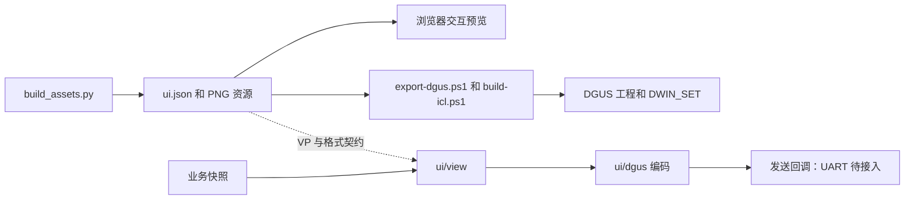

# 音频源固件 · 软件架构与实现计划

> 2026-09-20 建立。起因：用户「规划一下软件怎么写，我交给 ChatGPT」。
>
> **2026-09-20 软件接手修订：用户选择 Zephyr，并确认保留 DWIN 串口屏（ADR-019）。**
> 硬件接口依据 rev23 网表和 MAIN-01 PCB v8；Zephyr 负责线程、通信、日志及服务，
> TIM / ADC / DAC / DMA 的相干采样链由项目专用 STM32 LL 驱动管理。
> 首批无输出启动固件已交叉编译通过，见 §15；仍无实机验证。器件额定值、时序目标和实测结果必须区分；
> 未核实事项见 §14，不能因为写成宏就绕过验证。修订前版本保留于 Git 提交 `533a064`。
>
> **2026-09-22 用户确认：分压下臂 806 Ω、NTC 10 kΩ、分流器 20 mΩ；旋钮交互由 Codex 设计（ADR-020）。**
> 原 15 mΩ 换算和 10.3 Arms 过流计算不再适用。2026-09-23 用户 NTC 表已核：R25=10 kΩ、B25/50=3950 K；
> 宽温换算已按用户141点表实现，22 kΩ 上拉仍待实装核对。2026-10-02 用户确认AVDD正常；
> 当前三页蓝白界面、循环预选后确认、三路NTC与32条RAM日志见 §10/§15.6；§15.3～15.5保留历史验证记录。

---

## §0 怎么用这份文档

1. **§13「红线清单」先读。** 那 12 条只要破一条，要么烧变压器，要么测不准，要么保护失效。
2. **§14「待核实清单」按功能设门槛**：可以先验证 Zephyr 启动、DWIN 通信和日志，
   测量常数及触发链未核实前禁止进入闭环输出。
3. 实现顺序见 §15：安全启动与板级支持 → 屏幕/日志 → 相干采样 → 测量标定 → 档位与闭环。
4. **工程改用 Zephyr + west + CMake + Kconfig + Devicetree**，采用自定义 `ht_main` 板定义。
   CubeMX 仅辅助核对引脚/时钟，不再生成或接管启动文件、SysTick、调度器和中断向量。
5. 初始验证基线选 **Zephyr v4.4.2**，工程建立时在 `west.yml` 固定标签/提交及配套 SDK，
   不跟随 `main` 自动升级。官方 `nucleo_g474re` 可作为板级移植参考，
   其默认时钟、串口和引脚与 MAIN-01 不同，不能直接当本板配置。
6. 通用驱动与专用 LL 驱动的外设所有权见 §12.2；**同一外设不得由两套驱动同时初始化**。
   已核对的官方资料和源码入口列于文末。

---

## §1 这台机器是什么

高压电缆接头检测用的**音频信号源 + 阻抗表**。

| 项 | 值 |
|---|---|
| 输出频率 | 算法规划 **2 – 10 kHz**；当前面板只选 **2 / 5 / 8 / 10 kHz** 四档，预选后确认 |
| 输出功率 | **50 VA 连续** |
| 阻抗档位 | **7 档：1 / 3 / 10 / 30 / 100 / 300 / 1000 Ω** |
| 显示量 | 当前状态页：电流、电压、已生效阻抗/频率档、本次运行时间、电池状态；原测量规划的VA/W/阻抗/相位暂不放入本轮界面 |
| 模式 | **CC（恒流）** 或 **VA（恒视在功率）**，后台显式配置，本轮无模式/目标编辑页 |
| 供电 | 36 V 母线（AC 220 V 经 DRS-240-36 或内置锂铁电池），母线范围 **32 – 43.2 V** |

**信号链（从左到右）：**

```
STM32 DAC(PA4) → Sallen-Key(U27, f_c 25.6 kHz) → R41 100Ω → C65 2.2µF 隔直
   → 莲花座 → TPA3255 功放模块(BTL) → K_TRANS 选 TR_LOW / TR_HIGH
   → 7 只抽头继电器选一档 → KSAFE 双继电器（机箱内，硬件互锁，MCU 管不着）
   → 输出端子 → 被测电缆接头
                         ↑
      SNS-01 上：20 mΩ shunt + AMC3301（电流）/ 443.9:1 分压 + AMC3330（电压）
                 + AMC23C12 ×2（硬件 OC/OV）+ UCC12050（5 kV 隔离 5 V）
                         ↓
      两对差分模拟信号 → 抗混叠 RC(100Ω+100Ω+10nF, f_c 79.6 kHz) → STM32 ADC1/ADC2
```

**七档的额定值（按变压器规格表计算，约 50 VA；不代表整机已经实测达到）：**

| 档 | 绕组/抽头 | V_rms | I_rms | 计算 Z | VA |
|---|---|---|---|---|---|
| 1 Ω | TR_LOW ① | 7.07 | 7.07 | 1.000 | 49.98 |
| 3 Ω | TR_LOW ② | 12.25 | 4.08 | 3.002 | 49.98 |
| 10 Ω | TR_LOW ③ | 22.36 | 2.24 | 9.982 | 50.09 |
| 30 Ω | TR_LOW ④ | 38.73 | 1.29 | 30.02 | 49.96 |
| 100 Ω | TR_HIGH ① | 70.7 | 0.71 | 99.58 | 50.20 |
| 300 Ω | TR_HIGH ② | 122.5 | 0.41 | 298.8 | 50.23 |
| 1000 Ω | TR_HIGH ③ | 223.6 | 0.22 | 1016 | 49.19 |

**目标最大值：7.07 Arms / 223.6 Vrms。** 若 SNS-01 的 OC 参考电阻仍为网表/BOM 的 2.15 kΩ，
20 mΩ 分流器对应 **OC 10.95 A 瞬时峰值，正弦等效约 7.74 Arms（1.095×）**；OV 标称仍约 288 Vrms。
这些是典型参数计算，不是实测保护保证；实际 R_REF、门限误差和瞬态余量由硬件方复核。

🔴 **1 Ω 档会被接触电阻吃掉一截**：抽头继电器 + KSAFE + shunt + 铜箔 + 端子 + 线束的串联电阻
原15 mΩ模型估算153 mΩ；改20 mΩ后仅替换该项为约 **158 mΩ**，同模型下约 **37.3 VA**。
这是接触/线束参数假设下的估算，不是已测输出能力。软件按**实测 V/I 闭环**，不要按额定值开环。

---

## §2 MCU 引脚表（权威版，取自 rev23 网表逐脚提取）

**MCU：STM32G474RET6，LQFP64，512 KB Flash / 128 KB SRAM，主频 170 MHz。**

| 脚 | 端口 | 网络名 | 用途 | 软件要点 |
|---|---|---|---|---|
| 3 / 4 | PC14 / PC15 | `OSC32_IN/OUT` | LSE 32.768 kHz | RTC 可选 |
| 5 / 6 | PF0 / PF1 | `OSC_IN/OUT` | **HSE 8 MHz** | PLL 源 |
| 7 | PG10 | `NRST` | 复位 | 🔴 **同时接 TCA9539 的 `/RESET`**，见 §8.4 |
| **8 / 9** | **PC0 / PC1** | `ADC1_IN6/IN7` | **电压通道（AMC3330）差分对** | ADC1 差分 ch6 |
| 10 | PC2 | `V_BUS_SENSE` | 36 V 母线分压 | ADC1_IN8，注入组 |
| 11 / 13 / 12 | PC3 / PA1 / PA0 | `PC3/PA1/PA0` | **NTC1(CN6) / NTC2(CN7) / NTC3(CN8)** | ADC1_IN9/IN2/IN1，注入组；按 rev23 更正旧顺序 |
| 14 / 17 | PA2 / PA3 | — | **未接线**（原留给 DRS MODBus） | 🟡 rev23 里是空脚 |
| **18** | **PA4** | `PA4` | **DAC1_OUT1 → DDS 输出** | DMA 循环 |
| **20 / 21** | **PA6 / PA7** | `ADC2_IN3/IN4` | **电流通道（AMC3301）差分对** | ADC2 差分 ch3 |
| 24 | PB0 | `SNS_PRESENT#` | 采样板在位（10 kΩ↑） | **低 = 在位** |
| 27 / 28 / 29 | VSSA / VREF+ / VDDA | `AGND` / `$3N28` / `3V3_AVDD` | 基准 | 🔴 `VREF+` **没有 0 Ω 通向 3V3_AVDD**，必须用内部 VREFBUF |
| 33 / 34 / 35 / 36 | PB11 / PB12 / PB13 / PB14 | `AC_OK` `DC_OK` `BAT_OK` `CHARGE_OK` | DRS 四路干接点 | **低 = 正常**；🔴 **PB12 不能用 EXTI**（EXTI12 已被 PC12 占） |
| 37 | PB15 | `PB15` | **`COIL_LOOP` 监视**（经 PC817C） | **低 = 安全链通（KSAFE 已吸合）**；只读 |
| 38 / 39 | PC6 / PC7 | `PC6/PC7` | **编码器 A/B** | TIM3_CH1/CH2（AF2）编码器模式 |
| 40 / 41 | PC8 / PC9 | `MCU_SCL3/SDA3` | **I²C3**（4.7 kΩ↑） | TCA9539 `0x74` + FRAM `0x50/0x51` |
| 43 / 44 | PA9 / PA10 | `TX1/RX1` | **USART1 → CH340X → USB** | printf / 串口下载 |
| 45 | PA11 | — | 空闲（ADR-016 砍风扇 TACH 后释放） | |
| 46 | PA12 | `PA12` | **蜂鸣器**（Q2 BSS138 低边） | 🔴 见 §10.4 |
| 49 / 50 | PA13 / PA14 | `SWDIO/SWCLK` | 调试口 | |
| 51 | PA15 | — | **空闲**（ADR-018 删与门后释放） | ⚠️ 复位后有 JTAG 内部上拉 |
| 52 / 53 | PC10 / PC11 | `DSRX/DSTX` | **USART3 → DWIN 屏** | `PC10`=TX（接屏 RX） |
| 54 | PC12 | `INT` | TCA9539 `/INT`（10 kΩ↑） | EXTI12，低有效 |
| **55** | **PD2** | `OC_FAULT#` | **硬件过流** | **EXTI2 独占向量**，低有效 |
| **56** | **PB3** | `OV_FAULT#` | **硬件过压** | **EXTI3 独占向量**，🔴 **复位默认 AF0=JTDO，必须显式配成普通输入** |
| 60 | PB7 | `PROT_LATCH` | AMC23C12 锁存清除（10 kΩ↑） | 🔴 **开漏**，见 §9.4 |
| 61 | PB8 | `BOOT0` | | |
| 62 | PB9 | `WDI` | **外部看门狗 TPS3823A-33**（经 H3 跳线） | 🔴 见 §9.5 |
| 2 / 19 / 22 / 23 / 25 / 26 / 30 / 31 / 32 / 42 / 45 / 51 / 57 / 58 / 59 | PC13 PA5 PC4 PC5 PB1 PB2 PB10 … PA8 PA11 PA15 PB4 PB5 PB6 | — | **空闲** | ⚠️ PB2 标 `VREFBUF_OUT` 建议留空；PB4/PB6 有 UCPD 死电池下拉 |

**ADC 通道分配（已按 datasheet Table 12 核实 5/5）：**

```
ADC1 规则组（与 ADC2 同步）：差分 ch6 = PC0(IN6) / PC1(IN7)   ← 电压
ADC2 规则组（与 ADC1 同步）：差分 ch3 = PA6(IN3) / PA7(IN4)   ← 电流
ADC1 注入组（4 个，慢速）  ：IN8=PC2 母线, IN9=PC3 NTC1(CN6), IN1=PA0 NTC3(CN8), IN2=PA1 NTC2(CN7)
```

🔴 **差分模式的规则**：通道 i 的负输入固定落在通道 i+1 的引脚上。
`PC0/PC1` = IN6/IN7 相邻 ✅，`PA6/PA7` = IN3/IN4 相邻 ✅ —— 两对都成立。

---

## §3 时钟与上电初始化顺序

### 3.1 时钟树

```
HSE 8 MHz → PLLM=2 → 4 MHz → PLLN=85 → VCO 340 MHz → PLLR=2 → SYSCLK 170 MHz
AHB /1 = HCLK 170 MHz
APB1 /1, APB2 /1 → 定时器时钟 170 MHz（TIMPRE=0，预分频为 1 时定时器时钟 = PCLK）
ADC 时钟：ADC12_CCR.CKMODE = 11 (HCLK/4) = 42.5 MHz
```

🔴 **170 MHz 必须先进 Range 1 Boost**（`PWR_CR5.R1MODE = 0`），
而且切 boost 时 ST 规定 **AHB 先 /2 维持 1 µs** 再回 /1。由所选 Zephyr STM32 SoC/时钟实现负责，
首轮核对最终配置及寄存器读回；应用不再重复运行 CubeMX 时钟初始化。
🔴 Flash 等待周期：170 MHz / Range1 Boost → **4 WS**，并开 `ACR.PRFTEN/ICEN/DCEN`。

> 🟢 **晶振精度要求很低（±20 ~ ±50 ppm 都够）**。
> 理由：激励频率和采样率是**同一个定时器**分出来的，测的是比值，晶振误差在 V/I 之比和相位差上完全抵消。

### 3.2 上电顺序（安全依赖不变，按 Zephyr 初始化阶段落实）

```
 1. Zephyr SoC/时钟初始化：Range1 Boost → Flash 4WS → PLL → 170 MHz
 2. PWR_CR3.UCPD1_DBDIS = 1            🔴 否则 PA9/PA10 空闲高会常开 PB4/PB6 的 5.1 kΩ UCPD 下拉
 3. 板级 GPIO 安全态初始化；输出许可保持关闭，保护输入就绪后立即武装 EXTI2/3
      🔴 PB3 从 AF0(JTDO) 显式改成普通输入 + 上拉
      🔴 PB7 配成开漏输出，初始高阻（外部 10 kΩ 上拉 = 锁存模式已武装）
      🔴 PA12 蜂鸣器输出初始低
 4. I²C3 初始化 → 总线恢复例程（见 §10.2）→ 复位后 TCA9539 已是全输入 = 继电器全释放
 5. TCA9539：先写 Output Port0 = 0x00，再写 Configuration Port0 = 0x00（输出）；每步检查返回并读回
      🔴🔴 顺序反了会让 8 只继电器全部瞬间吸合（上电默认 Output = 0xFF）
      Port1 保持 Configuration = 0xFF（输入），两端口 Polarity 明确置 0；任一步失败禁止输出
 6. VREFBUF：VRS = 10 (2.9 V), HIZ = 0, ENVR = 1 → 轮询 VRR = 1
      🔴 VRS=10 要求 VDDA ≥ 3.135 V（我们 3V3_AVDD = 3.3 V ✅）
 7. ADC：开 ADC 电压调节器 → 等 20 µs → 单端校准 → 差分校准(ADCALDIF=1)
      → 写 DIFSEL（ch6 于 ADC1、ch3 于 ADC2）→ ADEN
      🔴 DIFSEL 只能在 ADEN=0 时写
 8. 读 VREFINT，算出实际 VREF+ = 3.0 V × VREFINT_CAL / VREFINT_DATA
      → 健全性检查 2.80 ~ 3.05 V，超范围 = VREFBUF 没起来，报错并禁止输出
 9. 从 FRAM 读标定表（CRC 校验），坏了就用默认值 + 置「未标定」标志
10. 清 AMC23C12 锁存：PB7 拉低 ≥5 µs 再释放；然后确认 PD2/PB3 都是高
11. 读 SNS_PRESENT#(PB0)、门互锁(P17)、SYSTEM ENABLE(P16)
12. TIM6 + DAC DMA 起来，但**幅度写 0**；ADC1/2 双同步 + DMA 起来
13. 进入 IDLE；启动健康监督和 IWDG（§9.5），健康条件成立时监督线程喂两只看门狗
```

Zephyr 驱动可能在 `main()` 前初始化。板级定义必须禁止通用 DAC、ADC 或 GPIO 扩展器驱动
提前使能激励/继电器；TCA9539 的安全写入顺序由专用封装执行。关键初始化均有超时，失败
停在故障状态。显示/日志可先启动报告进度，控制请求必须等全部输出前置检查通过。

---

## §4 激励链：DDS / DAC / 定时器 —— 相干采样的根

### 4.1 核心设计：一只定时器同时触发 DAC 和 ADC，每周期 **N = 85 点**

```
170 000 000 = 2⁷ × 5⁷ × 17
TIM6  ARR+1 = 170e6 / (85 × f_out)
DAC 更新率 = ADC 采样率 = f_s = 85 × f_out
```

| f_out | ARR+1 | ARR | f_dac = f_s | 窗口 M=100 周期 → L=8500 点 |
|---|---|---|---|---|
| **2 kHz** | 1000 | 999 | 170.0 kSPS | 50.0 ms |
| **5 kHz** | 400 | 399 | 425.0 kSPS | 20.0 ms |
| **8 kHz** | 250 | 249 | 680.0 kSPS | 12.5 ms |
| **10 kHz** | 200 | 199 | 850.0 kSPS | 10.0 ms |

🟢🟢 **这个方案顺手解掉了一条老账。** 旧文档（`MCU最小系统-设计与计算.md` §6）写：
「非预设频率无法严格相干采样，软件需用加窗 DFT」——
🔧 **那条不成立了**：只要 DAC 表长固定 85 点、ADC 和 DAC 由**同一个定时器**触发，
**2–10 kHz 里任何一个 ARR 值都是严格相干的**（窗口 = 整数个表周期 = 整数个信号周期）。
代价只是**频率被量化**：步进 = f/(ARR+1)，
10 kHz 处 **0.50%**（50 Hz 一档）、2 kHz 处 **0.10%**（2 Hz 一档）。
→ **实际合成频率** `f = 170e6/(85·(ARR+1))` 仍是采集/控制核验依据；不能用旋钮请求冒充实际频率。
当前两页界面的状态页显示控制器确认已生效的2/5/8/10 kHz频率档，设置页单独显示候选档，见§10/§15.3。

🔧 **同时关掉旧文档的待核实 #3「DAC 在 1.25 MSPS 下够不够快」** ——
datasheet Table 74/76：**DAC 外部输出只保证 1 MSPS**（15 MSPS 是内部输出）。
N=125 在 10 kHz 要 1.25 MSPS，**超规格**；**N=85 最高 850 kSPS，合规且余量 1.18×** ✅

### 4.2 DAC 配置

- `DAC1_OUT1` = PA4，**开输出缓冲**（后级是 U27 运放 + R41 100 Ω）
- 12 位右对齐 `DAC1->DHR12R1`
- **触发**：TIM6_TRGO（`DAC_CR.TSEL1` 选 TIM6，`TEN1=1`）
- **DMA**：DMA1 通道，外设=`&DAC1->DHR12R1`，存储器=正弦表，**循环模式**，16 位→16 位，**每周期 85 个点；实际循环缓冲按 §4.3 的两个半区配置**
- 正弦表：`tab[k] = 2048 + (int16)lround(amp * sin(2*M_PI*k/85))`，`amp ∈ [0, 2047]`

### 4.3 改幅度：只写 DMA 已释放的缓冲区

🔧 **撤销原文“TC 中断后原地改写 85 点表天然无竞争”的结论**。
循环 DMA 的 TC 发生后已经可能回到表头读取；中断响应、线程切换和其它中断抢占均会影响时序。
“计算比采样快”不能证明不会读到一半旧幅度、一半新幅度。

计划采用**循环 DMA 的两个半区**，每半区先取 10 个完整周期（850 点），总计 1700 个 uint16_t。
这属于软件管理的半区交接，不假设 STM32G4 具有硬件双缓冲切换功能。

- HT/TC 只交还已经播放完的半区；专用实时处理线程填充该半区，禁止写 DMA 正在读取的另一半区。
- 单一所有者合并幅度请求，在完整周期边界应用并记录实际生效代次。控制环须计入最多两个半区
  的生效延迟（初始预算约 2~10 ms），不能把“请求已入队”当作“输出已改变”。
- 每半区有序号、所有权和截止时间；最坏 10 kHz 时，释放的半区 **1 ms 后就会被复用**。
  必须测量响应时间、填充耗时及抢占裕量；发现失期或 DMA 错误后锁存故障并停止激励。
- **紧急静音绕过缓冲更新及线程**，由 §9.2 的寄存器路径执行。

半区长度是待台架验证的参数；不能以平均线程速度代替截止时间验证。
§4.2 的 85 点是一个基本波形周期，实际循环 DMA 搬运的是多个完整周期组成的双半区。

### 4.4 换频率：显式管理采样与波形边界

🔧 **TIM 的 ARR 预装载在下一次定时器更新事件生效，该事件是一个采样点，
不是 85 点正弦波的周期结束。** 原文“只改 ARR 即天然整周期无毛刺”撤销。

首版采用受控重启：控制线程请求静音 → 确认驱动已静音并满足模拟稳定时间 →
专用驱动停止触发、ADC/DAC DMA → 清残留标志和计数 → 更新分频及缓冲区 →
按统一起点重新武装双 ADC、DAC、DMA → 最后启动定时器 → 丢弃过渡窗口 → 软启动。
整个过程可被故障取消，进入 FAULT 后不继续恢复输出。

界面保留“请求频率”和“实际合成频率”；只有驱动完成切换后才更新后者。
连续无缝调频留待触发链、相位和缓冲交接验证后单独实现。

### 4.5 重建滤波器留给软件的两句话

U27 是 2 阶 Sallen-Key，`R38/R39 = 2 kΩ`、`C62∥C63 = 4.4 nF`、`C64 = 2.2 nF`
→ **f_c = 25.58 kHz，Q = 0.7071（Butterworth）**，10 kHz 处 −0.100 dB。
85 点/周期的零阶保持，第一镜像在 `f_dac − f_out` 处，幅度约 **−38.5 dB**，
再经这只滤波器最差（2 kHz 档，镜像在 168 kHz）还有 **−32.6 dB** → 合计 **−71 dB** ✅
→ 🟢 **软件不需要做任何预加重或补偿。**

---

## §5 测量链：ADC 双同步 + 相干 DFT

### 5.1 ADC 配置

| 项 | 值 | 依据 |
|---|---|---|
| 模式 | **ADC1/ADC2 规则同步（Dual regular simultaneous）** | 相位要求 V/I 同时采样 |
| `ADC12_CCR.DUAL` | `00110`（仅规则同步） | |
| `ADC12_CCR.MDMA` | `10`（12/10 位双 DMA），DMA 读 `ADC12_CDR` 32 位 | 一次搬两路 |
| `ADC12_CCR.CKMODE` | **`11` = HCLK/4 = 42.5 MHz** | 🔴 同步模式没有触发抖动；双 ADC 差分上限 **56 MHz**（datasheet Table 66） |
| 采样时间 | **24.5 cycles** | t_conv = (24.5+12.5)/42.5 MHz = **870.6 ns** < 1176 ns（850 kSPS）✅ 余量 1.35× |
| 源阻抗校核 | R_AIN max @24.5 cycles = **1500 Ω（快通道）/ 1200 Ω** | 我们只有 100 Ω（R34~R37）→ **余量 12×** ✅ |
| 触发 | **TIM6_TRGO**，上升沿 | 🟡 见 §14-2 |
| 分辨率 | 12 位，右对齐 | |

🔴 **上电必须做两次校准**：先单端（`ADCALDIF=0`）再差分（`ADCALDIF=1`），ADC1、ADC2 各做一遍。

### 5.2 DMA 与窗口切分（数字都对得上，不是随手取的）

```
DMA1 循环缓冲 uint32_t buf[1700]     ← 20 个信号周期 = 6.8 KB
半传输中断(HT) / 传输完成中断(TC) 各交付 850 个采样 = 10 个周期
一个测量窗口 = M = 100 周期 = L = 8500 采样 = 10 次半缓冲中断
```

🟢 **这套数字的妙处：850 和 8500 都是 85 的整数倍**
→ **每次中断进来时，旋转因子下标一定从 0 开始**，不用维护跨缓冲的相位状态。

🔧 原文的“100 µs / CPU 10%”只是未测估算，不能作为 Zephyr 调度结论。
ADC DMA 用普通 ISR：初版将已完成的 850 个 uint32_t 复制到预分配块，
通过 k_msgq 的非阻塞操作通知实时线程，在该线程内进行 DFT。
缓冲池和队列均有界，不做动态分配；池空、队列满、序号跳变或 DMA overrun 时丢弃窗口、
锁存采集故障并禁止闭环继续使用旧值。**只入队 DMA 半区指针不构成所有权转移**。
复制必须在 DMA 再次访问该半区前完成，最坏预算 1 ms；§12 列出内存与延迟验收要求。

### 5.3 相干单频点 DFT（用整数，不要用 float）

旋转因子只有 **85 组**，上电时按当前频率无关地算一次（和频率无关！因为 M/L = 1/85 恒定）：

```c
int16_t cos_q15[85], sin_q15[85];          // 上电算一次，永远不变
for (int k = 0; k < 85; k++) {
    cos_q15[k] = (int16_t)lround(32767.0 * cos(2*M_PI*k/85));
    sin_q15[k] = (int16_t)lround(32767.0 * sin(2*M_PI*k/85));
}
```

累加（每个窗口清零一次；block 是从队列取得的不可变采样副本，处理后归还池，不再读取 DMA 正在循环的 buf）：

```c
static int64_t Vc, Vs, Ic, Is;             // 🔴 必须 int64，见下
for (int n = 0; n < 850; n++) {
    uint32_t w = block->samples[n];
    int32_t v = (int32_t)(w & 0xFFFF) - off_V;   // ADC1 主机，低16位 = 电压
    int32_t i = (int32_t)(w >> 16)    - off_I;   // ADC2 从机，高16位 = 电流
    int k = n % 85;                              // 或用一个自增并回绕的下标
    int32_t c = cos_q15[k], s = sin_q15[k];
    Vc += (int64_t)v * c;  Vs += (int64_t)v * s;
    Ic += (int64_t)i * c;  Is += (int64_t)i * s;
}
```

🔴 **为什么必须整数**：Cortex-M4F 只有单精度 FPU。
float32 只有 24 位尾数，累加 8500 项会把小信号档（1000 Ω 档电流只有满量程的 1/32）的有效位吃掉；
双精度要软件模拟，850 kSPS 下跑不动。
**整数路径是精确的**：`|v| ≤ 2048`、`|c| ≤ 32767` → 单项 ≤ 6.7e7（放得进 int32）；
8500 项累加 ≤ 5.7e11 ≪ 2⁶³，整数累加不溢出，累加阶段不再引入舍入；仍有 ADC、旋转因子量化和浮点收尾误差。

窗口结束后（用浮点收尾，一个窗口只算一次，随便用）：

```c
// 约定：x[n] = A·cos(2πn/85 + φ)  →  相量 = Re + jIm = A∠φ
const float scale = 2.0f / ((float)L * 32767.0f); // 消除 Q15 旋转因子的缩放
float Vre = scale * (float)Vc, Vim = -scale * (float)Vs;
float Ire = scale * (float)Ic, Iim = -scale * (float)Is;
```

> ⚠️ 上面这个正负号取决于旋转因子的定义，**第一次上板必须用纯电阻负载验一次**：
> 接一只已知的无感功率电阻，读数相位应当 ≈ 0°。若读到 ≈180°，把**电流相量整体取负**
> （shunt 在回流侧，符号差 180° 是预期内的，是一个常数，存进 FRAM）。

### 5.4 物理量换算

```
V_rms = k_V · |V相量| / √2          I_rms = k_I · |I相量| / √2
φ     = arg(V) − arg(I) − φ_cal(f)              (V 超前 I 为正 = 感性)
S(VA) = V_rms · I_rms
P(W)  = S · cos φ          Q(var) = S · sin φ
|Z|   = V_rms / I_rms      R = |Z|·cos φ      X = |Z|·sin φ
```

**标称换算系数（下单前的理论值，最终以 §6 标定为准）：**

```
电流：shunt 20 mΩ × AMC3301 增益 8.2        = 0.1640 V/A（差分）
电压：1/443.9 分压 × AMC3330 增益 2.0       = 4.5055e-3 V/V（差分）
码值：code = 2047.5 + 2047.5 × v_diff / FS_diff
```

**差分满量程的文档核验已完成：`FS_diff = VREF+ = 2.9 V`，范围为约 −2.9~+2.9 V。**
依据 RM0440 Rev9 §21.4.7，以及固定 hal_stm32 版本的 `__LL_ADC_CALC_DIFF_DATA_TO_VOLTAGE`：
`v_diff = (2*code/4095 - 1)*VREF`。零差分实际中心码及失调以单板校准为准。

| 条件 | 标称峰值 | 量程占用 |
|---|---|---|
| 7.07 Arms、20 mΩ 分流器 | 199.97 mV | AMC3301 ±250 mV 的 80.0% |
| 上述电流经增益 8.2 | 1.63975 V 差分 | STM32 差分 ±2.9 V 的 56.54% |
| 223.6 Vrms、806 Ω 下臂 | 约 1.4246 V 差分 | STM32 差分 ±2.9 V 的 49.13% |

额定电流下分流器功耗约 **1.00 W**。保持用户确认的 806 Ω，不再依据已排除的 ±VREF/2 假设建议换 576 Ω。
以上不替代 ADC 零点/已知幅度、AMC/ADC 共模、输入每脚范围、削顶及相位标定的实板验证。

### 5.5 削顶检测（不依赖任何常数，必须做）

```c
if (raw_code <= 8 || raw_code >= 4087) over_range_flag = 1;   // 每个采样点都查
```
削顶时 DFT 结果无意义 → **丢弃该窗口 + 界面报「超量程」+ 调节环立刻降幅度**。

### 5.6 慢通道（注入组）

`V_BUS_SENSE` + 3 路 NTC，**ADC1 注入组，4 个通道正好装满**。

- **采样时间 640.5 cycles**（源阻抗 NTC 侧最坏 19.2 kΩ，R_AIN max @640.5 = 33 kΩ → 余量 1.7×）
- 单通道 (640.5+12.5)/42.5 MHz = **15.36 µs**，4 个 = **61.5 µs**
- 🔴🔴 **绝对不能在测量窗口进行中触发注入组** —— 注入会打断规则转换，
  一旦打断，ADC1 和 ADC2 的配对就错位了，**相位直接报废**。
  → 每 200 ms 向采集驱动申请一次**显式维护窗口**，不能仅用时间判断“刚好在两窗口之间”。
- 连续 TIM 触发和循环 DMA 本来没有自动产生的空隙。驱动需在完整窗口后停下两路规则采集及其 DMA，
  确认已停止，再用 JADSTART / LL_ADC_INJ_StartConversion() 触发注入转换；
  DAC 能否独立连续运行，必须通过触发路由及恢复时序验证。
  完成后重新建立 ADC1/ADC2 配对、DMA 起点和完整 DFT 窗口，废弃过渡数据。
- 维护期间控制环冻结积分，不能拿旧数据反复积分；超时立即进入故障。
  若不能可靠独立暂停采集，采用受控静音后的维护流程，并标明输出/测量暂停。

**换算：**

```
母线：  R28 100k + R29 100k 串，R30 10k 下臂，C40 100nF → 分压比 21.0 : 1，f_c 167 Hz
        V_bus = code/4095 × VREF+ × 21.0      （43.2 V → 2.057 V；56 V → 2.667 V < 2.9 ✅）
NTC ：  3V3_AVDD ─[22 kΩ]─┬─ NTCx(10 kΩ@25 °C, B3950) ─ AGND
                          └─[1 kΩ]─ ADC 脚 ─ 100 nF ─ AGND
        R_ntc = R_pullup × V_adc / (V_pullup − V_adc)
        T     = 按用户 R-T 表查找并插值（实现计划，当前尚无慢通道采集/温度换算）
```

用户资料：[B3950-10K-RT-table.pdf](../../reference/ntc/B3950-10K-RT-table.pdf)，1 页扫描表，已目视核验。
表头为 **R25=10 kΩ、B25/50=3950 K**，25 °C 的 min/norm/max 为 **9.9/10/10.1 kΩ**。
表的 −20～120 °C 是数据覆盖范围，不能当作探头/线缆/封装的额定工作范围。

| 温度 | 表中 Rnorm |
|---|---|
| −20 °C | 87.4288 kΩ |
| 0 °C | 31.770 kΩ |
| 25 °C | 10.000 kΩ |
| 50 °C | 3.5920 kΩ |

宽温换算采用该表并评估插值误差；`T(K)=1/(1/298.15+ln(R/10000)/3950)` 只保留作
**25/50 °C 两点参数的近似关系**，不能代替整张 R-T 表。22 kΩ 上拉仍是待核实的实装设计值。

上拉源 **3V3_AVDD 约3.3 V** 与 ADC 参考 **2.9 V** 不同，测量不是比例式。
按表中 −20 °C 的 87.4288 kΩ、假设上拉源恰为3.3 V计算：
22 kΩ 上拉得 **2.637 V**，10 kΩ 上拉得 **2.961 V**，后者高于2.9 V参考；
这替代旧 **2.730/3.014 V**，不构成实物供电、公差或削顶余量已验证的结论。
上拉源/电阻公差、VREF/ADC误差、探头 min/max、插值、自热及安装热阻须按目标温区预算并标定。
撤销「3.3 V偏1%只有0.33 °C、全温足够」的保证；旧B式导出的分辨率数值也不能作为全温验收指标。

### 5.7 相位精度预算（给 ChatGPT 交代"哪些能标定掉、哪些不用管"）

| 来源 | 量级 @10 kHz | 处置 |
|---|---|---|
| ADC 两路采样时刻差 | **0**（硬件双同步） | — |
| 抗混叠 `C56/C57` ±5% 对打 | **0.708°** | 🟢 **标定表吃掉**；C0G，40 °C 只漂 0.009° |
| `R34~R37` ±1% | 0.149° | 同上（要求同批次） |
| `C58~C61` 1 nF ±10% | 0.071° | 同上 |
| 20 mΩ shunt 残余电感 `L_s` | 约 0.18°/nH @10 kHz | 🟡 **向厂家要 `L_s`**；与 f 成正比、可重复 → 标定表吃掉 |
| AMC3301 / AMC3330 带宽差 | — | 标定表吃掉 |
| 走线长度差 6 mm | 0.0002° | 忽略 |
| `DDS_OUT` 长线 + 过孔 | 0.0037° | 🟢 **而且它在测量环路之外**，一个字都不进读数 |

🔴 **结论：相位要的是"稳定"不是"准"。** 全部系统性误差由 §6 的 4 点标定表吸收。

---

## §6 标定

三张表，全部存 FRAM（带 CRC + A/B 双份）：

### 6.1 失调（每次上电自动做）

条件：`amp = 0`（DAC 写 2048，功放实际无输出）、继电器全断。
采一个完整窗口，取两路的**平均码值** → `off_V`、`off_I`。
🔴 范围检查：应落在 2048 ± 100，超出说明 ADC 没校准或 AMC 没供上电 → 报错。

### 6.2 增益（出厂标定，人工）

每个档位接已知负载（或用外部标准表读 V/I），令：

```
k_V = V_参考 / (|V相量|/√2)      k_I = I_参考 / (|I相量|/√2)
```

🟢 `k_V` / `k_I` 与档位**无关**（分压比和 shunt 都不随档位变），所以**各标一次就够**，
但建议在**中间档（30 Ω 或 100 Ω）**标，两路都在量程 30~70% 的舒服区间。
🟡 可选：低档（1 Ω，大电流）和高档（1000 Ω，高电压）各复测一次，验证线性度。

### 6.3 相位（出厂标定，人工，**最重要的一张**）

接**纯电阻无感负载**，在 **2 / 5 / 8 / 10 kHz** 四个预设各测一次，记下读到的相位 `φ_meas(f)`：

> 🔴🔴 **2026-10-02 补充：这一步必须在 100 Ω 或 300 Ω 档上做，绝对不要在 1 Ω / 3 Ω 档上做。**
> 仪器自身的相位误差（shunt `L_s`、AMC 带宽差、抗混叠 RC 失配）**与负载无关**，所以标一次七档通用；
> 但**负载夹具自己的残余电感会被算进标定表**，而它在低阻档上被放大得离谱 ——
> 要把附加相位压到 ≤0.1°(10 kHz)，夹具电感上限是 **1 Ω 档 27.8 nH**（≈3 cm 引线，做不到）
> 对 **100 Ω 档 2.8 µH**（随便做得到）。同一只 0.5 µH 的夹具：100 Ω 上只加 **+0.018°**，1 Ω 上加 **+1.80°**
> —— 比要标定的那 0.708° 还大 2.5 倍，**整个标定表会被夹具污染**。
> 推导和选型见 **`docs/07-test/测试负载选型-标定电阻与电缆仿真网络.md` §1**。


```
φ_cal(f) = φ_meas(f)        （理想应为 0）
中间频率用线性插值： φ_cal(f) = 插值(2k,5k,8k,10k)
```

🔴 **为什么线性插值是对的**：主要误差源（shunt 残余电感、RC 失配、AMC 带宽差）
在这个频段里**都近似正比于 f**，所以四个点之间线性插值残差很小。
🔴 **同时在这一步确认电流相量的 180° 符号**（§5.3）。

### 6.4 标定数据结构

```c
typedef struct {
    uint32_t magic;          // 'HTCL'
    uint16_t version;
    int16_t  off_V, off_I;   // 失调（每次上电覆盖，不必存 FRAM，但存了便于诊断）
    float    k_V, k_I;       // 增益
    float    phi_cal[4];     // 2/5/8/10 kHz，单位：度
    int8_t   i_invert;       // 电流相量是否整体取负（0/1）
    float    fs_diff;        // §14-1 查实后填；仅用于上电自检的量程估算
    uint32_t crc32;
} calib_t;
```

---

## §7 调节环（CC / VA）

**被控量**：DAC 幅度 `amp ∈ [0, 2047]`。**反馈**：每个测量窗口一次（20 ~ 100 Hz）。

```
CC 模式：err = I_set − I_rms
VA 模式：err = VA_set − (V_rms × I_rms)          (VA_set ≤ 50)
```

推荐**纯积分（I）控制器**，因为被控对象基本是一阶比例环节：

```c
acc += Ki * err;                       // Ki 现场整定，起手值见下
amp  = clamp(acc, 0, amp_max);
if (amp == 0 || amp == amp_max) acc = amp;   // 抗积分饱和
```

起手整定：在 30 Ω 档测「amp 变 10% 时 I_rms 变多少」得到开环增益 G，
取 `Ki ≈ 0.2 / G`（闭环带宽约为采样率的 1/5，即 4 ~ 20 Hz）→ 稳定且不振荡。

🔴 **四条硬限制，必须写进环里：**

1. **软启动**：使能输出时 `amp` 从 0 线性爬升，**≥200 ms 爬到目标**（避免变压器涌流和继电器触点拉弧）
2. **软件限幅**：`I_rms > 7.07 × 1.05` 或 `V_rms > 223.6 × 1.05` → **立即静音**并报故障
   （20 mΩ 且 R_REF=2.15 kΩ 时硬件 OC 典型约 1.095×；须重新核对软硬件门限公差，不能沿用旧 1.46×）
3. **开路 / 短路检测**：`amp` 顶到上限而 `I_rms ≈ 0` → 开路；`V_rms ≈ 0` 而 `I_rms` 大 → 短路。两者都静音报警
4. **削顶时无条件降幅**（§5.5）

🟡 **功放余量参考**：TPA3255 模块在 36 V 母线下调制度 55%、32 V 下 62%，输出 49.3 W，
模块能力 140~150 W → **余量 3×**。所以 `amp_max` 卡在 2047 就行，功放不会先到极限。
🔴 但 1 Ω 档因为 153 mΩ 串联电阻，**可能怎么加都到不了 50 VA**（理论上限 ≈37.6 VA）
→ 环要能**优雅地停在上限**，而不是一直积分到饱和并反复报错。

---

## §8 档位切换状态机 —— **全机最危险的一段代码**

### 8.1 为什么这段特别重要

> 🔴🔴 **两只抽头继电器同时闭合 = 变压器次级匝间短路。**
> 这个故障回路是「抽头A → 触点 → `OUT_SEL` → 触点 → 抽头B → 绕组」，
> **不经过 `TR_COM`、不经过 shunt** → **硬件过流保护看不见它，整机没有任何硬件发现得了。**
> **这段软件是唯一的防线。**（项目里记作「待决 #71」。）

### 8.2 TCA9539 输出位定义（I²C 地址 `0x74`）

| 位 | 网络 | 含义 |
|---|---|---|
| P00 | `K_TRANS` | **0 = TR_LOW**（继电器释放走 NC 触点）/ **1 = TR_HIGH** |
| P01 | `TAP 1Ω` | TR_LOW ① |
| P02 | `TAP 3Ω` | TR_LOW ② |
| P03 | `TAP 10Ω` | TR_LOW ③ |
| P04 | `TAP 30Ω` | TR_LOW ④ |
| P05 | `TAP 100Ω` | TR_HIGH ① |
| P06 | `TAP 300Ω` | TR_HIGH ② |
| P07 | `TAP 1000Ω` | TR_HIGH ③ |

寄存器：`0x00/0x01` Input Port、`0x02/0x03` Output Port、`0x04/0x05` Polarity、`0x06/0x07` Configuration（1=输入）。

### 8.3 🔴 寄存器级互斥（必须写在最底层，不能靠上层自觉）

```text
控制状态机请求 Port0 = v：
  taps = v & 0xFE；多于一位为 1 → 拒绝并锁存 FAULT_TAP_MUTEX
  验证当前切档阶段允许该转换，附带请求序号和配置代次，提交 I/O 服务
I/O 服务执行私有 tca_write_p0(v)：
  整字节写 Output Port0，检查返回值并读回；向控制线程返回成功/错误及完成时刻
控制线程处理完成结果：
  只接受当前请求/代次的结果；成功才更新 p0_shadow 并开始规定的机械等待
  任一步失败 → 保持静音、取消切档，继电器实际状态标记未知
```

Port0 写事务只能来自控制状态机；I/O 服务调用唯一私有 tca_write_p0()，不能另有 GPIO/Shell 客户端
直接写 0x02。p0_shadow 仅由控制线程维护。Code review 应核对所有写入调用点及完成回报。
逐次 popcount 检查不能替代整个切档序列的串行化，也不能证明继电器物理触点已释放。
故障/取消时清掉尚未执行的旧代次请求；已在途的事务必须结束/中止并确认后才能开始恢复，
不能在故障锁存后继续执行队列中残留的合闸命令。保留优先的全断请求。

### 8.4 上电 / 复位时的安全状态（硬件已经帮了大忙）

- **TCA9539 的 `/RESET` 接在 `NRST` 上**（rev23 网表：`NRST ; C26.1 H1.1 R14.1 U1.7 U24.3`）
  → **MCU 每次复位（上电、IWDG、外部看门狗、复位按键）都会连带复位扩展器**
  → 16 路全变输入（高阻）→ RLY-01 上 TBD62083A 输入的 10 kΩ 下拉把驱动拉低 → **全部继电器释放** ✅
- 🔴 **反过来，MCU 没有单独复位 TCA9539 的手段**（没有专用 GPIO）。
  I²C 卡死的恢复路径只有两条：① 总线恢复（§10.2）；② `NVIC_SystemReset()` ——
  **后者同时会把继电器安全地放掉**，所以是可以接受的最后手段。

### 8.5 切档序列（时间常数全部来自继电器手册）

继电器参数（`reference/OMRON-G5RL-DataSheet.pdf` / `G2RL`）：
**G5RL-1A-LN DC12：272 Ω / 44.2 mA，动作 ≤15 ms，释放 ≤15 ms**；
**G2RL-2 DC12：360 Ω / 33.3 mA，动作 ≤15 ms**。→ **所有等待取 ≥30 ms（2× 余量）**。

```text
range_request(target):
  1. 控制线程接受命令，进入 MUTING，等待驱动确认输出已静音（有超时）
  2. 等待模拟稳定时间；原 2 ms 仅为初始候选，首板验证残余输出后定值
  3. 写 Port0 = p0_shadow & 0x01，抽头全断，保持 K_TRANS
  4. 写入成功且寄存器读回一致后，从事务完成时刻开始等待 ≥30 ms
  5. 若需切换变压器，写入 new_K_TRANS，验证成功，再等待 ≥30 ms
  6. 写入 new_K_TRANS | (1 << target_tap_bit)，验证成功，等待 ≥30 ms
  7. 再检查故障锁存、输入条件、命令代次和测量有效性，许可后 ≥200 ms 软启动
```

**上述是事件/截止时间驱动的状态机**：等待由 Zephyr 超时机制唤醒，不在控制线程里连串阻塞延时。
任何阶段失败、用户停止或故障都会取消后续合闸/软启动。寄存器读回只能确认命令，不能确认触点；
机械释放仍需规定等待时间。I²C 锁不得跨继电器等待持有。恢复总线后先执行全断、验证及等待，
不能直接重放故障前的抽头值。切档过程中收到新目标时只保留一个待处理目标，不并行执行。

静音不能省略；模拟衰减和机械动作时间必须通过首板低能量测试验证。

### 8.6 档位表

```c
static const struct { uint8_t k_trans; uint8_t tap_bit; float z_nom, v_nom, i_nom; }
RANGE[7] = {
  /* 1Ω    */ {0, 1,    1.0f,   7.07f, 7.07f},
  /* 3Ω    */ {0, 2,    3.0f,  12.25f, 4.08f},
  /* 10Ω   */ {0, 3,   10.0f,  22.36f, 2.24f},
  /* 30Ω   */ {0, 4,   30.0f,  38.73f, 1.29f},
  /* 100Ω  */ {1, 5,  100.0f,  70.7f,  0.71f},
  /* 300Ω  */ {1, 6,  300.0f, 122.5f,  0.41f},
  /* 1000Ω */ {1, 7, 1000.0f, 223.6f,  0.22f},
};
```

**2026-10-03 用户选定自动阻抗匹配**：不再人工逐挡切换，频率仍独立选择2/5/8/10 kHz。
当前从1 Ω挡限幅探测，依据Vrms/Irms及信号可信区间切挡；每次先静音、断抽头、切换并重新测量，见§15.10。
原“固定100 Ω挡、5%幅度”建议作废：标称模型中无法同时覆盖低阻过流和高阻电流低于ADC分辨率两端。

---

## §9 保护、看门狗、故障处理

### 9.1 故障源总表

| 信号 | 脚 | 有效电平 | 检测方式 | 处置 |
|---|---|---|---|---|
| `OC_FAULT#` | **PD2** | **低** | **EXTI2**（独占向量） | ISR 立即静音 |
| `OV_FAULT#` | **PB3** | **低** | **EXTI3**（独占向量） | ISR 立即静音 |
| `SNS_PRESENT#` | PB0 | 低=在位 | 轮询 10 ms | 高 → **禁止输出**（拔了采样板就没有任何保护了） |
| `COIL_LOOP` 监视 | PB15 | **低 = 安全链通** | 轮询 10 ms | 高 → KSAFE 已释放，输出已被物理切断 → 报「门开/变压器过热/12 V 失电」 |
| 门互锁监视 | TCA9539 P17 | 低=门关 | 轮询 50 ms | 只报警（真正的切断是硬件的） |
| `SYSTEM ENABLE` | TCA9539 P16 | 低=使能 | 轮询 50 ms | 松开即停 |
| `AC_OK` / `DC_OK` / `BAT_OK` / `CHARGE_OK` | PB11 / **PB12** / PB13 / PB14 | 低=正常 | **全部轮询**（🔴 PB12 不能用 EXTI） | `BAT_OK` 见 9.6 |
| NTC1/2/3 过温 | 注入组 | — | 每 200 ms | 分级：报警 → 降功率 → 停机 |
| 削顶 | ADC 码值 | — | 每采样点 | 丢弃窗口 + 降幅 |

### 9.2 OC / OV：专用快速停止路径 + 线程故障处理

ADR-018 保持不变：功放没有使能脚，OC/OV 经 PD2/EXTI2、PB3/EXTI3 通知 MCU 停止激励。
拟采用 Zephyr direct zero-latency ISR；其名字不代表物理零延迟，也不保证 <1 µs。

快速路径仅执行已审查的寄存器操作：
1. 分别锁存 OC、OV 的故障事实，撤销输出许可；两个 ISR 采用独立、单写者标志，
   不用多上下文共享的 volatile 位掩码读改写。清除仅在静音的受控恢复流程进行。
2. 禁止 DAC DMA 请求及相关通道继续更新，停止/隔离触发，确保中点真正进入 DAC 输出寄存器；
   具体禁用 TEN、写 DHR 并确认其提交至只读 DOR 的顺序，按 RM0440 和选定 LL 版本验证。
3. 清相应 EXTI pending 后返回。不能清除另一路尚未处理的故障。

🔧 **原“三行就够”的示例撤销**：TEN1 仍开启时，只写 DHR=2048 要等待下一次触发，
2 kHz 档最多等约 5.88 µs；这也不包含滤波、功放和变压器的衰减。
验收分别测量 IRQ 入口、数字停止完成、模拟输出降到规定阈值三个时间，不用 12 个核心周期替代实测。

启用 CONFIG_ZERO_LATENCY_IRQS，以 IRQ_DIRECT_CONNECT + IRQ_ZERO_LATENCY 连接；
ISR 不调用内核 API、LOG、printf、I²C、浮点或 ISR_DIRECT_PM，也不调用 k_sem_give/k_msgq_put。
直接 ISR 返回 0。IRQ 优先级按 Zephyr 架构规则分配，不能照抄裸机 NVIC 的 0/1/2。

EXTI2/3 必须只有一个所有者。STM32 通用 EXTI 驱动可能在启动时注册全部向量，
所以需要核实所选版本并做局部驱动适配/排除重复注册；不能仅再定义两个同名 Handler。
PC12 的 EXTI12 与 PB12 冲突仍按原规定处理，不影响独立的 EXTI2/3。

安全监督线程按最长 1 ms 的目标周期读取独立故障标志，在普通线程上下文发布故障事件；
控制线程随即撤销旧命令、请求全断、锁定，再由 HMI/存储处理告警和记录。
快速静音不等待这个线程。恢复必须人工确认、故障输入恢复、清锁存及重新检查通过。

**重新使能与故障抢占的竞争必须单独验证**：最终提交不能发生“检查许可后被故障抢占，
恢复执行时又开启 DAC”的情况。若采用极短全局屏蔽来完成提交，必须给出可测的最大时间，
将其计入保护响应预算；Zephyr irq_lock 不能代替对 zero-latency ISR 的同步。
未验证该提交协议前不允许带载输出。

### 9.3 为什么 MCU 掉电/复位时输出也是安全的

| 故障 | 谁在管 |
|---|---|
| MCU 正常时的 OC/OV | EXTI 快速停止路径；响应与输出衰减待实测 |
| MCU 复位 / 掉电 | ✅ DAC 停 → **`C65` 2.2 µF 是串联隔直电容** → 输出归零 |
| `UCC12050` 坏 / 线束断 | ✅ AMC 的 `VDD1` 掉电 >100 µs → `OUT` **主动拉低** → 报 OC/OV |
| 拔采样板 | ✅ `SNS_PRESENT#` |
| 开门 / 变压器过热 / 12 V 失电 | ✅ KSAFE 机械断开（不经 MCU），软件经 PB15 只是知情 |
| **MCU 跑飞但 DMA 还在输出** | 🔴 **只有看门狗** —— 见 9.5 |
| 未达到实际 OC 门限的持续过载 | 热保护仍由 T-3 兜底；20 mΩ 后需重新实测门限与热余量，不再沿用 1.45× 窗口 |

### 9.4 清 AMC23C12 锁存（`PROT_LATCH` / PB7）

AMC23C12 用的是**锁存模式**（`LATCH` 脚被 10 kΩ 上拉 = 默认锁存 = MCU 不在场时最安全）。

```
清除：PB7 拉低 ≥5 µs，然后释放（手册：LATCH 下降沿清除，去抖 1.8 ~ 3.2 µs）
```

🔴 **PB7 配成开漏输出**：正常时高阻（靠 10 kΩ 上拉保持锁存武装），要清时才拉低。
这样即使 MCU 在拉低的瞬间复位，上拉也会立刻把锁存模式恢复。
🔴 **绝对不能把 `LATCH` 配成"常低"（透明模式）** —— 那样故障一消失保护就自动放开，
而 AMC23C12 的输入范围只有 −400 mV ~ +4 V，短路瞬间会超范围，锁存正是为此而设。

🔴 **上电顺序里，清锁存必须排在"允许输出"之前**（§3.2 第 10 步）。

### 9.5 两只看门狗与关键任务健康监督

**① 外部：TPS3823A-33DBVR（U21），`WDI` = PB9，经 H3 跳线**

```
t_tout = min 0.9 s / typ 1.6 s / max 2.5 s      ← 🔴 设计按 min 算
触发条件：WDI 看到下降沿就重新计时；一直高或一直低超时都会复位
```
→ **健康监督线程在条件通过时每 100 ms 翻转一次 PB9**（下降沿间隔 200 ms）；线程运行本身不算健康证明。
🟡 调试时可以把 H3 跳线拔掉（WDI 悬空 → 芯片内部自激、不复位），串口下载和 SWD 单步才不会被打断。

**② 内部：STM32 IWDG —— 🔴 强烈建议开，而且这是一条真正的改进**

ADR-018 记过：删掉与门之后，「**MCU 跑飞但 DMA 还在输出**」是整机唯一没人管的故障，
最坏窗口 **2.5 s**（那就是 TPS3823 的 `t_tout` 最大值）。

**IWDG 候选配置：最后一次喂狗至复位约 241~278 ms，尚非故障至安全停止的总时间：**

```
LSI = 29.5 ~ 34 kHz（datasheet Table 45，全温全压）
IWDG_PR = 0 (÷4)，IWDG_RLR = 2047
t_iwdg = 4 × 2048 / f_LSI  =  241 ms (34 kHz) ~ 278 ms (29.5 kHz)
健康监督每 50 ms 审核关键任务进度，合格才喂 IWDG；实际窗口以驱动配置/LSI 容差读回验证
```

🟢 **IWDG 复位一样能停住输出**：复位 → DAC 停、PA4 回高阻 → `C65` 隔直 → 输出归零；
而且 `NRST` 被内部复位源拉低 → **TCA9539 跟着复位 → 继电器全释放** ✅ 双保险。

🔧 原“整机故障窗口降至 0.278 s”撤销。整链上界还包含健康进度判定、可能的最后一次喂狗延迟、复位及模拟输出衰减；须结合各状态截止时间验证，不能由 IWDG 自身超时直接推出。
（顺带更正：ADR-018 里写的「IWDG `t_tout` min 0.9 s / max 2.5 s」，那组数字其实是
**外部 TPS3823 的**，不是 STM32 IWDG 的。两只是两回事，建议**都开**。）

🔧 **两只看门狗都由健康监督线程统一喂养**，禁止在中断、定时回调或独立“自动喂狗任务”无条件喂。
监督依据采集、实时处理、控制状态机及总线事务的有效进度序号/截止时间，而非线程还在循环。
RUN 状态需有新数据和控制完成；IDLE/FAULT 状态则检查输出保持关闭和状态机响应，
不要求本来就停止的 ADC 继续产数。维护/切档必须有明确的有界期限。
关键链路失期先触发静音并记录 RAM 故障，停止喂狗；恢复不靠重复清超时掩盖停滞。
屏幕掉线或丢调试日志可降级，不得让它们阻塞关键控制或持续掩盖控制线程挂死。

### 9.6 `BAT_OK` 只给你 3 分钟

DRS-240-36 对 LiFePO₄ 的 `BAT_OK` 报警点（33 V）和切断点（31.3 V）只差约 1% 容量
→ **实测约 3 分钟预警**。
→ `BAT_OK` 正常信号一失效（PB13高电平）：计划立即上屏红色告警 + 蜂鸣，**把当前设置和标定写回 FRAM**，
　 并在 30 s 内自动静音停机（避免掉电发生在输出中）。

---

## §10 人机界面

### 10.1 编码器与三页导航

- rev23端子 **CN1.12→PC6、CN1.14→PC7**，可复用AF2的TIM3_CH1/CH2；Panel已接入GPIO双边沿中断，TIM3仍禁用。
- `src/ui/encoder` 为普通C的A/B四状态整格解码。每格合法转换数仅选2或4，方向可反转；
  必须按实物定位/脉冲关系和A/B相序配置，不能未经测定就宣称“计数右移2位等于一格”或旋向已正确。
- 非法跨两位跳变清除部分累计；合法回摆互相抵消。它不做基于时间的消抖，调用方须提供稳定电平且避免漏转换。
- 按键 `Encoder ENTER` 经CN1.6接TCA9539 **P15**，由适配层消抖后交 `panel_key(PANEL_KEY_ENCODER)`，不由A/B模块处理。

**2026-10-03 用户确认阻抗自动、频率自由选择；保留循环频率及三页导航，覆盖旧人工阻抗切换：**

| 页面/操作 | 软件行为 |
|---|---|
| 状态页右键、OK或编码器下压 | 进入设置页；状态页旋转不调档 |
| 状态页左键 | 进入日志页，默认显示最新记录 |
| 状态页下键 | 请求停止整机输出，同轮优先于导航/确认 |
| 设置页上/下键 | 在频率/目标VA/输出控制三项间选择，到头停止，丢弃前一项未确认草稿 |
| 设置页右旋/左旋 | 频率向后/向前双向循环；VA按1 VA步长钳制0–50；输出预选钳制开启/关闭，不立即执行 |
| 设置页OK或编码器下压 | 确认频率/VA会先停止输出再保存请求；输出项提交启停请求，运行中确认始终停止 |
| 设置页左键/右键 | 丢弃草稿，分别进入状态/日志页 |
| 日志页左键/右键 | 分别进入设置/状态页 |
| 日志页下键/右旋，上键/左旋 | 向旧/向新滚动一条，到头停止；OK或旋钮下压返回最新 |

自动阻抗档位为 **1/3/10/30/100/300/1000 Ω**，用户选择的频率为 **2/5/8/10 kHz**。
初始为状态页、自动阻抗/2 kHz请求、VA目标0、输出关闭。2026-10-03用户选定恒视在功率，
当前整机输出配置固定VA模式，目标可在设置页编辑；P10不再解释为模式开关。
草稿、已确认请求、硬件已生效状态分别保存，状态页不把待选挡位/目标当作实测。

整机输出见§15.9–15.10：物理使能P16与门闭合P17仅作许可，合上不能启动；目标大于0且全部许可有效时，
必须在输出项预选开启并按下确认。许可撤销即停，恢复、切页和调整目标均不会自动启动。
旧CC/VA模型的使能沿API仅保留原测试/后续复用，不作为当前屏幕启动路径。

### 10.2 TCA9539 与共享 I²C3

- 输出和安全初始化见 §8；P10～P15 当前为上/左/OK/右/下/编码器确认，P16/bit6为独立使能，P17/bit7为门监视。
  rev23原网名仍是CC/VA、2/5/8/10kHz、ENTER，不能据旧网名推断新操作；精确端子表见
  [面板与TCA9539说明](面板与TCA9539-16路IO说明.md)开头。六个导航键要求瞬时按下，实装类型仍待核验。
- TCA9539 地址 0x74。软件消抖初始取 20 ms；面板上拉设计为 10 kΩ，但 rev23 部分网络器件值
  与此不一致，实装阻值交硬件方按最终 BOM 核定，软件不把文档值当作实测。
- PC12 /INT 只通知 I/O 服务读取 Input Port 清中断；回调中不执行 I²C。
- **I/O 服务是 I²C3 的唯一事务执行者**：TCA 控制/输入优先于 FRAM 常规存储，
  每个请求有超时；FRAM 分小块，每块之间重新检查控制请求，不让整份日志占满总线。
- 总线恢复先停止接收新事务、确认在途事务结束/中止，再调用 Zephyr i2c_recover_bus()；
  若 STM32 驱动不支持，才在这一层实现 SCL 开漏恢复。不能由另一线程擅自切 GPIO。
  连续失败按故障流程保持静音，必要时系统复位；I²C 故障先记 RAM，不递归向坏总线写 FRAM。
- 控制状态机保有 Port0 唯一写权限，界面和 Shell 都只能提交控制命令；禁止注册第二个
  GPIO 扩展器客户端绕过互斥和等待顺序。总线错误后不能自动恢复输出。

### 10.3 DWIN 串口屏：用户确认保留现有模块

需求原文型号为 **DMG80480T043_09WN，无触摸**。界面由屏端工程绘制；
STM32 经 USART3（PC10 TX→屏 RX，PC11 RX←屏 TX）发送变量和页面命令。
**本板不引入 LVGL 或帧缓冲**；Zephyr 的作用是组织通信、输入处理、显示快照和超时恢复。

- HMI 线程是屏协议的唯一所有者，5~10 Hz 刷新；测量数据只保留最新完整快照，旧显示请求可覆盖。
  故障/状态变更优先于常规刷新，但不得阻塞保护或控制线程。
- 优先验证 Zephyr UART async API 及 STM32 USART3 DMA；若所选配置不支持，使用
  UART interrupt-driven API。**同一 UART 不混用两套 API/回调，也不另写 HAL IRQ 抢占驱动**。
- UART 回调只搬运字节和管理预分配缓冲区，在线程内按协议拼帧；一次回调或 IDLE
  不等于完整一帧。必须处理半帧、粘帧、长度越界、重同步和超时。
- HT屏工程、页面ID、VP表及字段宽度/字节序/缩放已建立，见§15.3；实际屏的波特率、
  DGUS内核版本、校验与应答配置仍需确认。模块供电及电平由硬件方核定。
- 屏离线时标记状态并限速重连；测量/保护继续按状态机运行，停机仍由面板控制。
  连上后发送全量状态；不将无触摸模块设计成触屏输入。
- 当前 **0状态/1设置/2日志** 三页：状态页显示电流、电压、已生效阻抗/频率档、本次运行时间、电池及三路NTC；
  设置页显示阻抗/频率候选及DAC试波项，日志页显示最近32条事件。候选和软件请求不能冒充控制器已生效状态。
- 运行秒数由控制器提供，切页不计时或重置。电池只显示正常/异常/未知，不显示SOC百分比；
  19个ASCII槽、9个图标控件，无动画；当前VP增量及日志语义见§15.6、§15.8。

**新到资料核验（2026-09-22）：** 用户手册及原始参考工程保存在 `reference/dwin/`。
手册为 13 页、Rev10（2025-12-19），已提取文字并查看接口、电气和机械引脚图。
第 5 页给出 9~36 V 供电、典型 12 V；UART2 为 N81，典型 115200 bps，**出厂默认 RS232，ON 才是 TTL/CMOS**。
TTL 发送高电平典型 5 V、接收高电平最低 2.5 V；不能据此假定当前实物已经切换模式或已配置该波特率。
第 8 页连接器定义：1/2=VIN、3=TX4、4=TX2、5=RX2、6=RX4、7/8=GND；
原待决 3/6 脚并非 NC，而是额外 UART4，不使用可不连接。与主板封装焊盘号/线束方向分别核对。

PC11 为 STM32 的 FT_f 输入，但仅在相关电源正常、数字模式、关闭内部上下拉且符合电压限值时讨论 5 V 输入；
屏单独有 12 V 而 MCU 掉电时不能直接套用容限结论。串口模式、5 V 上限/过冲及上下电反灌需硬件方确认。

参考工程声明 800×480，包含 `DWprj.hmi`、每页 `.tft` 和 `13TouchFile/14ShowFile/22_Config` 等下载文件。
页面为厂商通用数值录入/设置/测试演示，**不是 HT 的仪表页面**，也不能因存在触摸演示就把本机改成触控操作。
压缩包未发现 T5L 的 `.CFG`，`22_Config.bin` 不能当作已知 UART 配置；实际波特率/CRC仍待确认。
HT VP/页面映射现已另行实现于 `hmi/dwin/ui.json`（§15.3）。
首批 DGUS 编解码必须显式指定 CRC 模式；未配置就拒绝编解码。USART3 暂不启用，不自动向演示 VP 写仪表数据。

### 10.4 蜂鸣器（PA12 → BSS138 低边 → 有源蜂鸣器）

🔴🔴 **蜂鸣器的频率就落在 2 ~ 4 kHz —— 正好是我们的测量频段。**
→ **绝对不要在测量窗口进行中让它响。**
buzzer_request() 只提交请求，由控制状态机与采集驱动协商显式维护窗口；
或者在蜂鸣及其稳定时间内标记测量无效、冻结调节环。不能把统计窗口结束误当成硬件采样暂停。
故障时先静音再蜂鸣，相关窗口全部作废。

### 10.5 USART1 日志与调试（PA9/PA10 → CH340X → USB）

Zephyr console/logging 指定 USART1，初始 115200 8N1；USART3 专留 DWIN。
采用 **LOG_ERR/WRN/INF/DBG + deferred processing**，各模块独立日志级别和限频。
原 printf 重定向与手写 UART DMA 发送方案由 Zephyr 后端取代，不并行运行。

初始 Kconfig 候选（建工程时按固定版本验证，尚非已经编译的配置）：

```ini
CONFIG_LOG=y
CONFIG_LOG_MODE_DEFERRED=y
CONFIG_LOG_PROCESS_THREAD=y
CONFIG_LOG_BUFFER_SIZE=4096
CONFIG_LOG_BLOCK_IN_THREAD=n
CONFIG_LOG_MODE_OVERFLOW=y
```

- 日志处理线程低于采集、控制和 I/O 服务；缓冲满丢旧调试记录并统计丢失，不阻塞关键线程。
  快速故障事实另有独立锁存和事件记录，不能只依靠可丢弃的日志。
- 逐采样路径、DMA 紧急分支、zero-latency ISR 禁止打印，包括 deferred LOG。
- 115200 串口可用吞吐有限，不持续打印原始采样数组；启用大量调试信息时仍需跑满载验证。
- 初期只用日志后端；实现出厂标定 Shell 时统一走 Zephyr shell 日志后端，
  避免两个后端同时写 USART1 交叉输出。Shell 命令只入控制队列，无直接继电器/幅度写权限。
- panic 日志可能同步阻塞；致命错误处理先确保停止激励，再选择有限诊断或复位，
  不先刷完整日志再停输出。
- 串口 bootloader 下载仍须处理 H3 外部看门狗跳线；运行日志与 ROM 下载是不同模式。

---

## §11 存储（FM24V10 FRAM，I²C3）

- 1 Mbit = 128 KB；0x50 对应低 64 KB、0x51 对应高 64 KB。访问按总容量、
  64 KB 地址边界及单次事务上限分段；不能把 17 位地址塞进两个地址字节。
- 存储服务通过 I/O 服务异步访问 FRAM，标定和故障记录使用明确的版本、长度、序号及 CRC。
  A/B 副本先写未生效副本，验证完整后提交，保留旧有效副本，定义序号回绕比较和掉电恢复规则。
  不依赖直接写 C 结构体的 padding/ABI，采用固定序列化格式。
- 保存内容仍是标定、上次设置、环形故障记录和累计运行时间；恢复设置不等于自动恢复输出使能。
- **调试文本走 Zephyr 日志，持久故障记录走 FRAM 事件队列**。不将全部 LOG 文本和逐点 ADC
  数据写进 FRAM，也不为这两种用途引入文件系统或默认 Flash settings/NVS。
- 队列固定容量；满时优先保留首次故障，合并重复项并统计丢失。总线不可用时保留有界 RAM
  记录、报告存储降级；不阻塞静音，不无限重试。
- FRAM 无 EEPROM 式写周期等待，但写入寿命仍以手册为准，共享带宽和掉电一致性同样需要管理。
  原“没有写次数限制，可以随便写”撤销。

---

## §12 Zephyr 任务、外设所有权与资源预算

### 12.1 线程划分

🔧 用户已选择 Zephyr，原“裸机超循环，不需要 RTOS”方案撤销。
先用静态创建、有界队列和抢占式线程；下面优先级是**线程逻辑优先级，数值越小越高**，
不是 NVIC 优先级，最终需配合 ISR 和栈水位测试调整。

| 上下文 | 初始优先级 | 唤醒方式/职责 | 禁止事项 |
|---|---|---|---|
| OC/OV direct ISR | 独立 zero-latency 级 | 寄存器停止 + 各自故障锁存 | 内核 API、日志、I²C、浮点 |
| ADC/DAC DMA 普通 ISR | 架构分配 | 有界交接、复制采样块、非阻塞通知 | DFT、等待缓冲、阻塞事务 |
| safety_supervisor | 0 | 目标每 1 ms 检查故障标志；50 ms 审核进度；健康才喂狗 | 无条件喂狗、慢外设事务 |
| realtime_worker | 1 | 优先完成 DAC 空闲半区，再处理 ADC 块/DFT，发布窗口结果 | I²C、UART、LOG、动态分配 |
| control | 2 | 输出唯一状态机；命令、窗口结果、故障、切档截止时间 | 长阻塞延时、绕过保护恢复输出 |
| io_service | 3 | 串行化 I²C3；TCA 优先，FRAM 分块；面板/编码器采集 | 持锁跨继电器等待、无限重试 |
| hmi | 4 | DWIN 收发、5~10 Hz 快照；输入转控制命令 | 直接写硬件输出、帧缓冲渲染 |
| storage | 5 | 标定和故障记录打包、排队请求 FRAM | 直接占用总线、在故障 ISR 写入 |
| Zephyr log processing | 6 或更低 | 延迟格式化和 USART1 后端 | 抢占测量/控制、无界缓存 |

监督线程每次仅做有界检查；实时线程不依赖低优先级锁。
普通线程间使用 k_msgq / k_sem 等对象，满队列必须有明确丢弃/故障策略；
zero-latency 标志交接按 §9.2，不能直接操作这些对象。
测量快照整体发布，避免界面读到新电压配旧电流。控制使用新鲜度和配置代次，
输出参数变化/维护/故障后的旧窗口不得进入积分环。

### 12.2 外设只有一个所有者

| 资源 | 所有者 | 配置原则 |
|---|---|---|
| RCC、启动、SysTick、向量表、内核时间 | Zephyr SoC/内核 | 板级 Devicetree + Kconfig；应用不运行第二套 SystemInit/HAL tick |
| ADC1/ADC2 共用块、DAC1、TIM6、所用 DMA/DMAMUX 通道 | acq_stm32 专用驱动 | LL 配置双同步、差分、触发与循环 DMA；停用会接管同实例的通用客户端 |
| VREFBUF、ADC 慢通道 | acq_stm32 统一安排 | 同一个 ADC 不再由温度线程调用 adc_read |
| EXTI2/3 | protection_fast 专用适配 | 与 Zephyr STM32 EXTI 驱动排除重复向量注册；GPIO仍可读电平 |
| USART3 | Zephyr UART + DWIN 协议层 | async 或 interrupt-driven 二选一 |
| USART1 | Zephyr console/logging/shell 后端 | 一个传输所有者，禁止独立 printf DMA |
| I²C3 | Zephyr I²C + io_service | TCA/FRAM 均经服务调度 |
| TCA Port0 及影子状态 | control/range 模块 | 业务独占，I/O 服务仅执行命令，不向其它客户端暴露任意位写 |
| TIM3 编码器 | input 模块 | 优先核验 Zephyr STM32 qdec；不足时专用 LL，不能同时用于采样触发 |
| IWDG/PB9 | safety_supervisor | 经 Zephyr watchdog/GPIO 或经核验的单一适配层操作 |

上游 ADC 支持差分及普通 DMA，不代表已提供本机“双 ADC 同步 + TIM TRGO + 连续 DMA”整条链。
DAC 通用单值接口也不能代替波表输出。专用驱动的 DMA 通道和 IRQ 必须在板级资源表登记，
USART DMA/通用 DMA 驱动不得再次分配这些通道或覆盖回调。DMA 控制器共用时须验证初始化、
时钟和中断均不重置正在工作的通道。

第一版保持固定时钟；运行期间不启用动态频率或 system/device PM，
避免时钟/电源切换破坏触发与保护 ISR。之后如需省电再单独验证。

### 12.3 内存与时间预算

初始缓冲候选：ADC DMA 6800 B、3 个 ADC 交接块 10200 B、DAC DMA 3400 B，共 **20400 B**；
旋转因子、协议队列、4 KiB 日志缓冲以及各线程栈另计。链接和 DMA 地址必须落在真实可用、
DMA 可访问的 SRAM 区域，不能仅看“128 KB 总量”。DWIN 无本机帧缓冲需求。
初版以总静态 RAM/栈预算 ≤64 KiB 为设计目标，最终由 map、ram_report 和栈水位验证，
不是承诺现有二进制已达到。Flash 以实际链接结果核验，不为了未要求功能引入大型子系统。

- 10 kHz 时 ADC/DAC 半区每 1 ms 交接；**ISR 最坏延迟 + 拷贝/填充 + 抢占**必须小于复用期限，
  并留经实测确定的裕量。稳定平均 CPU 占用低不能替代这个检查。
- 连续测量时，100 周期窗口耗时 10~50 ms；控制仅消费新有效结果。维护期间冻结积分，
  维护超时进入故障。原“CPU 总占用 15%”缺少测试，撤销。
- 记录块序号、最坏调度延迟、DMA 错误、丢窗数和线程栈水位，诊断从低优先级路径读取。
- 验收同时施加 DWIN 刷新、日志洪泛、FRAM 写入和故障注入；证明紧急静音、采样配对、
  继电器时序及健康监督均不被这些任务拖住。首板验收记录才可给出响应时间结论。

---

## §13 🔴 红线清单（给 ChatGPT 的「不许改」）

1. **切档必须「静音 → 断当前抽头 → 等 ≥30 ms → 切 K_TRANS → 等 ≥30 ms → 合目标抽头 → 等 ≥30 ms → 软启动」。**
2. **7 个抽头位永远只允许一位为 1，互斥检查写在最底层的 TCA9539 写函数里，不许绕过。**
   （这是"两抽头短路烧变压器"的**唯一**防线，硬件 OC 看不见它。）
3. **TCA9539 初始化必须"先写 Output Port = 0x00，再写 Configuration = 输出"**，顺序反了会让 8 只继电器全部吸合。
4. **测量窗口进行中不许触发 ADC 注入组** —— 会打断规则转换，V/I 配对错位，相位直接报废。
5. **测量窗口进行中不许让蜂鸣器响** —— 它就在 2~4 kHz。
6. **OC/OV zero-latency ISR 不许有内核 API、I²C、浮点、printf 或 LOG；故障后旧请求不得重启输出。**
7. **两只看门狗只能由健康监督线程在关键链路进度合格时喂，禁止中断或无条件定时喂养。**
8. **`PB3` 复位后默认是 AF0 (JTDO)，必须显式配成普通输入**，否则 OV 保护根本收不到。
9. **`PB12`（`DC_OK`）只能轮询**，EXTI12 已经被 `PC12`（TCA9539 `/INT`）占了。
10. **`PWR_CR3.UCPD1_DBDIS = 1` 要在初始化里置。**
11. **基准只能用内部 VREFBUF（VRS=10, ENVR=1）。** 硬件上 `3V3_AVDD → VREF+` 的 0 Ω **没有安装**；
    任何时候都不要假设 `VREF+ = 3.3 V`，也永远不要试图从外部驱动 VREF+。
12. **DFT 累加必须用 int64 整数**，不许改成 float32（1000 Ω 档电流只有满量程的 1/32，float32 会吃掉有效位）。

---

## §14 🟡 待核实清单（**不许猜**，查实之前相关常量写成宏）

| # | 事项 | 怎么查 | 影响 |
|---|---|---|---|
| **1** | **ADC 理论差分范围已查实为 ±VREF；实板零点/增益/共模/削顶待验证** | RM0440 §21.4.7 + 固定 LL 换算宏；接已知差分输入实测 | 20 mΩ 电流通道标称占 56.54%，806 Ω 电压通道占 49.13%；不再猜 ±VREF/2 |
| **2** | TIM6_TRGO → ADC1/2 + DAC1 的实际配置 | ST G4 LL 已定义 ADC/DAC 的 TIM6_TRGO；固定 Zephyr 的 hal_stm32 版本后复核并测量同步 | 撤销“改用 TIM3、相同 ARR 即可”；TIM3 已归编码器，其它方案必须证明硬件同步 |
| **3** | `VREFINT` 在 ADC1 上的通道号（是不是 IN18）和 `VREFINT_CAL` 的地址 | RM0440 + datasheet「内部参考电压」 | 只影响上电自检那一步 |
| **4** | AMC23C12 `LATCH` 清除的**最小低电平宽度** | `reference/AMC23C12-DataSheet.pdf` §7 | 本文按「≥5 µs」写（手册去抖 1.8~3.2 µs），确认一下 |
| **5** | DWIN：实际 UART2 模式/波特率/CRC、HT 页面/VP，以及上下电电平匹配 | 型号手册和通用演示工程已到；未提供 `.CFG`，需屏端配置及实物核对 | 12 V 供电可用、UART2 默认 RS232已知；不能把演示工程视为 HT 页面或已实测通信 |
| **6** | 20 mΩ shunt 的**残余电感 `L_s`**与实装 OC 参考电阻 | 厂家参数 + 硬件方确认 | 1 nH ≈0.18°@10 kHz；R_REF 若仍2.15kΩ，则OC正弦等效约7.74Arms，旧10.3Arms结论失效 |
| **7** | Zephyr SoC 时钟/Boost、DMA 可访问 SRAM、通道与 IRQ 资源 | 固定版本 DTS/驱动 + 编译产物/map + 寄存器读回 | 板级启动与实时引擎的前置检查 |
| **8** | EXTI2/3 direct ISR 与通用 EXTI 驱动的向量所有权、故障/重新启动竞争 | 最终向量表、局部适配审查、交错故障注入 | 未闭环前禁止带载输出 |
| **9** | DAC 缓冲截止时间、ADC 维护后配对、线程/日志最坏干扰 | 10 kHz 满载时序测量、序号与丢窗统计 | 不能把文档时间估算当通过 |
| **10** | DAC 紧急中点提交与模拟衰减、正常切档静音等待 | RM0440 + 示波器/逻辑分析仪 | 分开数字停止与端子输出归零，不承诺未经测量的 <1 µs |
| **11** | UART async 支持、I²C 恢复、TCA 安全初始化、IWDG 实际超时 | 固定 Zephyr 源码/构建配置 + 低能量台架 | DWIN/日志不能占用采样 DMA；总线失败不能继续切档 |

---

## §15 工程结构与分阶段实现

以下是目标目录职责。2026-09-22 已实现首批板级启动与全断诊断，实际交付范围、构建和测试见 §15.1；
尚未实现的模块不创建空壳文件。

```text
firmware/
  west.yml                         固定 Zephyr 和模块依赖
  CMakeLists.txt
  Kconfig
  prj.conf                         内核、日志、栈与驱动配置
  boards/ht/ht_main/
    board.yml / board.cmake        自定义板与下载调试 runner
    ht_main.dts                    晶振、引脚、串口和硬件资源
    Kconfig.ht_main / Kconfig.defconfig / ht_main_defconfig
  src/
    main.c                         启动编排，保持输出禁止直至检查完成
    drivers/acq_stm32.c             ADC/DAC/TIM/DMA 唯一所有者；缓冲、维护、受控重启
    drivers/protection_fast.c       EXTI2/3 direct ISR 与故障交接
    drivers/tca9539_safe.c          安全初始化、完整 Port0 互斥写
    drivers/fm24v10.c               双地址与边界分段
    services/io_service.c           I²C3 事务优先级、超时与恢复
    services/safety_supervisor.c    进度检查、故障通知、两只看门狗
    services/storage.c             标定、设置、故障事件的持久记录
    measurement/meas.c              整数 DFT、校准、有效性与配置代次
    measurement/calib.c
    control/controller.c           输出状态机、切档、CC/VA、软启动
    ui/input.c                     面板消抖和 TIM3 编码器
    ui/dwin.c                      UART 协议、VP 映射与最新显示快照
    ui/buzzer.c                    与测量维护状态协作
  tests/                           后续为关键算法/状态机添加 ztest
```

模块使用 Zephyr LOG 宏，不另外实现第二套通用日志库。
板级之外的上游适配（如 EXTI 向量保留）须作为版本固定、可审查的最小补丁，
不散落在业务代码中。算法与状态机应可在 native_sim / ztest 验证，
但这些测试不能证明 STM32 的 DMA/中断/电气时序。

**模块接口采用异步请求 + 完成结果**：

```c
int control_request_range(uint8_t index);       // 接受请求不等于继电器已经到位
int control_request_frequency(uint32_t hz);    // 完成结果给出实际频率及配置代次
int control_request_amplitude(uint16_t amp);   // 仅控制状态机可向驱动提交
int control_request_stop(void);
int control_request_fault_reset(void);         // 人工确认请求，仍须满足恢复条件
int meas_get_snapshot(meas_t *out);              // 完整快照，含有效性/序号/配置代次/时间戳
```

底层寄存器停止函数、TCA Port0 写函数、DMA 缓冲区不暴露给 HMI/Shell；
fault reset 不等于立即恢复输出。接口返回队列满/忙/参数错误时调用方必须处理。

| 阶段 | 交付内容 | 验证边界 |
|---|---|---|
| 1 板级与安全启动 | Zephyr 自定义板、串口日志、GPIO 安全态、故障快速路径框架 | 编译、时钟读回、保持无输出、TCA 默认全断；确认向量/资源独占 |
| 2 DWIN 与日志 | 按实际屏工程配置协议；面板输入、延迟日志、FRAM 服务 | 半帧/粘帧/超时、断屏重连、日志溢出、I²C 错误、断电记录恢复；仍无功率输出 |
| 3 采集引擎 | 85 点相干链、双 ADC、DMA 半区交接、显式慢采样维护 | DAC 先不接功放；已知输入检查通道/满量程；测截止时间和故障停止 |
| 4 测量与控制 | DFT/标定、切档状态机、CC/VA、健康监督 | 数值及并发测试后，低能量负载联调；逐步验证限幅、复位、切档故障取消 |
| 5 整机联调 | 屏幕/日志/存储与实时链同时运行 | 最坏负载时序、故障注入、量程与精度；硬件实测通过后才报告整机达标 |

### 15.1 首批实现与复现方式（2026-09-22）

**本批是阶段 1 的无输出启动程序，尚未完成整个阶段 1。**

| 已有文件/模块 | 当前行为 |
|---|---|
| `firmware/boards/ht/ht_main` | G474RE、HSE 8 MHz、PLL M2/N85/R2、170 MHz；USART1 PA9/PA10，I²C3 PC8/PC9；DWIN PC10/PC11 预留但禁用 |
| `src/platform/board_io` | PB3/PD2 等输入显式配置，PB7 开漏释放、PA12 低、PB9 输入高阻；检查时钟配置、Boost/UCPD 位，启用 VREFBUF SCALE2 并限时等待 VRR |
| `src/drivers/tca9539_safe` | 通过回调注入总线，独立于 Zephyr；先清 Output0 并读回，再配置 Port1 输入及极性，最后把 Port0 配输出并读回；任何失败撤销 ready |
| `src/platform/relay_io` | I²C3 的单调用者适配；全断检查、原始面板读取；诊断失败仅尝试一次全断，随后强制保持不可用 |
| `src/main.c` | 启动检查，200 ms 轮询诊断，仅状态变化时记录；失败后结束诊断主线程，保留日志线程，需要复位重新初始化 |
| `prj.conf` | USART1 115200/8N1、Zephyr 延迟日志 4 KiB、不阻塞写入方、日志线程优先级 6；I²C 单次传输超时 20 ms；关闭 PM |

本批没有 DAC/ADC/TIM6 采集、量程吸合、自动清保护锁存、故障快速 ISR 或看门狗喂养路径。
PB12 仅轮询。当前 GPIO 驱动仍使用上游 EXTI 驱动，接入 direct ISR 前必须解决 EXTI2/3 向量所有权。
串口屏保留，HT VP 映射现已建立（§15.3），实际波特率/CRC及电气条件未确认前不发送数据。
FRAM、输入消抖、控制器后续按模块逐步接入。

依赖固定为 Zephyr v4.4.2 提交 `dccb09599635bdff17633fa7e9dab014b91dce90`，
仅引入对应版本的 CMSIS/CMSIS_6/hal_stm32。代码放在 `firmware/`，下载依赖及 Python 环境在
忽略目录 `.tools/`，构建产物在 `firmware/build*/`，不会上传 SDK 或编译产物。

Windows 需要 Python 3.12+、CMake 3.28+、Ninja 和已安装的 Zephyr SDK。仓库根目录执行：

```powershell
# 首次安装项目依赖；SDK 路径按本机修改
./firmware/tools/build.ps1 -Setup -SdkPath 'D:\zephyr-sdk'
# 日常构建，自动同步图谱；-Pristine 可清理后重建
./firmware/tools/build.ps1 -SdkPath 'D:\zephyr-sdk'
# 外部 8 MHz 晶振未装时的内部时钟诊断版
./firmware/tools/build.ps1 -InternalClock -SdkPath 'D:\zephyr-sdk'
```

产物：`firmware/build/zephyr/zephyr.elf`、`.hex`、`.bin`、`.map`。
`-InternalClock` 使用独立 `firmware/build-hsi/`：禁用 HSE，使用 HSI 16 MHz → PLL M4/N85/R2 → 170 MHz。
该选项只用于无外部晶振的无输出启动诊断，未改变 GPIO、继电器或串口屏的启用状态；不代表测量时基精度已验证。
必须禁用 HSE，单改 PLL 源仍可能在 Zephyr 启动阶段等待未安装的晶振。
脚本恢复调用前的 PATH/Zephyr 环境变量，不修改全局工具设置，不执行烧录。
换 SDK 时使用 `-Pristine`，避免复用旧编译器缓存。

**2026-09-29 无外部晶振烧录记录。** 用户补接 NRST 后通过 ST-Link V2J46S7、SWD 100 kHz 连接，
芯片 IDCODE `0x20036469`（G47/G48 系列）、512 KiB 双 bank、RDP0。烧录前完整备份 512 KiB，内容全为 `0xFF`。
HSI 版构建通过（Flash 44616 B、RAM 11136 B），写入校验后另行回读 44616 字节与 `zephyr.bin` 完全一致，
SHA-256 为 `32c994c27a78a879b3577b777f105ff2b1a8598e4b5c6a510ba802dbbb859a47`。
该次硬复位未完成应用启动，发出 Cortex-M SYSRESETREQ 后成功运行；断电重启行为尚未验证。
现场 `RCC_CR=0x03000500`、`CFGR=0x0000000F`、`PLLCFGR=0x39115532`，
HSE 关闭、HSI/PLL 就绪，M4/N85/R2；`SystemCoreClock=170000000`、`VTOR=0x08000000`。
两次 tick 为 1238639→1254400，CFSR/HFSR 均为 0；结束调试后已恢复 CPU 运行。
TCA 驱动 `ready=1` 表明全断寄存器初始化读回通过，不代表触点实测。
板级 `ready=0` 且 `VREFBUF_CSR=0x22`：已走 2.9 V 就绪超时分支并关闭参考输出、恢复高阻，
主诊断按设计结束，未启用功率输出。实板 VDDA/VREF+ 条件仍须核对，不能据此宣称整板自检通过。
备份及调试快照仅保存在忽略目录 `.tools/backups/`、`.tools/bringup-hsi-20260929/`。

无需 Zephyr 或硬件即可运行驱动测试。Windows 示例使用已有 MinGW：

```powershell
$env:HOST_CC = 'D:/mingw64/bin/gcc.exe'
$env:PATH = 'D:\mingw64\bin;' + $env:PATH
cmake -S firmware/tests/tca9539 -B firmware/build-host -G 'MinGW Makefiles'
cmake --build firmware/build-host
ctest --test-dir firmware/build-host --output-on-failure
python -m unittest discover -s firmware/tests/code_graph -v
python firmware/tools/code_graph.py --check
```

Linux/macOS 可使用本机 C 编译器并把生成器改为 Ninja。TCA 测试覆盖所有初始化读写失败点、
读回不符、全断检查、失败锁定及面板字节；图谱测试覆盖普通函数/直接 ISR、注释字符串排除、
静态同名函数、间接调用和源码变化检测。

代码图谱入口：[代码图谱.md](代码图谱.md)、[代码图谱.json](代码图谱.json)。
构建脚本先生成，CMake 每次构建执行 `--check`，直接运行 west/CMake 时图谱过时会中止构建；
函数指针、条件编译和硬件连线的关系仍需人工审查。

**首批验证记录（c39f37e）**：本机 Python 3.12.10、CMake 4.2.0、Zephyr SDK 1.0.1 / GCC 14.3.0 已成功交叉链接；
静态 Flash **44476 B**、RAM **11136 B**。MinGW GCC 8.1.0 严格警告编译和 TCA CTest **8/8** 通过。
设备树经过 Zephyr 的 Python 解析/绑定检查；本机缺少独立 `dtc`，其额外检查未运行。
`CONFIG_ASSERT=y` 的构建提示保留，用于开发期诊断。

以上均为源码、构建和主机测试证据。VRR 只代表就绪标志，不是 VREF 电压实测；寄存器读回不代表继电器
触点实际断开；20 ms 为单次 I²C 等待配置，不是整机紧急停止上界。上板前按既有 H3 规则隔离外部看门狗
并保持功率输出隔离，本批不会喂狗；尚未证明实物时钟、电压、电气安全或任何功率/测量指标。

### 15.2 面板与 DGUS 协议增量（2026-09-23 更新）

| 模块 | 已实现 | 接入边界 |
|---|---|---|
| `src/config/analog.h` | 集中定义20 mΩ、806 Ω、10 kΩ；启动日志报告参数 | NTC B25/50=3950 K已有用户表；上臂、上拉、基准仍须核实，尚无ADC采集/查表换算/标定 |
| `src/ui/panel` | 两页导航、阻抗/频率候选草稿、按下确认及取消；后台目标边界；释放后启用及停止优先 | 输入是已消抖按下和完整旋钮格数；确认仅提交软件请求，控制器仍须校验各档限值及健康状态 |
| `src/ui/encoder` | A/B四状态整格解码，每格2/4次转换、反转配置、非法跳变复位部分累计 | 不处理按下、时间消抖、GPIO或TIM3；实物定位/脉冲及旋向未验证，见§15.4 |
| `src/ui/dgus` | 82写VP、83读请求/回传、82 OK确认；显式CRC模式、固定缓冲、半帧/粘帧/坏帧重同步 | 不含HT VP映射或UART驱动；帧间超时/丢字节由调用者检测并reset |
| `src/ui/view` | 两页快照、7文本槽/4图标VP映射、字段清尾、页同步缓存及发送失败重建 | 回调注入发送，尚无UART适配；已生效档位/运行秒数/有效性由外部提供，详见§15.3 |

DGUS零初始化状态不默认关闭CRC；必须显式选择无CRC或Modbus CRC。单帧最多120字，
检查长度、地址回绕及容量；编码/解码失败不修改调用者输出。CRC按官方向量验证，覆盖指令与数据，低字节先传。
`panel_inputs()` 须在修改目标及每次输入采样后调用；使能期间换CC/VA或目标归零返回STOP并撤销启动许可。

上述模块纳入Zephyr编译，但尚未由主循环驱动。当前主程序仍仅无输出诊断，USART3保持禁用；
HT页面/VP定义、view重同步和纯C旋转解码已实现；物理输入适配/按键消抖、串口连接/断线检测及电气联调尚未实现。
未使用的模块函数可被链接器移除，
因此当前固件大小不代表最终接入UI后的资源占用。

统一主机测试入口（首次先按§15.1准备Python依赖；GCC路径按本机调整）：

```powershell
$env:HOST_CC = 'D:/mingw64/bin/gcc.exe'
$env:PATH = 'D:\mingw64\bin;' + $env:PATH
.\.tools\venv\Scripts\python.exe firmware/tools/code_graph.py
cmake -S firmware/tests -B firmware/build-host-all -G 'MinGW Makefiles' -DPython3_EXECUTABLE="$PWD/.tools/venv/Scripts/python.exe"
cmake --build firmware/build-host-all
ctest --test-dir firmware/build-host-all --output-on-failure
```

**本轮两页版本验证（2026-09-23）**：统一CTest **52/52通过**：TCA 8项、面板16项、DGUS 9项、view 8项、
encoder 9项、图谱单元测试组1项（内含8个测试）、图谱同步检查1项；严格警告主机构建通过。
面板覆盖导航/取消/确认、极值钳制、独立使能、模式变化及零目标停止，编码器覆盖见§15.4；
view核对两页VP、时间/档位/新鲜度、同页刷新、发送失败及复位重建。DGUS保留官方CRC向量及坏帧/噪声测试。
本轮Zephyr/ARM GCC 14.3正式交叉构建通过，Flash **44592 B**、RAM **11136 B**，encoder/panel/view新源码均实际编入app库。
主程序仍是诊断入口，未调用UI的代码可能被链接剔除，此占用不代表UI接入后的资源占用；尚未烧录或完成实屏/实机验证。

用户提供的手册及原始参考工程保存在 `reference/dwin/`，解压/渲染文件仅在忽略目录 `.tools/dwin-reference/`。
手册13页已提取并渲染核对关键电气/接口页面，参考工程46页背景确认为通用演示。后续实屏接入需要确认TTL模式、
电平与上下电条件、实际波特率/CRC；HT专用页面与VP表见下节。NTC表已归档并核验，22 kΩ上拉实装值与
20 mΩ分流器精度/温漂/功率规格仍待核实。

### 15.3 HT 两页屏幕工程与 view 复现（2026-09-23）

屏端采用 **0=状态、1=设置** 两页，800×480、无触摸；实体旋钮/按键仍由主控接收。
蓝白视觉参考 [fzu-kwz/ui](https://gitee.com/fzu-kwz/ui/tree/f8dd458a30b82ee3b27321004d94bdbc726ffc0a)，
固定提交 `f8dd458a30b82ee3b27321004d94bdbc726ffc0a` 含MIT许可；只借鉴 `#409eff`、白底、细边框与淡蓝选中，未复制组件代码。
生成源在 `hmi/dwin/tools/build_assets.py`，生成 **2页背景、12个图标素材** 到 `hmi/dwin/assets/`，同时写出
布局与VP契约 [`hmi/dwin/ui.json`](../../hmi/dwin/ui.json)。`export-dgus.ps1` 用官方 DLL 创建
`hmi/dwin/project/DWprj.hmi` 并导出 `project/DWIN_SET/`；不是复制出厂46页演示来充当HT仪表。



**快照与输出契约。** 接口见 [`view.h`](../../firmware/src/ui/view.h) 和 [`view.c`](../../firmware/src/ui/view.c)。
每块屏维护独立 `struct view`，初始置零或 `view_reset()`；`view_refresh()` 接收快照、显式CRC、同步发送回调和上下文。
每次先写4个连续图标及7个文本槽，共8帧；首次/失同步或换页时追加VP0084的 `[0x5A01,page]`，共9帧。
同页不重复切页。任一发送失败使缓存失同步，下次完整重建；屏复位、断线重连或CRC配置变化由适配层调用
`view_reset()`，它自身不发送数据。**当前 `ui.json` 为v2、`animations=[]`，旧三页VP表和动画控制地址全部失效。**

| ASCII VP | 快照字段 | 输入/显示 |
|---|---|---|
| 1100 | 电流 | mA整数，显示A、3位小数 |
| 1110 | 电压 | mV整数，显示V、3位小数 |
| 1120 | 已生效阻抗档 | Ω整数 |
| 1130 | 已生效频率档 | Hz整数，仅2000/5000/8000/10000；显示2/5/8/10 kHz |
| 1140 | 本次运行时间 | 控制器给秒数，显示HH:MM:SS或HHH:MM:SS，上限999:59:59 |
| 1150 | 候选阻抗档 | Ω整数，仅设置值有效性控制 |
| 1160 | 候选频率档 | Hz整数，四档及显示规则同1130 |

图标VP1000为待机/运行/切档/故障/离线（0～4），VP1001为电池正常/异常/未知（0～2），
VP1002为选中阻抗/频率（0/1），VP1003为无/有未确认修改（0/1）。地址以当前 `ui.json` 和 `view.h` 为准。

- 状态页档位来自控制器**已生效状态**，设置页来自面板候选；已确认请求仍不能冒充已生效反馈。
  运行时间由控制器持有，view切页不开始计时或重置，电池只显示三种状态，无SOC百分比。
- 数值以定点整数输入，每槽16word/32字节、最多9个ASCII可见字符，全槽清零尾部；无效或超宽显示 `--`。
  `fresh=false`或离线时隐藏状态数值并显示电池未知；故障/切档时隐藏电流电压，
  已生效档位和运行时间仍须各自有效且快照新鲜。候选值仅受各自 `valid` 控制。
- 故障/离线不显示绿色运行状态。`view`发送成功只表示回调接收帧，不能代替屏幕应答、主控心跳或输出证明；
  屏幕断线可能保留最后画面，适配层仍需超时检测。本轮移除动画，不以屏幕自身运动判断主控存活。

**复现环境和命令。** Windows下准备Python、Pillow **11.3.0** 和Windows字体；生成脚本默认使用
`C:/Windows/Fonts`中的微软雅黑/Consolas，可用 `--font-dir` 指定字体目录。
官方 **DGUS 7.651** 工具ZIP的SHA-256为
`773d8310aa22c59d8e61b33a4f7ecba80e6b55ef8aebdadd8d065674372b446f`，本机解压目录默认
`.tools/dwin-tools/DGUS_V7651/DGUS_V7651`；导出脚本的 `-ToolDir` 可指定其他安装目录。
工具DLL不随固件构建依赖自动安装。屏用ASCII字库来自原始参考工程，已随仓库保存在
`hmi/dwin/project/DWIN_SET/0_DWIN_ASC.HZK`，导出默认复用它，`-FontFile` 可覆盖；新检出无需再解原始RAR。

仓库根目录执行（Python环境已按§15.1准备）：

```powershell
# 生成两页背景、图标与 ui.json
.\.tools\venv\Scripts\python.exe -m pip install Pillow==11.3.0
.\.tools\venv\Scripts\python.exe hmi/dwin/tools/build_assets.py

# 默认 ToolDir 和仓库字库；脚本会按需切换32位STA Windows PowerShell
./hmi/dwin/tools/export-dgus.ps1
# 工具不在默认目录时，给出本机实际路径
# ./hmi/dwin/tools/export-dgus.ps1 -ToolDir 'D:\DWIN\DGUS_V7651'

# 本地交互预览，浏览器访问 http://127.0.0.1:8766/preview/
python -m http.server 8766 --bind 127.0.0.1 --directory hmi/dwin
```

官方 `.hmi/.tft` 工程位于 `project/`；其 `DWIN_SET/` 包含显示/触控资源、背景库 `32.icl`、图标库 `42.icl`及ASCII字库。
`-Manifest`、`-OutputDir`可选；`-SkipIcl`只用于控件调试，跳过ICL时不能把结果当作完整下载包。
布局/素材修改先改生成源，再重新生成资产/契约并导出；若改VP或定点单位，同时改view和对应主机测试。
固件/统一测试继续使用§15.1/§15.2的命令，代码图谱由构建脚本同步。

**验证边界。** 本轮官方DLL回读两页分别7/5个显示控件；ICL/字库等6个导出文件独立重建hash一致，
统一主机测试52/52及ARM交叉构建通过，详见§15.2。浏览器实际交互已核对候选确认/取消、频率正反旋、
切页及重复点击运行不重置计时（37→46秒连续），资源均加载成功；浏览器两页截图及合成预览已目视核对。
保护时电流/电压隐藏、已生效档位与时间保留；离线时状态读数隐藏、电池未知，设置页候选保留。
本轮未取得可核验的官方DGUS GUI界面，故未完成编辑器目视复验。
上轮三页工程的GUI证据只覆盖旧版，不作为当前两页界面的通过结论；浏览器交互及官方DLL导出验证也不等于实屏运行。
主程序仍为无输出诊断，未连接DWIN UART、未自动执行屏幕初始化或启动自检流程。
原始参考工程无 `.CFG`，本轮也未生成用于确认实屏串口配置的 `.CFG`；
物理TTL模式/收发电平、上下电条件、实际波特率与CRC仍需确认后再接入。

### 15.4 EC11 资料核验与纯C解码（2026-09-23）

用户资料为 `D:/BaiduNetdiskDownload/EC11旋转编码器/EC11_旋转编码器驱动.zip`，SHA-256：
`7401719f9f341b95dc9511770e9ab7b89680c63ff504ccd494fda89a02fc28c9`。
先检查241个归档条目的路径/类型，再仅提取8个驱动及示例C/H到忽略目录 `.tools/ec11-reference/zip-7401719f/`；
没有执行二进制、加载不可信工程或复制整个ZIP到仓库。

例程在A低时延时100 µs、读取B、再延时1 ms确认A，随后阻塞等待A释放；按键延时5 ms后等待释放。
它没有完整A/B四状态合法性检查或定位数匹配，`DelayUs/DelayMs`直接改写72 MHz STM32F1的SysTick配置，
不能照搬到Zephyr。例程PA0/PA1/PA4只是其示例接线，HT采用§10.1和面板IO表中的实际端子。

新增 `src/ui/encoder` 不依赖OS、动态内存或硬件：`encoder_init()` 设置稳定初始A/B，
`encoder_update()` 输入 `ab=(A<<1)|B` 并返回−1/0/+1整格；默认正序00→01→11→10→00，
每格2/4次转换及 `reversed` 由实物测定。非法两位跳变丢弃部分累计，回摆抵消；非法输入后重建基线不生成事件。
它是状态序列解码，无法区分完整合法噪声周期与真实转动，不代替输入调理/时间消抖；ENTER仍交面板模块处理。

独立主机严格编译（`-Wall -Wextra -Werror -pedantic`）和**9项测试通过**，覆盖完整正反、部分行程、
回摆/反转、非法跳变/重新同步、每格2/4次转换、反向配置、多实例、非法参数。
这只证明纯C模型，不证明实物旋向、定位关系、GPIO/TIM3服务、按键消抖或Zephyr集成已验收。

---

### 15.5 无AVDD的屏幕联调与串口下载（2026-09-29）

用户确认屏是原厂演示、UART2已设ON/TTL，只有串口没有TF卡；主板USB接入后为COM16。
最初所述4/5交叉与实物不符，随后确认接反并修正：屏TX2/4→R64/PC11，屏RX2/5←R63/PC10。
`board_io_init_digital()`复用安全GPIO和170MHz时钟检查，但关闭VREF并保持高阻；默认`board_io_init()`仍执行VREF就绪检查。
桥接和Panel配置互斥且默认关闭；两者初始化TCA全断并周期检查，任何故障返回主程序再次尝试全断。
不启用ADC、DAC、TIM6或看门狗，不执行继电器吸合。数字联调通过不能当作模拟电源、触点或测量验收。

```powershell
# 当前未装8MHz晶振；桥接占用USART1，因此完全关闭日志，USART1/3均115200 8N1
./firmware/tools/build.ps1 -InternalClock -ScreenMode Bridge -SdkPath 'D:\zephyr-sdk'
# 页面安装后使用Panel，USART1恢复日志；先编译不等于已烧录
./firmware/tools/build.ps1 -InternalClock -ScreenMode Panel -SdkPath 'D:\zephyr-sdk'

# 先查看资源范围，再只读探测；实际端口按设备管理器为准
.\.tools\venv\Scripts\python.exe hmi/dwin/tools/uart_download.py plan --keep-font
.\.tools\venv\Scripts\python.exe hmi/dwin/tools/uart_download.py probe --port COM16
# probe成功确认CRC后才安装；每次用新的journal文件，保留中断记录
# .\.tools\venv\Scripts\python.exe hmi/dwin/tools/uart_download.py install --port COM16 --crc none --keep-font --journal .tools/dwin-install-本次时间.json
```

产物分别为`firmware/build-hsi-screen-bridge/`和`firmware/build-hsi-screen-panel/`。
Bridge使用独立完整配置，避免关闭UART日志后仍运行无后端日志线程触发Zephyr断言。
`screen_uart`每端口2KiB中断RX缓冲；只在接管时丢弃有界的旧半帧/错误，运行时错误或溢出锁存失败。
Panel先取得有效版本回包再写VP，探测NONE/MODBUS并在失联后停止VP发送；每5秒有效回包后重设背景库与页面，恢复短时屏重启。
按键启动持下需释放后才响应、稳定20ms生成按下事件；编码器按两路边沿IRQ解码，默认每格4转换，旋向尚未实测。
状态页I/V、实际挡位及运行时间保持无效，电池未知；设置页草稿/确认只代表请求。

下载依据DGUSII V2.921 PDF第56–62、68、74页：停止GUI刷新（保留OS），每32KiB先写VP8000–BFFF，
完整读回核对，再通过00AA/02写对应外置资源块并核对完整目标描述符及完成标志。失败立即停，不自动复位屏。
白名单只有0字库、13/14/22及32/42；文件ID对应256KiB，块号为ID×8，末块未用部分明确填FF。
22文件是128KiB+尾部4字节，不能裁头。`--keep-font`沿用出厂ASCII0，只写其他五文件共16块。
00DE临时选择32背景库，保留出厂CFG、波特率、CRC及内核。没有通用Flash完整回读保证，记录严格区分RAM一致与Flash命令完成。
007A/B是原生水平/垂直分辨率，0080末字节低2位选择0/90/180/270°旋转（指南PDF第52–53页）。
本机回读为480×800、配置0014F03B，即270°横屏；`identify()`按旋转核对800×480画布，记录原生尺寸与角度，保持配置不变。

当前默认HSE构建Flash44592/RAM11136 B；HSI Bridge为27368/10816 B，Panel为56072/15360 B。
统一CTest **53/53通过**，下载组含14项子测试（包含原生横/竖屏与四个旋转方向的匹配/拒绝），代码图谱同步。
现场已备份原512KiB Flash（`.tools/bringup-screen-20260929/before-bridge.bin`）并验证其前44616字节为先前HSI固件。
首次仅halt写Flash受旧应用状态影响超时；改用`reset_config none; reset halt`后写入校验通过。
早期桥接运行时board/relay ready均为1，HOST RX=16、DISPLAY TX=16，反方向为0；PC11/RX为低。
用户实测屏TX2单独为4.45V，主板通电后为3.5V，临时释放PC10后恢复4.45V，随后确认两根信号线接反。
修正接线并复位后GPIOC IDR为0x0F00，屏完整应答`5A A5 06 83 00 0F 01 65 22`，UART无错误。
最终Bridge烧录后首次独立读取有1字节差异，另两次完整读取均与27368字节产物一致，SHA-256为
`ef66d4230ad5bee54968a21adc79171599b280aa77750e5580ffdef419e4a55e`，原异常读回也保留供追溯。
接线修正前也曾出现帧错误（flags=4）并锁存退出；上述历史异常不代表修正后的运行状态。

电脑→COM16→MCU→屏正常；屏应答能被MCU收到并转发，电脑却收不到USB回传。
USART1 PA9/AF7/TX、PA10/AF7/RX及115200配置正确，rev23的TX1仅连接U1.43/PA9与U8.9/RXD。
此段焊接/通断及电脑接收链路仍待检查；不能仅凭发送计数认定CH340已收到。
本次临时使用`.tools/dwin_swd_return.py`：COM16发送，ST-Link只读运行中Bridge的RX缓存；
核对固定ELF/地址、累计计数与head发布一致性、读取前后覆盖、UART错误及单调tick，不停止MCU、不改生产桥接协议。
它仅适用于该次Bridge构建，不能用于Panel或其他固件，也不能代替USB回传修复。

资源安装记录`.tools/dwin-install-20260929-corrected-swd-02.json`为complete：五文件16块均完成全块RAM读回核对与Flash命令确认，
复位后版本6522、配置0014F03B保持一致，00DE回读选择32库，0014确认页面0。
前次01记录因回读较慢，在第三块暂存阶段中止，随后02从头完整重写；两份记录保留，未跳过任何资源块。
仍没有外置Flash完整回读证据，不将RAM核验表述为Flash逐字节核验。

之后已烧录HSI Panel，56072字节独立读回与产物一致，SHA-256为
`72a46026aaddbdb82057ae551df638bc6849837447a6a10e11ba121c9adb5ce9`。
`.tools/bringup-screen-20260929/panel-verified.json`记录启动44秒时：屏RX=11121、TX=62375，错误/溢出为0；
board/relay ready、rotary active/registered均为1，rotary.error=0；connected=1、version=6522、view.synced=1、page=0、send_error=0。
请求为1Ω/2kHz、两项目标为0；VREFBUF=2（关闭/高阻），ADC/DAC/TIM6关闭。
**页面资源下载、固件烧录及主板与屏幕的持续通信已验证；画面外观、实体按键和编码器旋向仍待用户实物验收。**

### 15.6 三页显示、循环挡位与温度采样（2026-10-02）

用户要求动态数字正常显示、接入电池状态、双向循环选挡、显示三路NTC并增加日志页；同日确认AVDD输出正常。
当前状态/设置/日志页为0/1/2，左右切页、上下选字段或翻日志，具体操作见§10.1。
状态页I/V、实际生效挡位及运行时间仍等控制/测量模块提供，当前显示`--`；确认候选只保存软件请求，不吸合继电器。

**模块职责与数据。** `panel`处理导航和循环索引；`event_log`为无硬件依赖的32条环形记录；
`screen_panel`读取板级状态、生成事件及快照；`view`只格式化和发送VP；`temperature_io`独占ADC1慢采样；
`ntc`依据用户141点Rnorm表作整数插值。日志按新到旧显示4行，满32覆盖最旧，断电清空，尚未写FRAM。
记录上电、屏连接/断开、确认挡位、BAT/OC/OV变化及温度通道有效性/初始化错误；事件时间为上电秒数，
不是输出运行时间。初始和状态边沿才记录，避免每200ms刷满日志；翻看历史时新事件尽量保持原窗口。

BAT_OK取PB13归一化值：物理低=正常，物理高=异常，未读成功=未知。没有SOC数据，不推算百分比或充电进度。
NTC1/2/3依次为PC3/PA1/PA0（CN6/7/8），每200ms读取；支持−20.0～120.0°C，单通道异常或超过1秒未更新显示`--`。
换算按22kΩ上拉、上拉电源3300mV、ADC参考2900mV；用户确认AVDD正常不等于这些误差已标定。
温度配置独占ADC12公共资源，不与未来相干ADC采样并行；采样初始化或读取失败后停止温度服务，屏幕继续运行。

```powershell
./firmware/tools/build.ps1 -InternalClock -ScreenMode Panel -Temperature -SdkPath 'D:\zephyr-sdk'
```

输出目录`firmware/build-hsi-screen-panel-temperature/`。`-Temperature`仅允许Panel，默认数字联调仍不开ADC/VREF。
本配置启动VREFBUF 2.9V、ADC1 HCLK/4=42.5MHz、640.5周期采样；ADC2、DAC、TIM6与功率输出保持关闭。
按[ST ES0430 Rev9 §2.7.9](https://www.st.com/resource/en/errata_sheet/es0430-stm32g471xx473xx474xx483xx484xx-device-errata-stmicroelectronics.pdf)，
每通道连续两次转换、丢首取次，64位周期计数核对整对小于1ms；不主动屏蔽中断，超时拒绝结果。
只支持Rev Y/X（0x2002/0x2003），Rev Z及未知修订返回`-ENOTSUP`，避免遗漏§2.7.8的额外规避；实板IDCODE为0x20036469。

**显示乱码修复。** 原导出0x80编码与DGUSII不匹配，现改用固定宽GBK模式0x82，ASCII字节仍按32字节槽发送。
该模式ASCII宽度为Font_X/2，因此导出Font_X取实际ASCII宽的两倍，Font_Y不变；数值单位已烘焙于背景。
0号ASCII字库与原厂文件hash一致，保留字库/CFG/内核。依据[迪文官方字符显示说明](https://www.dwin.com.cn/dwin_news_dguspxskjwtdhtbxswbltbxs.html)。
原VP1100～1160保持；新增NTC1170/1180/1190，日志图标1010～1013、时间1200/1220/1240/1260、
数值1210/1230/1250/1270、位置1280。共19文本槽、8图标控件、28图标图片；官方工程只有3页，DWprj.tft是首页副本。

**验证及现场记录。** 统一主机CTest 77/77、真实screen_panel配模拟硬件的11组服务场景通过；
覆盖循环边界/极值、日志覆盖与滚动、新鲜度、断连、ADC错误、三通道状态及发送失败清尾。
官方DLL回读控件、ICL校验和与VP边界通过，合成布局目视检查；本次浏览器控制工具不可用，仅离线交互测试，不声称浏览器实测通过。
HSI普通Panel为57472/15360 B，温度Panel为60508/15360 B；默认HSE配置仍44592/11136 B。
代码图谱由构建脚本同步，包含新增事件/温度模块。

屏资源五文件共20块：32/42背景图标库13块、22配置5块、13/14各1块。
`.tools/dwin-install-20261002-v3-swd-01.json`在前13块完成后、22首块暂存期间检测到转发状态清零而停止，未提交该暂存块。
恢复通信后02记录核对同一资源计划及已完成文件的逐块hash，跳过已完成的两个整文件，完成余7块并复位。
02记录为complete，版本6522、配置0014F03B、页面0；每块RAM完整比对、Flash命令完成，仍没有外置Flash完整回读保证。
电脑USB回传仍未恢复，本次继续借ST-Link读取Bridge RX缓存；不能把这一路当作正常USB双向通信验收。

随后烧录温度Panel，60508字节完整读回SHA-256与产物一致：
`431fe04cddfb4494855d3fde4adbfb51a9381d2e12bd06661ea7f610e3989a6a`。
`.tools/bringup-screen-20261002/temperature-verified.json`记录约48秒时：connected/view.synced=1、收发16404/95172字节、
错误与溢出均0、旋钮服务正常；NTC原始1214/1401/1392，对应30.9/26.3/26.5°C，三路有效。
PB13高、BAT正常信号未断言，图标据此显示异常；VREFBUF=0x29、ADC1开启，DAC/TIM6关闭，继电器初始化及全断周期检查正常。
主栈4096字节中填充值前缀约1960字节尚未使用，该快照不代表所有运行路径的最大栈深。
用户随后确认“数字和三路温度都正常”，乱码与温度显示完成实屏验收；物理温度准确度及按键旋向仍待核对。

### 15.7 MCUboot串口恢复与首次安装（2026-10-02）

用户新增串口下载需求，复用固定Zephyr manifest配套MCUboot v2.4.0
（`6d3b3d2c38ab20c242e5b9abb04d050086383eb2`）及zcbor，不修改第三方源码。
sysbuild仅在`-Bootloader`时启用，原直烧配置仍可构建，但不能覆盖已安装的引导区。

| 区域 | 地址/大小 | 文件 |
|---|---|---|
| MCUboot | 0x08000000，预留64KiB | `mcuboot/zephyr/zephyr.hex` |
| 单应用槽 | 0x08010000，448KiB；头0x200、向量0x08010200 | `firmware/zephyr/zephyr.signed.hex`首次安装；`.signed.bin`串口升级 |

采用SINGLE_APP及SHA256，每次启动校验完整镜像。初始化后USART1 PA9/PA10以115200 8N1等待SMP约3秒，
无命令且应用有效则跳转；收到合法SMP后持续恢复，应用无效时也持续恢复。
没有有效镜像便不跳转，断电/半包可重新下载；单槽没有旧应用回滚副本。SHA256校验完整性，不提供来源签名认证。
文件名由MCUboot工具生成而称`.signed`，本配置实际未启用签名。

`bootloader/src/safe.c`复用现有board_io/relay_io/TCA驱动：启动数字GPIO与全断核验，VREF关闭高阻，
启动失败禁止跳转；恢复循环回调每到200ms检查全断状态，失败锁定；跳转前再次核验。
不承诺散列/Flash操作期间严格200ms周期，不开启外部看门狗。引导阶段不开ADC、DAC或TIM6。
新增代码已纳入代码图谱；第三方MCUboot不作本项目原创函数展开。

```powershell
# 首次准备会安装MCUboot的Python依赖（包括cbor2）；已有依赖时可省-Setup
./firmware/tools/build.ps1 -Setup -InternalClock -ScreenMode Panel -Temperature -Bootloader -SdkPath 'D:\zephyr-sdk'

# 只探测，不擦写。先运行工具，再于15秒内复位主板
.\.tools\venv\Scripts\python.exe firmware/tools/uart_update.py --port COM16 probe

# 正式上传必须使用同一Bootloader布局的应用镜像；先运行工具，再复位
.\.tools\venv\Scripts\python.exe firmware/tools/uart_update.py --port COM16 upload firmware/build-hsi-screen-panel-temperature-boot/firmware/zephyr/zephyr.signed.bin
```

需要更长人工操作时间时，在`probe/upload`之前加`--wait 30`。probe收到合法SMP后会使Bootloader留在恢复，手动复位退出。
工具先检查本地头、分区入口和SHA256，随机echo及镜像列表应答成功后才发首个Flash上传；
每256字节严格核对返回偏移，不盲重试写入。最后设备image-list执行完整校验且返回SHA与本地TLV一致才发复位。
协议参见[固定MCUboot串口实现](https://github.com/zephyrproject-rtos/mcuboot/blob/6d3b3d2c38ab20c242e5b9abb04d050086383eb2/boot/boot_serial/src/boot_serial.c)。
首次ST-Link安装顺序为应用hex写入/核验后，再写入/核验MCUboot hex；两个镜像地址互不重叠。

**验证。** Bootloader为33304字节；应用含头/TLV为61208字节。官方imgtool verify通过，PC工具15组及真实安全钩子7项测试通过，
统一CTest共85项通过（DWIN临时目录测试需正常Windows权限；沙箱下ACL失败后以正常权限重跑该组通过）。
无引导温度构建仍为60508字节，SHA与前述直烧版一致。
安装前完整512KiB备份`.tools/bringup-screen-20261002/before-boot.bin`，SHA
`994dd36965af9d1279f7eb83ddcd71a1858974ba53fe7e67e160f06e2d511e04`，前60508字节与直烧温度应用一致，64KiB之后全FF。
首次安装两个镜像独立读回全部字节均一致：

- Boot文件SHA：`66170a0a2e412efdd511a1969644b20c8c12723d7f2a60cc6f23ff957d519188`。
- 应用文件SHA：`c1093eabf5d3392ec94127a637b707482502536ae7b1ef835c6c56840dbb7bf6`。
- 应用正文TLV SHA：`a2544ff678e792745268e40682682ee0815a2692254e10a7cc7a1427301b36ea`；这是设备应答中的镜像散列，与整文件SHA含义不同。

实机VTOR=0x08010200，应用屏连接/温度采样正常，DAC/TIM6关闭，证明Bootloader已成功校验并跳转。
随后只读probe等待30秒仍无USB回包，工具退出且没有发送Flash上传命令；主板VTOR仍为0x08000000、
已在恢复模式运行约42秒并处理SMP echo，safe/board/relay ready均1、VREF关闭、DAC/TIM6关闭。
证据为`boot-recovery-verified.json`；它证明电脑到主板的接收路径，不证明电脑收到了主板应答。
主板PA9/TX1→CH340X U8.9/RXD及电脑接收链路仍需修复，**目前未完成USB串口整包升级的实机验收**。

结束探测后已复位应用，再次读取应用Flash SHA不变。调试期间长停核曾使屏UART溢出并触发安全退出，
再次复位后改用不停核短读取，最终三次快照显示tick及收发计数递增，错误/溢出均0，温度三路有效，屏连接及view同步均1。
最终记录`.tools/bringup-screen-20261002/boot-final-verified.json`，温度30.8/26.3/26.9°C；结束时程序持续运行、调试服务器已退出。

### 15.8 DAC台架及屏幕启停（2026-10-02，历史联调配置，未烧录）

> 2026-10-03 更正：用户要求整机恒VA输出，当前交付采用§15.9；本节保留独立台架配置记录。

用户确认功放未供电或未连接，仅检查STM32 DAC；随后明确设备已断开，先完成代码及屏幕启用输出。
本配置保留HSI 170MHz与现有MCUboot布局，继电器全断，不启用CC/VA闭环、双ADC测量或功放使能。
屏幕状态页的电流、电压和实际阻抗挡仍为`--`，只有DAC真实运行时才显示频率和本次运行秒数。

**模块职责。** `core/dds`生成85点/周期的整数正弦及四档定时参数；`platform/dds_io`独占
PA4/DAC1_CH1、TIM6_TRGO、DMA1_CH1与DMAMUX通道0，用1700点不可变循环表输出。
2/5/8/10kHz对应ARR=999/399/249/199、采样率170/425/680/850kSPS；频率精度仍由实际HSI时钟决定。
运行中拒绝修改波表，先停再配置；本轮不实现DMA半区动态调幅，也不声称已经与ADC同步采集。
驱动要求现有温度服务的2.9V VREF已就绪，不修改ADC/VREF配置；初始化不开DAC。
正常停止停TIM/DMA并提交2048中点，不能确认停机则关DAC；DMA/DAC/资源故障锁到复位。

`app/dds_bench`提供屏幕和USART1 shell共用的线程安全请求队列，仅主线程执行硬件调用。
STOP可抢占满队列并取消已取出的START，执行前重新检查许可，成功入队不代表已经输出。
许可来自数字输入有效、无OC/OV、继电器检查无错、屏幕在线、温度采样服务工作且未过期。
采样服务新鲜度不是各路NTC有效性或超温保护；三路温度当前仅显示。
OC/OV为约10ms周期读取，显示断链由1秒探测周期及300ms应答期限识别；60秒截止由主线程轮询执行，
均不作独立硬件截止或整机安全认证。失去许可即停波并清请求，恢复后须重新明确启动。
物理使能释放沿可停波，合上不启动本台架；电池BAT_OK不作此次PA4试波的许可条件。

**面板操作。** 设置页选第三项“DAC试波”，右旋预选开启，OK/旋钮下压提交启动。
使用已确认的频率、100mVpp请求和60秒期限。幅度按2.9V向下量化为70码，理论约99.15mVpp，
不是示波器实测值；PA4直流中心约1.45V。运行中在该项确认即停，状态页下键也停。
切页不延长运行期限，离开设置取消未确认草稿；确认阻抗或频率时先停波，仅保存选择，不自动重启。
未启用DDS构建显示“未启用台架”，故障/不可用状态禁止新启动。

HMI契约升为v4：VP1002选中字段0/1/2对应图标31..33；VP1004状态0..5依次为
关闭、准备开启、运行中（确认停止）、不可用、故障、未启用台架，对应图标34..39。
旧图标0..27编号保留；追加事件16/17/18为DAC启动/停止/故障，对应图标28/29/30，日志图标连续12..30。
19个文本控件仍使用GBK `0x82`和FontX倍宽修复；三页共9个图标控件、40张图标。
新屏幕资源与本版应用需配套更新；只更新应用不会自动把新设置行下载到屏幕。

```powershell
./firmware/tools/build.ps1 -InternalClock -ScreenMode Panel -Temperature -Dds -Bootloader -SdkPath 'D:\zephyr-sdk'
```

应用产物在`firmware/build-hsi-screen-panel-temperature-dds-boot/firmware/zephyr/zephyr.signed.bin`，
首次ST-Link应用更新使用同目录`.signed.hex`；已有Bootloader保持原布局，不可用无头直烧bin覆盖应用槽。
USART1为115200 8N1，shell与日志共用单一后端，USART3继续独占DWIN：
`dds start 2000 100 10`、`dds stop`、`dds status`。命令最大100mVpp、60秒，默认10秒；量化为零的请求拒绝。

**验证。** 统一主机CTest **157/157**通过，包含15项真实DDS寄存器驱动故障模型、21项真实请求服务及21项
真实screen_panel+DDS服务集成测试；覆盖停止抢占、撤销许可、故障锁定、固定期限与实际状态显示。
DDS+温度+Panel+Bootloader及原无DDS温度配置均通过ARM构建；代码图谱检查通过。
DDS应用Flash使用104024B、RAM使用24384B，含头/TLV镜像104064B；官方imgtool及PC工具头/入口/TLV校验通过。
应用文件SHA256为`9373bb2f3068f999859342be1bcdd4dc0b3b477b103541c2c04307fb3438db64`，
正文TLV SHA256为`ef9ae14d8582f1b0d80c52c26f9ea9f2e7f6f98239e102613693229d2fa06959`。
Bootloader仍33304B，SHA与§15.7首次安装完全一致，无需为此次DDS功能重刷引导区。
官方DGUS工程导出、ICL CRC与文本编码核验通过，预览JavaScript离线交互断言和合成画面目视通过；
浏览器连接未成功，未作浏览器或实屏验收。本批没有硬件连接、烧录或实际DAC波形测量。

本轮断开前两次只读串口probe仍无电脑回包，未发送Flash上传；USB返回链路及整包串口升级仍待实机验证。
电池异常已定位用户接DRS 7–9，而正常闭合接点应为8–9，经主板U4/U3至PB13；
旧文档U3/U5编号已按rev23纠正。用户尚未确认改接，软件保持PB13低有效，不反转极性掩盖接线问题。

### 15.9 整机恒VA输出（2026-10-03，软件完成，未烧录）

> 本节记录首版手动阻抗基线。当前自动阻抗、三项设置页和验证结果以§15.10为准。

用户选择目标视在功率，路径为DAC→功放→变压器→所选阻抗抽头。目标 **1–50 VA、步长1 VA**，
0表示禁止启动；上电默认0且输出关闭。控制量为 **S=Vrms×Irms**，不以有功功率W代替VA。
此配置没有60秒试波截止，持续至用户停止或保护触发；实际连续运行能力须负载与温升试验。

**模块与资源。** `core/power`为无RTOS控制状态机；`app/output`为优先级2的独立输出线程，
接收屏幕请求及主线程心跳、处理数字输入许可、喂内部/外部看门狗；`platform/signal_io`拥有ADC12，
与`platform/dds_io`协调同源TIM6采集；`core/rms`只做差分原始码统计和标称换算。
旧温度驱动与DDS台架不在此配置编译，避免重复拥有ADC。主界面只读取快照及提交请求。

ADC1差分PC0/PC1(CH6)采电压，ADC2差分PA6/PA7(CH3)采电流，双规则同时模式，
ADC12时钟42.5MHz、24.5周期采样，TIM6每周期85次触发；CDR经DMA1_CH2搬运32位配对数据。
ADC/DAC各1700点双半区，ADC完成半区复制入深度3消息队列，线程按序处理；丢半区、积压、OVR、
DMA错误或资源配置异常锁存停止。每8500对样本扣除均值后计算AC RMS，窗口随频率为50/20/12.5/10ms。
换算使用20mΩ、增益8.2、357kΩ/806Ω分压、AMC增益2及2.9V参考标称值，尚未引入实测校准系数。
不实现W/相位/R/X测量；双通道同步不等于整条模拟通路相位已经校准。

每200ms暂时停规则组并清空不完整测量窗，ADC1注入组采三路NTC；每路丢首笔取第二笔、整对限1ms。
DDS保持运行，恢复规则组后丢首个DMA半区，再累计完整窗口。只接受Rev Y/X；未实测此组合ADC/DMA时序及IRQ余量。
动态DDS调幅只重写已消费的850点半区，前后核对DMA位置及HT/TC标志，错过期限直接静音。

**切档与控制。** 启动依次为静音30ms→断所有抽头30ms→切变压器30ms→合唯一抽头30ms→
零幅采样确认→积分调幅。每个间隔从硬件写入及回读结束算起；P00控制变压器，P01..P07为七档抽头。
驱动拒绝多抽头同时合上、跨抽头直接切换、带抽头切变压器；I²C操作串行，关键寄存器回读核对。
正常停止先静音，再断抽头、回全断；故障静音后立即尝试全断。寄存器回读不是实际触点反馈。
当前Ki=20码/(VA·s)，积分钳位并设≥1秒全幅斜坡；反馈超过150ms失期、超过各档额定V/I的105%或52.5VA、
ADC削顶/零点异常、开路/近短路判据均锁存停止。Ki、保护裕量和开短路阈值是首版参数，须实际负载整定。

**许可与停止。** 需要P16使能/P17门闭合、SENSOR/COIL/DC正常、AC或BAT至少一个正常、OC/OV均无故障、
三路NTC有效且低于`HT_OUTPUT_TEMP_LIMIT_DC`（首版80°C）、温度未超过1秒、屏幕在线、主线程心跳未超过100ms。
OC/OV GPIO中断直接停止DDS；故障锁到复位。内部IWDG请求1秒、PB9外部WDI每50ms翻转，
只在主线程存活且控制正常或已确认静音全断时喂狗；实际复位时间取决于LSI/外部器件，不作截止保证。
STOP清除待启动；切档/设置确认/停止同一批输入优先于START；许可恢复后必须重新预选并确认。
功放无软件使能脚，停机依赖DAC静音与继电器。保护锁存清除、触点释放、功放余振及输出残压仍需实机确认。

**屏幕。** v5仍为状态/设置/日志三页，设置增加目标VA为第三行，输出控制为第四行。
VP1002的0..3对应图标31..34；VP1004的0..5对应图标35..40；目标VP11A0为16字文本槽。
共20个ASCII文本控件、9个图标控件、41张图标；延续GBK/FontX宽度修正。
状态页显示本次已应用挡位/频率、Vrms/Irms、本次运行秒数及三路温度，未运行或失效字段显示`--`；
输出启停与故障写入原日志页。修改阻抗、频率或VA须重新开启；左右切页不主动停止运行。
HMI资源与应用须配套更新，旧屏幕资源不会因刷应用自动更新。

```powershell
./firmware/tools/build.ps1 -InternalClock -ScreenMode Panel -Output -Bootloader -SdkPath 'D:\zephyr-sdk'
```

应用在`firmware/build-hsi-screen-panel-output-boot/firmware/zephyr/zephyr.signed.bin`，
ST-Link应用更新对应`.signed.hex`；沿用64KiB MCUboot布局，不能用无头bin覆盖槽首。
此次不要求更新已安装引导区。USB回传问题未完成修复，因此串口整包升级仍不能宣称实机通过。

**验证。** 统一主机CTest **191/191**通过，包含14项功率/RMS/继电器模型、5项正式DDS动态半区驱动、
8项真实输出线程测试及四字段面板/视图回归。覆盖切档时序、全部挡位、中途停止、许可撤销、反馈失期、
模拟恒VA收敛、限制保护和STOP在I²C动作内到达；最后一项在同轮返回时断言已进入正常停机，不能靠下一轮补停通过。
控制器使用停止代际，已取走的启动/切档动作在返回后也会取消；先记录成功写入的实际继电器状态，再执行释放。

整机输出+Panel+MCUboot ARM构建通过：应用Flash 71064B、RAM 42916B，含头/TLV镜像71104B；
官方imgtool与PC升级工具的镜像头、入口和SHA256检查通过。应用文件SHA256：
`030f660f8851fec30e0e1ad788716dc4d381c78eed2c4ae94db78f76ba53e016`；正文TLV SHA256：
`9a456324e035a3746ff55535a9c70b75ebbb10e850c49d0b5c240dd2b1458f04`。
原温度Panel+MCUboot配置也通过编译。新构建引导33320B，布局/校验协议未变，已安装引导仍可使用，无需随此应用更新重刷。
DGUS官方导出通过，32.icl为3页180664B、42.icl为41图标419640B，两者CRC有效；
离线JavaScript交互断言及按契约坐标合成的设置页目视通过，代码图谱同步通过。
未作真实浏览器或实屏验收，也未实测ADC DMA时序、闭环稳定性和功率精度。
这些验证不替代实际ADC测量、功放/变压器加载、继电器切换或温升验收。本批没有连接、启用或烧录硬件。

### 15.10 自动阻抗匹配、独立选频（2026-10-03，未烧录）

> 本节为自动挡首版软件记录。随后发现ADC通道编码比较错误，下面旧镜像由§15.11修正版替代。

用户明确阻抗不用人工逐挡切换、频率可自由选择。正式`app/output`启动接口只接收频率和目标VA，
固定请求`POWER_RANGE_AUTO`；`core/power`保留指定挡位入口供底层验证，面板不提供手动阻抗项。
仍使用§15.9的ADC、恒VA调幅、保护许可及停止代际；频率为2/5/8/10 kHz，目标0–50 VA，0禁止启动。

**初次匹配。** 从1 Ω挡开始，完成原有静音/继电器顺序及零幅检查，再进入`POWER_PROBING`。
每次将DAC幅度增加32码，等待100 ms以覆盖半区更新和完整采样窗，最多511码（满幅2047码）。
测得VA达到`min(目标VA, 5 VA)`、V或I达到本挡额定值35%时停止加幅；这是离散反馈判断，
不保证瞬时输出严格受限于该值。另设探测硬判据：超过上述VA的两倍或额定V/I的70%立即故障停机，
在100 ms等待期间同样检查。原OC/OV、失期及全程105% V/I等保护仍生效。

有效判挡至少需要800 mV、20 mA，且分别超过实测零幅噪声的4倍。由`|Z|=Vrms/Irms`选择七挡中
对数距离最近的一挡，连续三个新采样窗口结果一致才执行。低信号时以至少200 mV、5 mA及零幅噪声两倍
作为余量估计阻抗上下界；只有整个界跨过迟滞边界，才允许向对应方向换挡再测，仍需三窗一致。
低电流本身不判开路、不直接强选1000 Ω；证据不足、阻抗超出0.5–2000 Ω可判范围则停止。
每次匹配限15秒、最多10次切挡，超出锁存`POWER_ERROR_MATCH`。

**运行中重新匹配。** 确定挡位后从当前探测幅度交接积分器并缓升至目标VA。
驻留至少1秒、连续三窗越过约20%迟滞后，先静音再重新匹配；同次启动最多允许三次重新匹配。
自动切挡始终保留用户频率与目标VA，重置调幅积分；会话计时从接受启动请求开始，包含初次匹配时间，
后续匹配不清零，匹配期间暂不显示运行秒数。超限或失去许可仍直接停机，不以切挡替代保护。
七个抽头不保证任意中间阻抗都能达到50 VA；不可越过本挡电压/电流限制追求目标。

**HMI v6。** 设置页仅频率、目标VA、输出三行；阻抗显示自动匹配提示。
状态页显示“自动匹配”以及实际写入的抽头；断开期间显示`--`，不把待切挡位当作生效状态。
日志记录启动、成功匹配到的阻抗、停止与故障，自动切换不重复生成启停记录。
保留状态/NTC地址，停用VP1150；VP1002的0..2对应图标31..33，VP1004的0..5对应34..39。
共19个ASCII控件、9个图标控件、40张图标，沿用GBK/FontX。必须同步更新屏资源与应用。
官方导出32.icl为188360B、42.icl为366192B，CRC及工程重载检查通过；离线预览测试及三页合成图检查通过，
预览模拟1→30 Ω匹配仅展示操作流程，不连接设备。

**验证。** 统一主机CTest **201/201**通过，其中功率控制24项、真实输出线程8项、面板/视图/屏服务63项。
新增覆盖七挡×四频率、12位ADC量化正弦送入实际RMS模块、六个挡位交界抖动、无信号/超时、
匹配各阶段停止和许可撤销、重复/过期反馈、稳定等待期间超限、运行中重新匹配次数限制。
这些是标称模型和软件时序测试，不代表真实噪声、模拟增益、继电器触点或加载闭环已经验证。

整机输出ARM构建通过：应用Flash **72292B**、RAM **42916B**，含头/TLV文件 **72332B**。
官方imgtool与PC升级工具检查均通过，文件SHA256：
`0c19a234338e194a6341aeec40eecd4019492bd0c624d6c5519664bdb227f8df`；正文TLV SHA256：
`94a83f5cf93db4fda8310d55621e045398c62a4493ba1068e9ecc3f8864e246b`。
原温度Panel+MCUboot配置也通过编译。沿用§15.9构建命令和MCUboot槽位。
本批未连接、启用或烧录硬件；自动探测阈值、实际增益/噪声、
恒VA稳定性与负载变化后的切换须在实板验证。代码图谱同步更新。

### 15.11 ADC通道自检修正与部署中断（2026-10-03）

烧录前对真实ARM产物复核发现：`LL_ADC_REG_GetSequencerRanks`只返回通道编号编码，
`LL_ADC_CHANNEL_6/3`还包含采样时间/位域信息，直接比较导致`resources_ready()`恒假。
编译器因此删除了正常RMS/NTC处理路径；先前主机测试替换了平台驱动，不能发现该问题。
修正为使用ST的`__LL_ADC_CHANNEL_TO_DECIMAL_NB`后分别比较6、3，保留其余资源自检。

真实ST HAL/CMSIS头的19通道设置/读回测试通过，也验证了ADC1=6、ADC2=3及错通道拒绝；
相关92项主机回归通过。ARM重编恢复完整测量/温度处理路径，官方imgtool及PC镜像检查通过。
修正版应用Flash **76820B**、RAM **46436B**，含头/TLV文件 **76860B**，文件SHA256：
`6158149cc5dc47d2d29e46b7921150c77d40a495a392c400cd51e0c3ae7f8873`，正文TLV SHA256：
`042daacf95da2c40c486c89d6f12d03a6a7d1cd14d2a4f518ab76db3c9216e47`。代码图谱同步。

本次识别STM32G47x、512KiB Flash、Rev Y/X范围内ID，ST-Link目标约3.24V；完整备份524288B并校验旧应用。
备份及本次过程证据位于`.tools/deploy-auto-20261003/`（本机忽略目录，非Git交付）。
为更新v6页面，临时将28084B的`Bridge -Bootloader`应用写入0x08010000，完整读回一致，
首64KiB引导区与备份逐字节一致。正式Output应用尚未写入，当前Flash中仍是临时桥接应用。

用户确认COM5为主板USB1。SMP及DWIN串口查询均无电脑回包，桥接阶段USB发包后两UART接收计数仍为0；
USB BREAK期间PA10仍保持高，不能把USB枚举成功当作TTL收发已通。
以ST-Link临时注入桥接队列，DWIN双向查询成功：GUI/OS=65/22、原生480×800、旋转270°、显示800×480。
这是主板USART3与屏幕链路证据，不是USB串口链路证据。

页面更新尚在RAM暂存/预检阶段，记录中没有启动Flash块写入。随后主板报外设通信异常、COM5消失、
SWD重连失败；停止写入并请求用户重新接稳电源/USB/ST-Link。屏幕GUI可能仍处于暂停状态，
恢复后须重新下载v6资源并重启屏幕，写入正式修正版应用，再核对启动、温度、输出关闭及屏幕同步。
本次未使能输出、未做负载测试，也未完成串口整包升级验收。

## 附：这份文档更正/关闭了此前的哪几条

| 出处 | 原文 | 本文 |
|---|---|---|
| `MCU最小系统` §6 | 「取 N = 125 点/周期」 | 🔧 **改 N = 85** —— DAC 外部输出只保证 1 MSPS，125 点在 10 kHz 要 1.25 MSPS，超规格 |
| `MCU最小系统` §8 待核实 #3 | 「DAC 在 1.25 MSPS 下的更新能力」 | ✅ **结案**：datasheet Table 74/76，外部输出 1 MSPS |
| `MCU最小系统` §6 注 | 「非预设频率无法严格相干采样，需加窗 DFT」 | 🔧 **不成立** —— DAC 与 ADC 同一只定时器 + 固定 85 点表 → **2~10 kHz 全部严格相干**，只是频率被量化（0.1~0.5%） |
| ADR-018 | 「只有 IWDG（t_tout min 0.9 s / max 2.5 s）→ 最坏 2.5 s」 | 🔧 那组数字是**外部 TPS3823** 的。**建议同时开 STM32 IWDG；候选 241~278 ms 仅指最后一次喂狗至复位，整链停止上界另测** |
| `引脚分配总表` | `PD2 = SW_ENABLE → 与门`、`PB3 留给 SWO` | 🔧 **rev22 起与门已删**：`PD2 = OC_FAULT#`、`PB3 = OV_FAULT#`，各占一个 EXTI 独立向量 |
| — | 差分满量程一直没查 | **2026-09-22 已按 RM0440 §21.4.7 与固定 LL 宏核为 ±VREF**；保留806 Ω，§14-1继续实板验证 |


## 本轮软件修订依据（2026-09-20）

- 用户选定 Zephyr、保留 DWIN；撤销裸机任务表、CubeMX 主工程和“只在主循环喂狗”的实现安排。
- 修正 NTC2/3 连接、ADC_CDR 主从半字、Q15 相量归一化；撤销 DMA 原地更新和 ARR 自动整周期生效的断言。
- 软件物理常数、原硬件保护链及待决硬件改动仍按对应决策记录处理；本文没有修改原理图或 BOM。

官方资料入口（版本化源码优先；main/master 文档事实需在实际依赖版本再次核对）：

- [Zephyr v4.4.2 发布](https://github.com/zephyrproject-rtos/zephyr/releases/tag/v4.4.2)
- [STM32G474 参考板支持](https://docs.zephyrproject.org/latest/boards/st/nucleo_g474re/doc/index.html)、
  [板级移植](https://docs.zephyrproject.org/latest/hardware/porting/board_porting.html)
- [v4.4.2 STM32 ADC 驱动](https://github.com/zephyrproject-rtos/zephyr/blob/v4.4.2/drivers/adc/adc_stm32.c)、
  [STM32 DAC 驱动接口](https://github.com/zephyrproject-rtos/zephyr/blob/main/drivers/dac/dac_stm32.c)
- [中断与 zero-latency 约束](https://docs.zephyrproject.org/latest/kernel/services/interrupts.html#zero-latency-interrupts)
- [UART API](https://docs.zephyrproject.org/latest/hardware/peripherals/uart.html)、
  [延迟日志](https://docs.zephyrproject.org/latest/services/logging/index.html)、
  [线程栈分析](https://docs.zephyrproject.org/latest/services/debugging/thread-analyzer.html)
- [ST G474 CMSIS 寄存器定义（ADC_CDR 主从半字）](https://github.com/STMicroelectronics/cmsis-device-g4/blob/master/Include/stm32g474xx.h)
- [ST G4 ADC LL（TIM6_TRGO、JADSTART）](https://github.com/STMicroelectronics/stm32g4xx-hal-driver/blob/master/Inc/stm32g4xx_ll_adc.h)、
  [ST G4 DAC LL（触发与输出数据提交）](https://github.com/STMicroelectronics/stm32g4xx-hal-driver/blob/master/Inc/stm32g4xx_ll_dac.h)
- [RM0440 差分范围 §21.4.7](https://www.st.com/resource/en/reference_manual/rm0440-stm32g4-series-advanced-armbased-32bit-mcus-stmicroelectronics.pdf)、
  [固定版本差分换算宏](https://github.com/zephyrproject-rtos/hal_stm32/blob/fc11896dd39cfca37bf9b4aeaaa2df8861b81875/stm32cube/stm32g4xx/drivers/include/stm32g4xx_ll_adc.h#L3388-L3393)
- [DWIN 官方 DGUSII 指南入口](https://www.dwin-global.com/development-guide/)、
  [DGUSII V2.921（CRC及帧格式见PDF第45/47页）](https://ecdn6.globalso.com/upload/p/1355/source/2026-03/T5L_DGUSII-Application-Development-Guide-V2.921.pdf)
